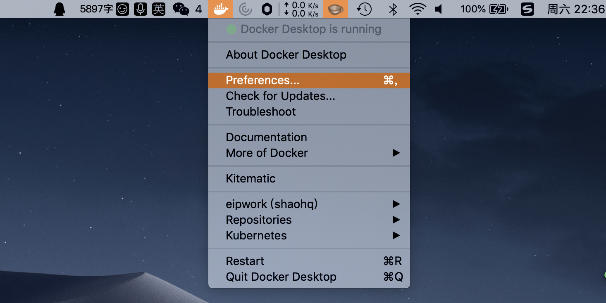

# 安装Kubernetes测试集群Win_Mac

<AdSenseTitle/>

只需要一台笔记本/台式机，就可以拥有一台用于学习的 Kubernetes 集群。单台机器可以用于学习 Kubernetes，但是，单台机器始终玩不出集群的感觉...

## 前提

如果您的笔记本/台式机电脑的性能足够强劲（内存不低于 8G），您可以直接安装 docker-desktop，并启用其中内嵌的 Kubernetes 集群，用做学习、测试，也可以用作日常开发。

## 下载 docker-desktop

从 docker 下载 [docker-desktop](https://hub.docker.com/?overlay=onboarding)，并完成安装

## 启用 Kubernetes 集群

<b-card>
<b-tabs content-class="mt-3">
  <b-tab title="MAC" active>

* **启动 docker-desktop**

* **打开 docker-desktop 的 preference 面板**

  

    
  

* **切换到 Kubernetes 标签页**

  并勾选启动 **Enable Kubernetes**，点击 **Apply**

  

    
  

</b-tab>
<b-tab title="Windows">

具体操作与 Mac 的操作过程相似，已有许多网友验证过。作者使用的是 MAC 电脑，所以未能提供 Windows 上的截图。

  </b-tab>
</b-tabs>
</b-card>
