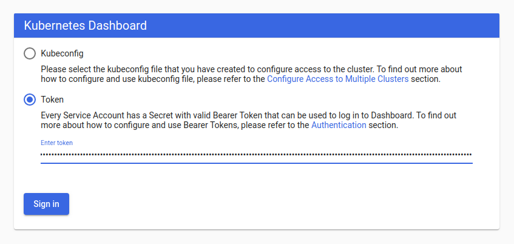
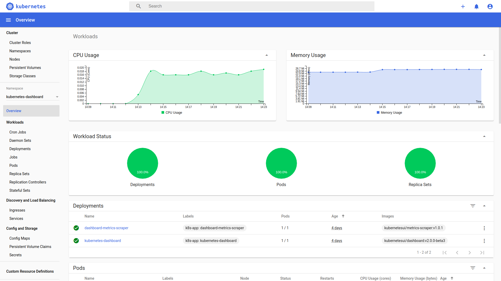

# 安装Kubernetes Dashboard

<AdSenseTitle/>

> 参考文档： [Web UI (Dashboard)](https://kubernetes.io/docs/tasks/access-application-cluster/web-ui-dashboard/)

Kubernetes Dashboard 是 Kubernetes 的官方 Web UI。使用 Kubernetes Dashboard，您可以：
* 向 Kubernetes 集群部署容器化应用
* 诊断容器化应用的问题
* 管理集群的资源
* 查看集群上所运行的应用程序
* 创建、修改Kubernetes 上的资源（例如 Deployment、Job、DaemonSet等）
* 展示集群上发生的错误

例如：您可以伸缩一个 Deployment、执行滚动更新、重启一个 Pod 或部署一个新的应用程序

以上文字翻译自 Kubernetes 官方文档。Kuboard 的定位和 Dashboard 是相似的，**主要的区别** 在于：
* Kuboard 关注微服务参考架构的视角对界面进行组织，参考 [Kuboard 简介](/overview/share-coder.html)
* Kuboard 中，不需要手工编写 YAML 文件，进一步降低 K8S 使用难度，提高便捷性
* Kuboard 可以导出整个微服务架构的部署信息，并在新的名称空间/集群导入配置信息
* Kuboard 的一个发展方向是，提供内建的 [监控套件](/guide/example/monitor.html)（目前的全局监控套件成熟度比较高）

为了帮助大家选择适合自己的工具，本文将详细描述如何在 Kubernetes 集群中安装 Kubernetes Dashboard。

## 安装

执行如下命令，以安装 Kubernetes Dashboard

``` sh
kubectl apply -f https://raw.githubusercontent.com/kubernetes/dashboard/v2.0.0-beta5/aio/deploy/recommended.yaml
```

> 如果访问不了该 yaml 文件，请使用下面的命令，效果是等价的
> ``` sh
> kubectl apply -f https://kuboard.cn/install-script/k8s-dashboard/v2.0.0-beta5.yaml
> ```


## 访问

Kubernetes Dashboard 当前，只支持使用 Bearer Token登录。
由于 Kubernetes Dashboard 默认部署时，只配置了最低权限的 RBAC。因此，我们要创建一个名为 `admin-user` 的 ServiceAccount，再创建一个 ClusterRolebinding，将其绑定到 Kubernetes 集群中默认初始化的 `cluster-admin` 这个 ClusterRole。

> 更多关于权限管理的信息，请参考 [Using RBAC Authorization](https://kubernetes.io/docs/reference/access-authn-authz/rbac/)

* 创建 Service Account 和 ClusterRoleBinding

  使用 `kubeadm` 安装集群时，默认创建了 ClusterRole `cluster-admin`。此时我们可以直接为刚才的 ServiceAccount 创建 ClusterRoleBinding。

  <<< @/.vuepress/public/install-script/k8s-dashboard/auth.yaml

  执行如下命令可创建 ServiceAccount 和 ClusterRoleBinding
  ``` sh
  kubectl apply -f https://kuboard.cn/install-script/k8s-dashboard/auth.yaml
  ```

* 获取Bearer Token
  
  执行命令：
  ```sh
  kubectl -n kubernetes-dashboard describe secret $(kubectl -n kubernetes-dashboard get secret | grep admin-user | awk '{print $1}')
  ```

  输出信息如下所示：

  ``` {13}
  Name:         admin-user-token-v57nw
  Namespace:    kubernetes-dashboard
  Labels:       <none>
  Annotations:  kubernetes.io/service-account.name: admin-user
                kubernetes.io/service-account.uid: 0303243c-4040-4a58-8a47-849ee9ba79c1

  Type:  kubernetes.io/service-account-token

  Data
  ====
  ca.crt:     1066 bytes
  namespace:  20 bytes
  token:      eyJhbGciOiJSUzI1NiIsImtpZCI6IiJ9.eyJpc3MiOiJrdWJlcm5ldGVzL3NlcnZpY2VhY2NvdW50Iiwia3ViZXJuZXRlcy5pby9zZXJ2aWNlYWNjb3VudC9uYW1lc3BhY2UiOiJrdWJlcm5ldGVzLWRhc2hib2FyZCIsImt1YmVybmV0ZXMuaW8vc2VydmljZWFjY291bnQvc2VjcmV0Lm5hbWUiOiJhZG1pbi11c2VyLXRva2VuLXY1N253Iiwia3ViZXJuZXRlcy5pby9zZXJ2aWNlYWNjb3VudC9zZXJ2aWNlLWFjY291bnQubmFtZSI6ImFkbWluLXVzZXIiLCJrdWJlcm5ldGVzLmlvL3NlcnZpY2VhY2NvdW50L3NlcnZpY2UtYWNjb3VudC51aWQiOiIwMzAzMjQzYy00MDQwLTRhNTgtOGE0Ny04NDllZTliYTc5YzEiLCJzdWIiOiJzeXN0ZW06c2VydmljZWFjY291bnQ6a3ViZXJuZXRlcy1kYXNoYm9hcmQ6YWRtaW4tdXNlciJ9.Z2JrQlitASVwWbc-s6deLRFVk5DWD3P_vjUFXsqVSY10pbjFLG4njoZwh8p3tLxnX_VBsr7_6bwxhWSYChp9hwxznemD5x5HLtjb16kI9Z7yFWLtohzkTwuFbqmQaMoget_nYcQBUC5fDmBHRfFvNKePh_vSSb2h_aYXa8GV5AcfPQpY7r461itme1EXHQJqv-SN-zUnguDguCTjD80pFZ_CmnSE1z9QdMHPB8hoB4V68gtswR1VLa6mSYdgPwCHauuOobojALSaMc3RH7MmFUumAgguhqAkX3Omqd3rJbYOMRuMjhANqd08piDC3aIabINX6gP5-Tuuw2svnV6NYQ
  ```

* 执行 `kubectl proxy` 命令

  您必须能够在自己的笔记本（工作电脑）上运行 kubectl 并访问您的集群。可参考文档 [安装Kubectl](./install-kubectl.html)

  访问路径： `http://localhost:8001/api/v1/namespaces/kubernetes-dashboard/services/https:kubernetes-dashboard:/proxy/`

  > 如需要使用 nodePort 或 Ingress 的方式访问 Kubernetes Dashboard 请配置正确的 https 证书，或者使用 Firefox 浏览器，并忽略 HTTPS 校验错误。

* 将上一个步骤中获得的 Token 输入到登录界面中，点击 **Sign in** 按钮，完成登录

  

* 登录成功后，界面如下图所示：

  

:tada: :tada: :tada: Have Fun!
