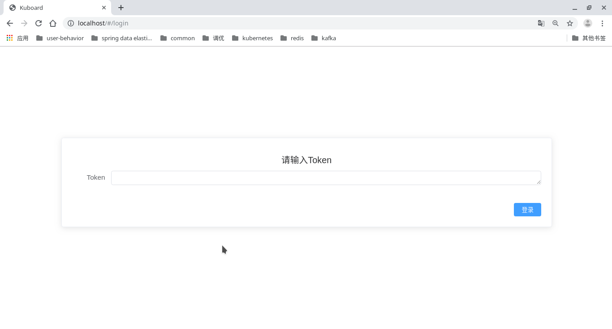

# 在单机使用 kind 安装 Kubernetes

本文旨在通过使用 kind 搭建本地 k8s 集群环境，为技术爱好者提供快速上手 Kuboard 的基本实践方式。

## 环境简介

本地搭建 k8s 集群需要 kind 工具及 docker 环境。

建议硬件配置：2核 cpu，8G 内存

ps: 以下均为在 Linux 平台实践，其他平台可参考文章中链接。

### kind 简介与安装
kind：https://kind.sigs.k8s.io/ 是一个使用 Docker 容器运行本地 Kubernetes 集群的工具。
ps:本文使用kind V0.4.0

安装:

- linux:

  ```bash
  curl -Lo ./kind-linux-amd64 https://github.com/kubernetes-sigs/kind/releases/download/v0.4.0/kind-linux-amd64
  chmod +x ./kind-linux-amd64
  mv ./kind-linux-amd64 /usr/local/bin/kind
  ```

- win:

  ```powershell
  curl.exe -Lo kind-windows-amd64.exe https://github.com/kubernetes-sigs/kind/releases/download/v0.4.0/kind-windows-amd64
  Move-Item .\kind-windows-amd64.exe c:\some-dir-in-your-PATH\kind.exe
  ```

- mac:

  ```bash
  curl -Lo ./kind-darwin-amd64 https://github.com/kubernetes-sigs/kind/releases/download/v0.4.0/kind-darwin-amd64
  chmod +x ./kind-darwin-amd64
  mv ./kind-darwin-amd64 /usr/local/bin/kind
  ```

### docker 环境

Kind 的主要功能目前需要有 Docker 环境的支持，可参考 Docker 官方文档：https://links.jianshu.com/go?to=https%3A%2F%2Fdocs.docker.com%2Finstall%2F 进行安装。

### kubectl 安装

kubectl https://kubernetes.io/docs/tasks/tools/install-kubectl/ 是 Kubernetes 命令行工具，可以在 Kubernetes 上部署和管理应用程序

Linux:

```
curl -LO https://storage.googleapis.com/kubernetes-release/release/v1.15.0/bin/linux/amd64/kubectl
chmod +x ./kubectl
sudo mv ./kubectl /usr/local/bin/kubectl
```

ps: 由于网络问题多次尝试可下载成功

## k8s 集群搭建

### 准备 kind 搭建集群配置文件 kind-config.yaml

```yaml
kind: Cluster
apiVersion: kind.sigs.k8s.io/v1alpha3
nodes:
- role: control-plane
- role: worker
```

### 使用 kind 搭建集群

```
kind create cluster --config kind-config.yaml
```

### 创建成功


按照提示配置环境变量

```
export KUBECONFIG="$(kind get kubeconfig-path --name="kind")"
```

查看集群信息

```
kubectl cluster-info
```


## kuboard 安装

官方安装地址：http://kuboard.cn/#/install/install-dashboard

### 获取并修改 yaml 文件

```bash
wget https://raw.githubusercontent.com/eip-work/eip-monitor-repository/master/dashboard/kuboard.yaml
```

修改文件 kuboard.yaml 中 Ingress 的 host 为空

### 执行安装

```bash
kubectl apply -f kuboard.yaml 
```

### 查看启动状态

```
kubectl get pods -n kube-system --watch
```

等待 kuboard 启动成功

### 访问 kuboard 页面

待启动成功后，需要做 80 端口转发，通过浏览器访问 kuboard

```
kubectl port-forward service/kuboard 9080:80 -n kube-system
```

获取登录 token

```bash
kubectl -n kube-system describe secret $(kubectl -n kube-system get secret | grep kuboard-user | awk '{print $1}')   
```


浏览器中访问 http://localhost:9080



将获取的 token 复制到浏览器中，访问成功


