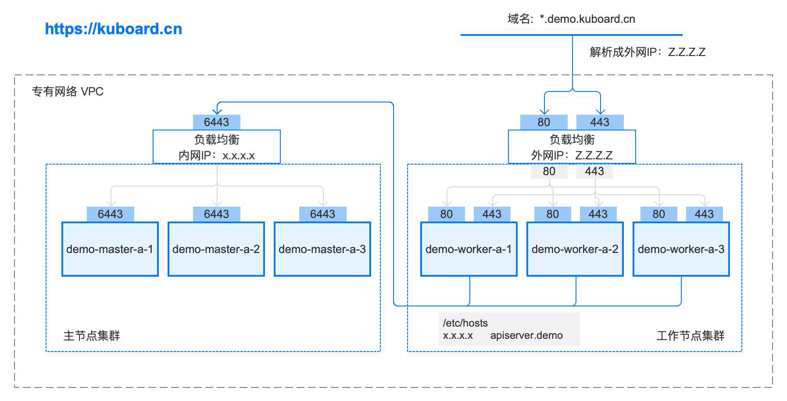

# 安装 Kubernetes 高可用

::: tip
推荐初学者按照 [安装Kubernetes 单Master节点](install-k8s.html) 文档进行 Kubernetes 集群搭建
:::

# 介绍

kubernetes 安装有多种选择，本文档描述的集群安装具备如下特点：

* Kubernetes 1.15.2
  * calico 3.8
  * nginx-ingress 1.5.3
* Docker 18.09.7
* 三个 master 组成主节点集群，通过内网 loader balancer 实现负载均衡
* 多个 worker 组成工作节点集群，通过外网 loader balancer 实现负载均衡

安装后的拓扑图如下：<a :href="$withBase('/kuboard.rp')" download="www.kuboard.cn.rp">下载拓扑图源文件</a> <font color="#999">使用Axure RP 9.0可打开该文件</font>



* **在线答疑** QQ 群
  
  

# 安装步骤

## 检查 centos / hostname

``` sh
# 在 master 节点和 worker 节点都要执行
cat /etc/redhat-release

# 此处 hostname 的输出将会是该机器在 Kubernetes 集群中的节点名字
hostname
```

**操作系统兼容性**

| CentOS 版本 | 本文档是否兼容                          | 备注                                |
| ----------- | --------------------------------------- | ----------------------------------- |
| 7.6         | <span style="font-size: 24px;">😄</span> | 已验证                              |
| 7.5         | <span style="font-size: 24px;">😄</span> | 已验证                              |
| 7.4         | <span style="font-size: 24px;">🤔</span> | 待验证                              |
| 7.3         | <span style="font-size: 24px;">🤔</span> | 待验证                              |
| 7.2         | <span style="font-size: 24px;">😞</span> | 已证实会出现 kubelet 无法启动的问题 |

## 安装 docker / kubelet

使用 root 身份在所有节点执行如下代码，以安装软件：
- docker
- nfs-utils
- kubectl / kubeadm / kubelet

:::: tabs type:border-card

::: tab 快速安装 lazy

``` sh
# 在 master 节点和 worker 节点都要执行

curl -sSL https://kuboard.cn/install-script/install-kubelet.sh | sh

```

:::

::: tab 手动安装 lazy

手动执行以下代码，效果与快速安装完全相同。

<<< @/.vuepress/public/install-script/install-kubelet.sh

::: warning
如果此时执行 `service status kubelet` 命令，将得到 kubelet 启动失败的错误提示，请忽略此错误，因为必须完成后续步骤中 kubeadm init 的操作，kubelet 才能正常启动
:::

::::

## 初始化API Server

### 创建 ApiServer 的 ELB（私网）

监听端口：6443 / TCP

后端资源组：包含 demo-master-a-1, demo-master-b-1, demo-master-b-2

后端端口：6443

开启 按源地址保持会话

假设完成创建以后，ELB的 ip 地址为 x.x.x.x

### 初始化第一个master节点


::: tip
* 以 root 身份在 demo-master-a-1 机器上执行
* 初始化 master 节点时，如果因为中间某些步骤的配置出错，想要重新初始化 master 节点，请先执行 `kubeadm reset` 操作
:::

::: warning
* POD_SUBNET 所使用的网段不能与 ***master节点/worker节点*** 所在的网段重叠。该字段的取值为一个 <a href="/glossary/cidr.html" target="_blank">CIDR</a> 值，如果您对 CIDR 这个概念还不熟悉，请不要修改这个字段的取值 10.100.0.1/20
:::

:::: tabs type:border-card

::: tab 快速初始化 lazy

在第一个 master 节点 demo-master-a-1 上执行

``` sh
# 只在 master 节点执行
# 替换 x.x.x.x 为 ApiServer LoadBalancer 的 IP 地址
export APISERVER_IP=x.x.x.x
# 替换 apiserver.demo 为 您想要的 dnsName
export APISERVER_NAME=apiserver.demo
export POD_SUBNET=10.100.0.1/20
echo "${APISERVER_IP}    ${APISERVER_NAME}" >> /etc/hosts
curl -sSL https://kuboard.cn/install-script/init-master.sh | sh
```

:::

::: tab 手工初始化 lazy

``` sh
# 只在 master 节点执行
# 替换 x.x.x.x 为 ApiServer LoadBalancer 的 IP 地址
export APISERVER_IP=x.x.x.x
# 替换 apiserver.demo 为 您想要的 dnsName
export APISERVER_NAME=apiserver.demo
export POD_SUBNET=10.100.0.1/20
echo "${APISERVER_IP}    ${APISERVER_NAME}" >> /etc/hosts
```

<<< @/.vuepress/public/install-script/init-master.sh

:::

::::


**检查 master 初始化结果**

``` sh
# 只在 master 节点执行

# 执行如下命令，等待 3-10 分钟，直到所有的容器组处于 Running 状态
watch kubectl get pod -n kube-system -o wide

# 查看 master 节点初始化结果
kubectl get nodes
```

### 初始化第二、三个master节点

在 demo-master-a-1 上执行

```sh
# 只在 demo-master-a-1 节点执行
kubeadm init phase upload-certs --upload-certs
```

输出结果如下：

```

```

在 demo-master-b-1 和 demo-master-b-2 机器上执行

``` sh
# 只在 demo-master-b-1 和 demo-master-b-2 节点执行
# 替换 x.x.x.x 为 ApiServer LoadBalancer 的 IP 地址
export APISERVER_IP=x.x.x.x
# 替换 apiserver.demo 为 前面已经使用的 dnsName
export APISERVER_NAME=apiserver.demo
echo "${APISERVER_IP}    ${APISERVER_NAME}" >> /etc/hosts
```


执行 （替换参数）

```bash
kubeadm join apiserver.demo:6443 --token ejwx62.vqwog6il5p83uk7y \
--discovery-token-ca-cert-hash sha256:6f7a8e40a810323672de5eee6f4d19aa2dbdb38411845a1bf5dd63485c43d303 \
--control-plane --certificate-key 70eb87e62f052d2d5de759969d5b42f372d0ad798f98df38f7fe73efdf63a13c
```

**检查 master 初始化结果**

``` sh
# 只在 demo-master-a-1 节点执行
# 查看 master 节点初始化结果
kubectl get nodes
```

## 初始化 worker节点

### 获得 join命令参数

**在第一个 master 节点 demo-master-a-1 节点执行**

```bash
kubeadm token create --print-join-command
```

可获取kubeadm join 命令及参数，如下所示

```bash
kubeadm join apiserver.demo:6443 --token mpfjma.4vjjg8flqihor4vt     --discovery-token-ca-cert-hash sha256:6f7a8e40a810323672de5eee6f4d19aa2dbdb38411845a1bf5dd63485c43d303
```


### 初始化worker

**针对所有的 worker 节点执行**

```sh
# 只在 worker 节点执行
# 替换 ${APISERVER_IP} 为 ApiServer LoadBalancer 的 IP 地址
# 替换 ${APISERVER_NAME} 为 前面已经使用的 dnsName
echo "${APISERVER_IP}    ${APISERVER_NAME}" >> /etc/hosts

# 替换为前面 kubeadm token create --print-join-command 的输出结果
kubeadm join apiserver.demo:6443 --token mpfjma.4vjjg8flqihor4vt     --discovery-token-ca-cert-hash sha256:6f7a8e40a810323672de5eee6f4d19aa2dbdb38411845a1bf5dd63485c43d303
```

### 检查 worker 初始化结果

在第一个master节点 demo-master-a-1 上执行

```sh
sudo -i
kubectl get nodes
```


## 移除 worker 节点

::: warning
正常情况下，您无需移除 worker 节点
:::

在准备移除的 worker 节点上执行

```sh
kubeadm reset
```

在第一个 master 节点 demo-master-a-1 上执行

```sh
kubectl delete node demo-worker-x-x
```

> * 将 demo-worker-x-x 替换为要移除的 worker 节点的名字
> * worker 节点的名字可以通过在第一个 master 节点 demo-master-a-1 上执行 kubectl get nodes 命令获得


## 安装 Ingress Controller

> Ingress官方文档：https://kubernetes.io/docs/concepts/services-networking/ingress/
>
> Ingress Controllers官网介绍：https://kubernetes.io/docs/concepts/services-networking/ingress-controllers/
>
> 本文中使用如下部署方式：https://kubernetes.github.io/ingress-nginx/deploy/baremetal/#using-a-self-provisioned-edge
>
> kubernetes支持多种Ingress Controllers (traefic / Kong / Istio / Nginx 等)，本文推荐使用 https://github.com/nginxinc/kubernetes-ingress


:::: tabs type:border-card

::: tab 快速安装 lazy

**在 master 节点上执行**

``` sh
# 只在 master 节点执行
kubectl apply -f https://kuboard.cn/install-script/nginx-ingress.yaml
```

:::

::: tab YAML文件 lazy

<<< @/.vuepress/public/install-script/nginx-ingress.yaml

:::

::::

::: warning
如果您打算将 Kubernetes 用于生产环境，请参考此文档 [Installing Ingress Controller](https://github.com/nginxinc/kubernetes-ingress/blob/v1.5.3/docs/installation.md)，完善 Ingress 的配置
:::

### 在 IaaS 层完成如下配置（**公网ELB**）

创建负载均衡 ELB：

​    监听器 1：80 / TCP， SOURCE_ADDRESS 会话保持

​    服务器资源池 1： demo-worker-x-x 的所有节点的 80端口

​    监听器 2：443 / TCP， SOURCE_ADDRESS 会话保持

​    服务器资源池 2： demo-worker-x-x 的所有节点的443端口

假设刚创建的负载均衡 ELB 的 IP 地址为： z.z.z.z


### 配置域名解析

将域名 *.demo.yourdomain.com 解析到地址负载均衡服务器 的 IP 地址 z.z.z.z


### 验证配置

在浏览器访问 a.demo.yourdomain.com，将得到 404 NotFound 错误页面


## 下一步
:tada: :tada: :tada: 

您已经完成了 Kubernetes 集群的安装，下一步请：

[安装 Kuboard](/install/install-dashboard.html)

安装 Kuboard 之前先
  <a target="_blank" :href="`http://demo.kuboard.cn/#/dashboard?k8sToken=${$site.themeConfig.kuboardToken}`">
    在线体验 Kuboard
  </a>
