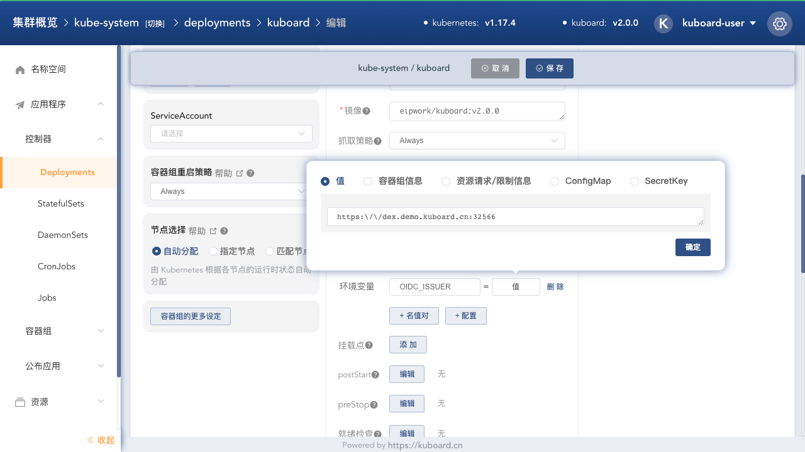

# 配置Kuboard环境变量

<AdSenseTitle/>

## 环境变量

安装 Kuboard 后，有如下几个环境变量值得您关注：

| 环境变量名                | 描述                                    | 默认值        |
| ------------------------- | --------------------------------------- | ------------- |
| KUBERNETES_CLUSTER_DOMAIN | Kubernetes Cluster Name                 | cluster.local |
| KUBOARD_PROXY_COOKIE_TTL | Kuboard Proxy 中 Cookie 的有效时长 | 36000         |
| OIDC_ISSUER               | OpenID Connect 对应的 Identity Provider | 空            |

## 修改Kuboard环境变量

* 打开 Kuboard 界面，并导航到 Kuboard 工作负载编辑页：

  kube-system 名称空间 --> Kuboard 工作负载 --> 编辑

* 也可以按如下方式直接进入 Kuboard 工作负载编辑页：

  打开链接 `http://节点IP:32567/namespace/kube-system/workload/edit/Deployment/kuboard`


在 Kuboard 工作负载编辑页，为 `kuboard` 容器添加、修改环境变量，如下图，正在修改 `OIDC_ISSUER` 的取值



## KUBERNETES_CLUSTER_DOMAIN

如果您通过 kubeadm 安装 Kubernetes 集群，执行命令
``` sh
kubeadm config view
```

可以查看到输出结果中的 `networking.dnsDomain` 字段，该字段通常取值为 `cluster.local`，如下所示：
``` yaml {19}
apiServer:
  extraArgs:
    authorization-mode: Node,RBAC
  timeoutForControlPlane: 4m0s
apiVersion: kubeadm.k8s.io/v1beta2
certificatesDir: /etc/kubernetes/pki
clusterName: kubernetes
controlPlaneEndpoint: apiserver.demo:6443
controllerManager: {}
dns:
  type: CoreDNS
etcd:
  local:
    dataDir: /var/lib/etcd
imageRepository: gcr.azk8s.cn/google-containers
kind: ClusterConfiguration
kubernetesVersion: v1.16.4
networking:
  dnsDomain: cluster.local
  serviceSubnet: 10.96.0.0/12
scheduler: {}
```

少数情况下，您安装集群时可能修改了这个字段的取值，此时，请确保您为 Kuboard 设置了 `KUBERNETES_CLUSTER_DOMAIN` 这个环境变量，并将其取值设置与 `networking.dnsDomain` 的取值相同。否则 Kuboard 的一部分功能将无法正常工作。

## OIDC_ISSUER

`OIDC_ISSUER` 这个环境变量与 Kubernetes Authentication 相关，建议您不要手工设置此环境变量，如果您想通过 OpenID Connect 的方式登录 Kuboard / Kubectl 请参考 [Kubernetes Authentication 安装向导](/learning/k8s-advanced/sec/authenticate/install.html)，在该向导的引导下，您将能够顺利配置 Kuboard 与 GitHub / GitLab 等的单点登录。
> 设置 `OIDC_ISSUER` 是该向导自动完成的一个步骤。
