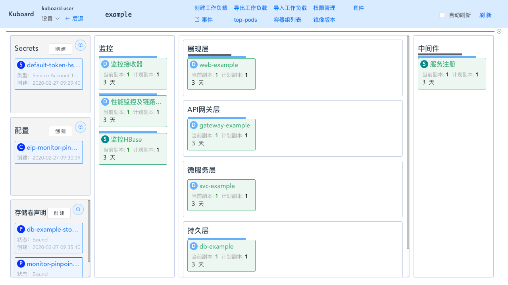
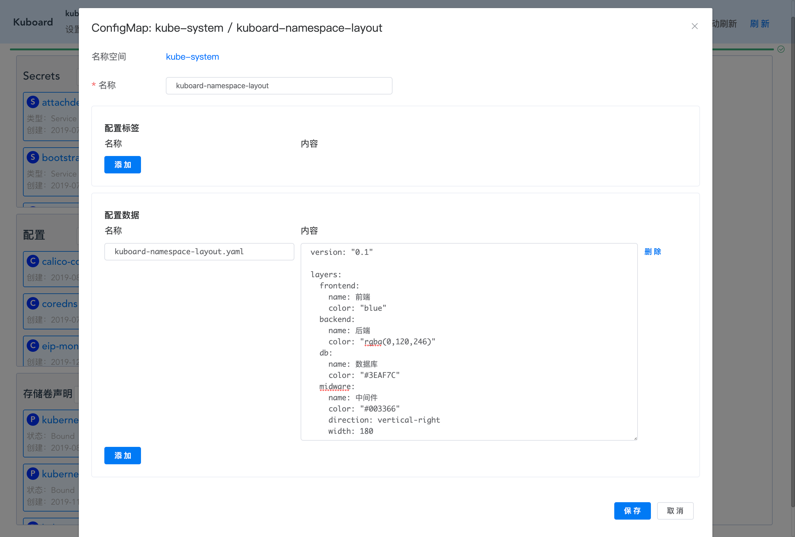
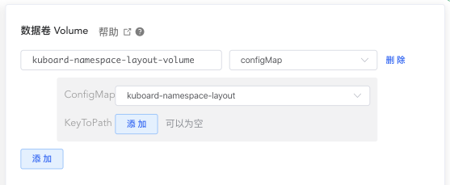
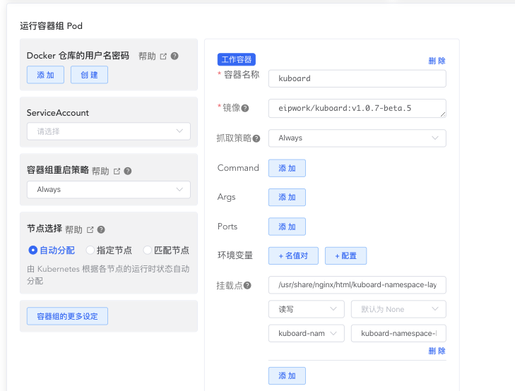
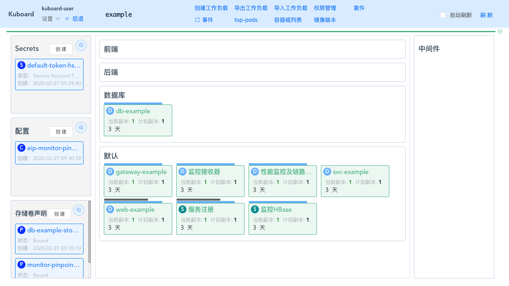
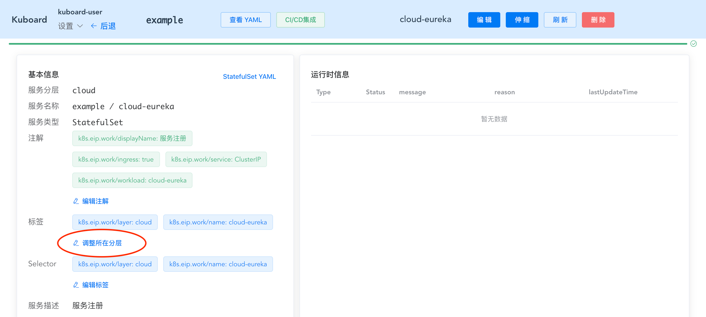
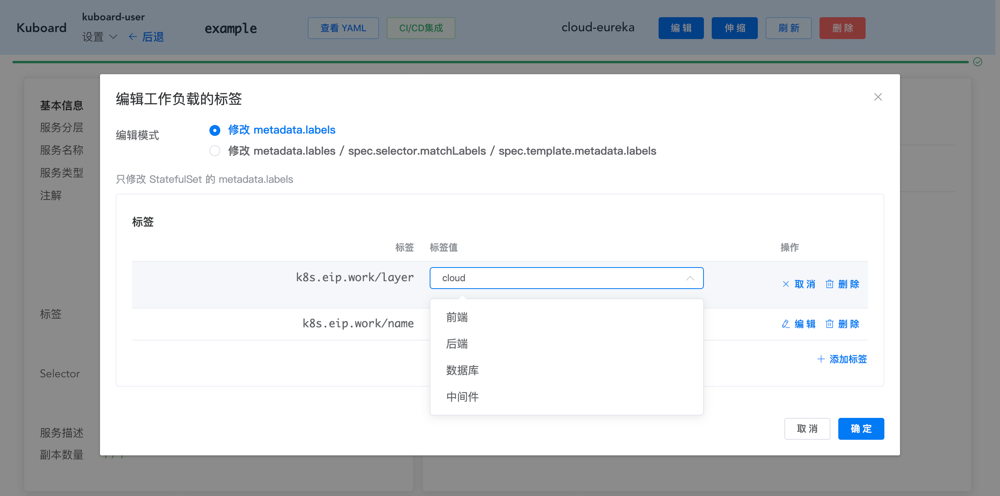

# 自定义Kuboard名称空间布局

<AdSenseTitle/>

## 名称空间布局

Kuboard 名称空间界面中，以微服务分层架构的形式对工作负载进行分类展示，默认布局模式如下图所示：



## 自定义布局

自 Kuboard v1.0.7-beta.5 开始，允许用户自定义名称空间的布局。本章节描述了如何配置自定义布局的参数。

* 在 Kuboard 界面中，导航到 `kube-system` 名称空间；

* 创建 ConfigMap

  > 点击名称空间左侧 **配置** 标题后面的 ***创建*** 按钮，可以创建 ConfigMap。

  在名称空间 `kube-system` 中创建一个名为 `kuboard-namespace-layout` 的 ConfigMap，并在其中添加一个 Key 为 `kuboard-namespace-layout.yaml` ，Value 为如下 yaml 内容的配置数据条目，如图所示：

  

  yaml 文件内容为：

  ```yaml
  version: "0.1"
  
  layers:
    frontend:
      name: 前端
      color: "blue"
    backend:
      name: 后端
      color: "rgba(0,120,246)"
    db:
      name: 数据库
      color: "#3EAF7C"
    midware:
      name: 中间件
      color: "#003366"
      direction: vertical-right
      width: 180
  ```

  yaml 文件中，各字段的描述如下：

  ::: tip Layer ID

  layers 下每一个字段代表一个分层的 id。例如，此配置文件中定义了 4 个分层：`frontend`、`backend`、`db`、`midware`。对于每个分层，可以配置的参数见下表：

  :::

  | 字段名    | 字段类型 | 必填 | 字段描述                                                     |
  | --------- | -------- | ---- | ------------------------------------------------------------ |
  | name      | String   | 是   | 分层的名称，显示在界面上                                     |
  | color     | String   | 是   | 分层中工作负载对象的主题色，可以使用 rgba 编码、颜色名称颜色编码等 html 支持的形式； |
  | direction | String   | 否   | 如果不填写，则该分层按 yaml 中出现的顺序自上而下显示在中间。如果填写，必须从下面两个取值当中选择：<ul><li>`vertical-right`：垂直显示在右侧</li><li>`vertical-left`： 垂直显示在左侧</li></ul> |
  | width     | Number   | 条件 | 如果填写了 `direction` 字段，则此字段为必填；<br />该字段标识了垂直显示时，该区块的宽度，单位为像素 `px`。 |

  

* 挂载 ConfigMap 到 Kuboard 容器

  * 在 `kube-system` 名称空间中，导航到 `kuboard` 工作负载页面；

  * 在 `kuboard` 工作负载页面，点击 ***编辑*** 按钮，进入工作负载编辑页面；

  * 在工作负载编辑页面，增加数据卷

    为 `kuboard` 增加一个数据卷，字段描述及截图如下：

    | 字段名称      | 字段取值                        | 字段描述                                                     |
    | ------------- | ------------------------------- | ------------------------------------------------------------ |
    | 数据卷名称    | kuboard-namespace-layout-volume | 数据卷名称，在该工作负载内可用                               |
    | 数据卷类型    | configMap                       | 选择 configMap 类型的数据卷                                  |
    | ConfigMap名称 | kuboard-namespace-layout        | 选择前一个步骤中创建的 kuboard-namespace-layout 这个 ConfigMap |

    

  * 在工作负载编辑页面，挂载配置文件到 `kuboard` 容器

    仍然在工作负载编辑页面，将 ConfigMap 中的配置内容挂载到 `kuboard` 容器，字段描述及截图如下：
    
    | 字段名称               | 字段取值                                            | 字段描述                                      |
    | ---------------------- | --------------------------------------------------- | --------------------------------------------- |
    | 镜像                   | eipwork/kuboard:v1.0.7-beta.5                       | Kuboard 版本不能低于 v1.0.7-beta.5            |
    | 挂载点：容器内路径     | /usr/share/nginx/html/kuboard-namespace-layout.yaml | 替换容器中该路径中的配置文件                  |
    | 挂载点：数据卷名称     | kuboard-namespace-layout-volume                     | 选择前一个步骤中添加的数据卷                  |
    | 挂载点：数据卷内子路径 | kuboard-namespace-layout.yaml                       | 此字段取值为 configMap 中，对应配置条目的名称 |
    
    > 上述配置可以将 configMap 中 `kuboard-namspace-layout.yaml` 的内容映射为容器内路径为 `/usr/share/nginx/html/kuboard-namespace-layout.yaml` 的一个文件
    
    
    
  * 保存对 `kuboard` 工作负载的修改

* 刷新 Kuboard 界面

  刷新 Kuboard 界面后，可以看到，名称空间的布局被调整为如下形式：

  * 省略了左侧的 `监控层`；
  * 中间三层被调整为 `前端`、`后端`、`数据库`；
  * 右侧名称仍然为 `中间件` ，但是标识已经从 `cloud` 调整为 `midware`，所以原本在此处的 `服务注册` 工作负载现在显示在 `默认` 分层中。

  

## 调整工作负载所在分层

如果您在使用 Kuboard 之前，就已经创建了许多的工作负载，然后您安装了 Kuboard，此时，所有的工作负载都是显示在 `默认` 这个分层的。

Kuboard 通过工作负载（Deployment / StatefulSet / DaemonSet 等）的 `k8s.eip.work/layer` 这个标签来识别工作负载应该显示在哪个分层。

如果您想要将工作负载调整到对应的分层，可以按照如下步骤操作：

* 进入工作负载查看页面，如下图所示：

  

* 点击上图中 ***调整所在分层*** 按钮，将打开编辑标签的界面：

  编辑 `k8s.eip.work/layer` ，并选择您想要的分层后，点击 ***确定*** 按钮。

  

* 该工作负载将显示到您所期望的分层当中。

