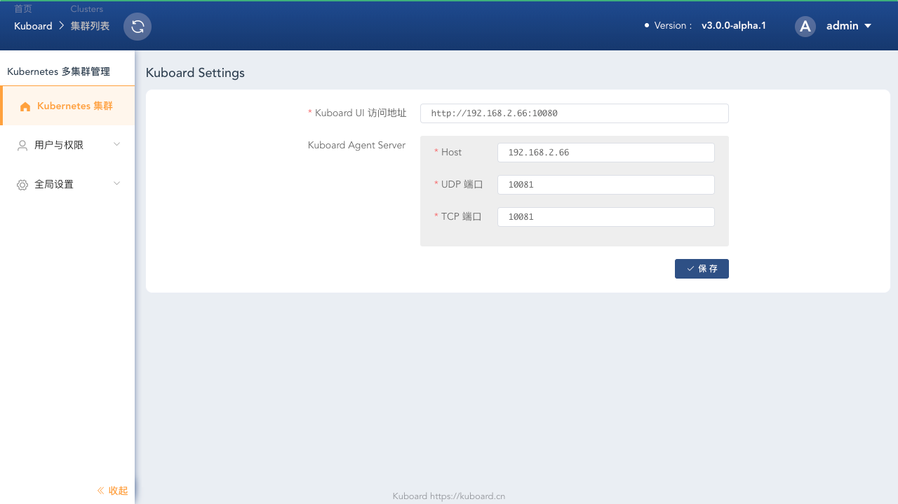

# 安装 Kuboard v3

<AdSenseTitle/>

## Alpha 版本说明

Kuboard v3.0 支持 Kubernetes 多集群管理。当前为 alpha 内测版本，已经完成了多集群管理的主要特性，有如下功能尚未验证：
* Kuboard Proxy
* Kuboard PortForward
* Kuboard 套件

如果您从 Kuboard v1.0.x 或者 Kuboard v2.0.x 升级到 Kuboard，请注意：
* 您可以同时使用 Kuboard v3.0.x 和 Kuboard v2.0.x
* Kuboard v2.0.x 时购买的授权文件，可以在 Kuboard v3.0.0 正式发布后迁移到 Kuboard v3.0.x

Alpha 版本为早期内测版本，预计 Kuboard v3.0.0 的正式发布时间在 2021 年元旦前后

## 安装

Kuboard v3.0 不再部署在 Kubernetes 集群当中，而是以一个 docker 容器的形式运行在集群之外。安装之前，请确保：

* 用于安装 Kuboard v3.0 的机器已经安装了 docker，并且版本不低于 docker 19.03
* 您已经有自己的 Kubernetes 集群，并且版本不低于 Kubernetes v1.13

安装 Kuboard v3.0 alpha 版本的指令如下：

``` sh {6}
sudo docker run -d \
  --restart=unless-stopped \
  -p 10080:10080/tcp \
  -p 10081:10081/tcp \
  -p 10081:10081/udp \
  -v /root/kuboard-data:/data \
  eipwork/kuboard:v3-alpha
```

::: tip Tips
* Kuboard v3.0 的持久化数据存储在 `/data` 目录，如安装指令的第六行所示，默认映射到了宿主机的 `/root/kuboard-data` 路径，请根据您自己的情况进行调整；
* Kuboard v3.0 需要暴露 `10080` 端口，如安装指令的第三行所示，默认映射到了宿主机的 `10080` 端口，您可以根据自己的情况选择宿主机的其他端口；
* Kuboard v3.0 需要暴露 `10081` 端口 TCP / UDP，如安装指令的第四、第五行所示，默认映射到了宿主机的 `10081` 端口，您可以根据自己的情况选择宿主机的其他端口；
:::

## 访问 Kuboard v3.0

在浏览器输入 `http://your-host-ip:10080` 即可访问 Kuboard v3.0 的界面，登录方式：
* 用户名： `admin`
* 密 码： `Kuboard123`

首次登录成功后，Kuboard 将要求您完成一个初始化设定，如下图所示：

Kuboard 在添加被纳管的 Kubernetes 集群时，需要向集群中安装 Kuboard Agent，下图的参数在安装 Kuboard Agent 时将被使用到：

| 参数名称                      | 默认值                                                     | 描述                                                         |
| ----------------------------- | ---------------------------------------------------------- | ------------------------------------------------------------ |
| Kuboard UI 访问地址           | <div style="width: 190px;">http://your-host-ip:10080</div> | Kuboard Agent 访问 Kuboard web 时所使用的地址，必须映射到 Kuboard 的 `10080` 端口 |
| Kuboard Agent Server Host     | your-host-ip                                               | Kuboard Agent 访问 Kuboard Agent Server 时所使用的目标地址   |
| Kuboard Agent Server UDP Port | 10081                                                      | Kuboard Agent 可以使用 UDP 协议或者 TCP 协议连接 Kuboard Agent Server，二者选其一即可，必须映射到 Kuboard 的 `10081` 端口。<br />* *UDP 比 TCP 快 20%*；<br />* *TCP 可以使用 http 或 socks5 代理*；<br />不同的 Kubernetes 集群可以选择 UDP 或 TCP。 |
| Kuboard Agent Server TCP Port | 10081                                                      | 同上                                                         |





## 问题反馈

关于 Kuboard v3.0.0-alpha 版本的问题反馈，请加 QQ 群：656520037


