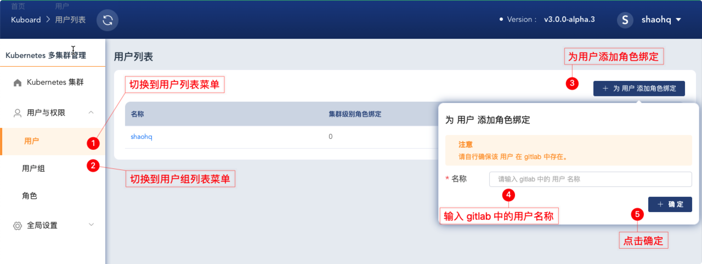
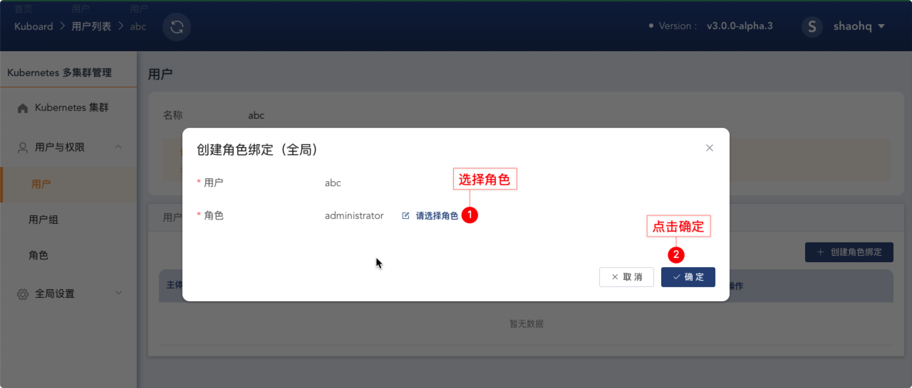

# 为单点登录的用户/用户组授权

当您配置 Kuboard 与 gitlab / github / ldap 实现单点登录以后，Kuboard 并不管理用户基本信息、用户组信息、用户与用户组之间的映射信息，这些信息需要您在 gitlab / github/ ldap 中管理和配置。

默认情况下，只有 `KUBOARD_ROOT_USER` 参数指定的用户可以执行 Kuboard 中的所有操作，其他用户通过单点登录进入 Kuboard 系统后，除了退出系统，几乎什么事情也做不了。为了让单点登录的用户获得合适的权限，您需要在 Kuboard 中为对应的用户/用户组授权。下面描述了为指定用户授权的操作步骤：

* 为用户添加角色绑定

  如下图所示，导航到 ***用户*** 列表菜单，点击 ***为用户添加角色绑定*** 按钮

  

  在图中的弹出对话框输入单点登录用户系统中的用户名，点击确定。

* 切换到 ***角色绑定（全局）***

  点击上图中的确定之后，将进入用户的授权界面，如下图所示，此时请切换到 ***角色绑定（全局）*** 标签页，点击 ***创建角色绑定*** 按钮。

  

* 创建角色绑定

  选择角色，点击确定后，用户将具备该角色指定的权限。

  

::: tip 注意

* 全局角色绑定，用户可以在所有 Kubernetes 集群范围内执行该角色授予的权限；
* 集群角色绑定，用户只能在指定的 Kubernetes 集群范围内执行该角色授予的权限；
* 通常，以为用户组授权比为单个用户授权更为灵活和方便。

:::
