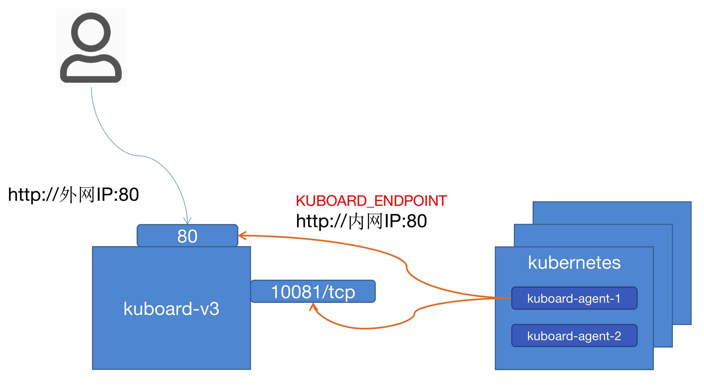

# Kuboard v3 导入集群不能进入已就绪状态的可能原因

当您看到这个页面时，说明您已经向被导入集群安装了 kuboard-agent，但是在 Kuboard 界面里，一直显示该集群处于 `已导入` 状态，不能进入 `已就绪` 状态。出现这种状况，可能的原因有：

## 网络连通性

如下图所示，`kuboard-agent-1` 与 `kuboard-agent-2` 是导入 Kuboard 时，安装到 Kubernetes 集群中的代理程序。它们需要访问 Kuboard 的两个端口，这两个端口通过 Kuboard 启动参数指定：
* `KUBOARD_ENDPOINT` 指向 kuboard 的 web 端口
  * 如果 Kuboard 是使用 docker run 命令启动的，默认为 `http://内网IP:80`
  * 如果 Kuboard 是安装在 Kubernetes 中的，默认为 `http://${hostIP}:30080`
* `KUBOARD_AGENT_SERVER_TCP_PORT` 指向 kuboard 的 agent-server 端口
  * 如果 Kuboard 是使用 docker run 命令启动的，默认为 `10081`
  * 如果 Kuboard 是安装在 Kubernetes 中的，默认为 `30081`

请检查你的防火墙、Kuboard 启动参数等配置，解决网络连通性问题后，通常就能够很顺利地导入 Kubernetes 集群到 Kuboard 中了。

  

:::tip 修改 Kuboard 启动参数
如果您修改了 Kuboard 的启动参数中 `KUBOARD_ENDPOINT` 或者 `KUBOARD_AGENT_SERVER_TCP_PORT` 的字段，您需要重新在 Kubernetes 集群中安装 kuboard-agent。
:::