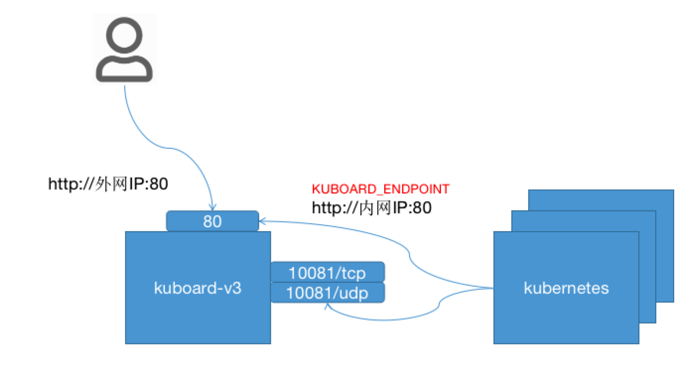

# 安装 Kuboard v3 - 内建用户库

<AdSenseTitle/>

## 部署计划

在正式安装 kuboard v3 之前，需做好一个简单的部署计划的设计，在本例中，各组件之间的连接方式，如下图所示：

* 假设用户通过 http://外网IP:10080 访问 Kuboard v3；
* 安装在 Kubernetes 中的 Kuboard Agent 通过 `内网IP` 访问 Kuboard 的 Web 服务端口 10080 和 Kuboard Agent Server 端口 10081。

<p>

</p>


安装 Kuboard 之前，假设：

* 您已经准备好了一个 Linux 服务器用于安装 Kuboard-V3，并且该机器上的 docker 版本不低于 19.03
* 用于安装 Kuboard v3.0 的机器已经安装了 docker，并且版本不低于 docker 19.03
* 您已经有自己的 Kubernetes 集群，并且版本不低于 Kubernetes v1.13

## 安装

安装 Kuboard v3.0 版本的指令如下：

``` sh {10}
sudo docker run -d \
  --restart=unless-stopped \
  --name=kuboard \
  -p 10080:80/tcp \
  -p 10081:10081/udp \
  -p 10081:10081/tcp \
  -e KUBOARD_ENDPOINT="http://内网IP:10080" \
  -e KUBOARD_AGENT_SERVER_UDP_PORT="10081" \
  -e KUBOARD_AGENT_SERVER_TCP_PORT="10081" \
  -v /root/kuboard-data:/data \
  eipwork/kuboard:v3
  # 也可以使用镜像 swr.cn-east-2.myhuaweicloud.com/kuboard/kuboard:v3 ，可以更快地完成镜像下载。
  # 请不要使用 127.0.0.1 或者 localhost 作为内网 IP \
  # Kuboard 不需要和 K8S 在同一个网段，Kuboard Agent 甚至可以通过代理访问 Kuboard Server \
```

::: danger 
* KUBOARD_ENDPOINT 参数的作用是，让部署到 Kubernetes 中的 `kuboard-agent` 知道如何访问 Kuboard Server；
* KUBOARD_ENDPOINT 中也可以使用外网 IP；
* Kuboard 不需要和 K8S 在同一个网段，Kuboard Agent 甚至可以通过代理访问 Kuboard Server；
* 建议在 KUBOARD_ENDPOINT 中使用域名；
* 如果使用域名，必须能够通过 DNS 正确解析到该域名，如果直接在宿主机配置 `/etc/hosts` 文件，将不能正常运行；
:::

::: tip 参数解释
* 建议将此命令保存为一个 shell 脚本，例如 `start-kuboard.sh`，后续升级 Kuboard 或恢复 Kuboard 时，需要通过此命令了解到最初安装 Kuboard 时所使用的参数；
* 第 4 行，将 Kuboard Web 端口 80 映射到宿主机的 `10080` 端口（您可以根据自己的情况选择宿主机的其他端口）；
* 第 5、6 行，将 Kuboard Agent Server 的端口 `10081/udp`、`10081/tcp` 映射到宿主机的 `10081` 端口（您可以根据自己的情况选择宿主机的其他端口）；
* 第 7 行，指定 KUBOARD_ENDPOINT 为 `http://内网IP`，如果后续修改此参数，需要将已导入的 Kubernetes 集群从 Kuboard 中删除，再重新导入；
* 第 8、9 行，指定 KUBOARD_AGENT_SERVER 的端口为 `10081`，此参数与第 5、6 行中的宿主机端口应保持一致，修改此参数不会改变容器内监听的端口 `10081`；
* 第 10 行，将持久化数据 `/data` 目录映射到宿主机的 `/root/kuboard-data` 路径，请根据您自己的情况调整宿主机路径；
:::

## 访问 Kuboard v3.0

在浏览器输入 `http://your-host-ip:10080` 即可访问 Kuboard v3.0 的界面，登录方式：
* 用户名： `admin`
* 密 码： `Kuboard123`
