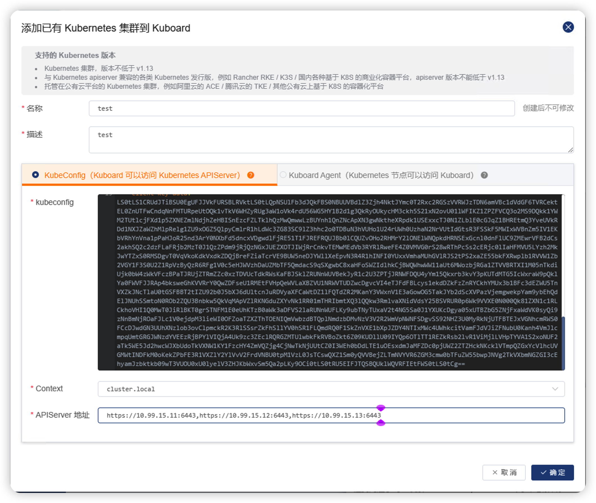

# 安装 Kuboard v3 - 高可用部署

* 普通部署模式可以满足绝大部分用户的需求；
* 普通部署模式不影响 Kubernetes 的高可用；
* 除普通部署模式外 Kuboard 提供高可用部署模式；

## 普通部署模式

相较于 Kuboard 的高可用部署模式，前面的几种安装模式都被认为是 Kuboard 的普通部署模式，包括：

* [安装 Kuboard v3 - 内建用户库](./install-built-in.html)
* [安装 Kuboard v3 - gitlab](./install-github.html)
* [安装 Kuboard v3 - github](./install-gitlab.html)
* [安装 Kuboard v3 - ldap](./install-ldap.html)
* [安装 Kuboard v3 - kubernetes](./install-in-k8s.html)

在普通部署模式下 Kuboard 通常只部署了一个容器实例，存在单点故障，因此 Kuboard 本身并不能保证高可用。但是在 Kuboard 出现故障时，并不影响 Kubernetes 的正常，因此，普通部署模式下安装的 Kuboard 是可以满足绝大部分用户的需求的。普通部署模式下，当 Kuboard 出现故障时，可以重新部署一个 Kuboard，并导入 Kubernetes 到新的 Kuboard 实例，即可恢复故障。

如下图所示，Kuboard 普通部署模式下，Kuboard 以及其依赖组件（包括 etcd / questdb）都与 Kuboard 部署在同一个容器实例中；

* 1. 用户访问 Kuboard 界面时，所有请求都被转发到该 Kuboard 容器实例；
* 2. Kuboard 在访问 Kubernetes API 时，只能指定一个 apiserver 的服务器地址。

Kubernetes 集群的高可用并不受 kuboard 影响，Kubernetes 实现高可用的方式，请参考 [Kubernetes 高可用](https://kuboard-spray.cn/guide/maintain/ha-mode.html)

<p>
  
</p>

在部分企业，对高可用的要求相对来说比较高，因此，Kuboard 自版本 `v3.5.0.0` 开始，提供了 Kuboard 的高可用部署模式。

## 高可用部署模式

Kuboard 高可用部署模式下，以集群的方式部署 Kuboard 实例，如下图所示：

* 1. 多个 Kuboard 实例以集群方式部署在负载均衡后面，任意一个 Kuboard 实例出现故障不会影响 Kuboard 的正常服务；
* 2. 导入集群时，可以将同一个集群的多个 kube-apiserver 的地址配置到集群信息中，这样，Kuboard 可以通过内嵌的负载均衡访问 kube-apiserver；
* 3. Kuboard 使用 QuestDB 存储审计日志，然而 QuestDB 目前并不支持高可用的集群部署，Kuboard 提供如下几种与 QuestDB 的连接方式：
  * 禁用审计日志，此时无需部署 QuestDB；
  * 忽略错误：独立部署单节点的 QuestDB，在 QuestDB 出现故障时，不记录审计日志；
  * 高一致性：独立部署单节点的 QuestDB，在 QuestDB 出现故障时，暂停 Kuboard 服务，待故障修复后恢复服务。
* 4. Kuboard 使用 ETCD 存储信息，高可用部署模式下，Kuboard 可以连接独立部署的 ETCD 集群：
  * 使用独立部署的 ETCD 集群存储 Kuboard 信息；
  * 与 Kubernetes 共享 ETCD 集群存储 Kuboard 信息。

<p>
  
</p>

<p style="font-size: 20px; font-weight: 600;">安装步骤描述如下：</p>

### 安装 ETCD 集群

本文使用 binary 的方式安装 ETCD 集群，您可以参考 [etcd.io](https://etcd.io/docs/v3.5/tutorials/how-to-setup-cluster/) 了解其他部署 etcd 集群的方式。

ETCD 集群需要三台机器才能搭建，假设我们用于安装 ETCD 集群的节点信息如下：

| 机器名称 | IP地址 |
| ------- | ------- |
| etcd1 | 10.99.16.11 |
| etcd2 | 10.99.16.12 |
| etcd3 | 10.99.16.13 |

本章节后面的部分描述了如何在这三个节点上安装 `etcd` 集群，shell 脚本的第一行注释标注了您应该在哪台机器上执行该指令。

* 设置机器信息

  ```sh
  # 在 etcd1 节点上执行：
  hostnamectl set-hostname etcd1

  # 在 etcd2 节点上执行：
  hostnamectl set-hostname etcd2

  # 在 etcd3 节点上执行：
  hostnamectl set-hostname etcd3

* 下载并解压缩 `etcd`
  
  ```sh
  # 在每一个 etcd 节点上执行如下命令，安装 etcd
  cd ~
  rm -rf etcd-v3.5.6-linux-amd64.tar.gz
  rm -rf etcd-v3.5.6-linux-amd64
  curl -OL https://github.com/etcd-io/etcd/releases/download/v3.5.6/etcd-v3.5.6-linux-amd64.tar.gz
  tar -xvf etcd-v3.5.6-linux-amd64.tar.gz
  cd etcd-v3.5.6-linux-amd64
  cp etcdctl /usr/local/bin/
  cp etcd /usr/local/bin/
  etcd --version
  etcdctl version
  ```

* 配置 `etcd` 集群

  ```sh
  # 在每一个 etcd 节点上执行如下命令
  cat << EOF > /etc/systemd/system/etcd.service
  [Unit]
  Description=etcd
  After=network.target

  [Service]
  Type=notify
  User=root
  EnvironmentFile=/etc/etcd.env
  ExecStart=/usr/local/bin/etcd
  NotifyAccess=all
  Restart=always
  RestartSec=10s
  LimitNOFILE=40000

  [Install]
  WantedBy=multi-user.target
  EOF

  cat << EOF > /tmp/etcd-hosts.txt
  etcd1 10.99.16.11
  etcd2 10.99.16.12
  etcd3 10.99.16.13
  EOF

  #获取本机 IP 地址
  this_ip=$(cat /tmp/etcd-hosts.txt | grep $(hostname) | awk '{print $2}')
  etcd1_ip=$(cat /tmp/etcd-hosts.txt | grep etcd1 | awk '{print $2}')
  etcd2_ip=$(cat /tmp/etcd-hosts.txt | grep etcd2 | awk '{print $2}')
  etcd3_ip=$(cat /tmp/etcd-hosts.txt | grep etcd3 | awk '{print $2}')
  etcd_cluster_token="kuboard_etcd_cluster_token"

  cat << EOF > /etc/etcd.env
  # Environment file for etcd v3.5.6
  ETCD_DATA_DIR=/var/lib/etcd
  ETCD_ADVERTISE_CLIENT_URLS=http://${this_ip}:2379
  ETCD_INITIAL_ADVERTISE_PEER_URLS=http://${this_ip}:2380
  ETCD_INITIAL_CLUSTER_STATE=new
  ETCD_METRICS=basic
  ETCD_LISTEN_CLIENT_URLS=http://${this_ip}:2379,http://127.0.0.1:2379
  ETCD_ELECTION_TIMEOUT=5000
  ETCD_HEARTBEAT_INTERVAL=250
  ETCD_INITIAL_CLUSTER_TOKEN=${etcd_cluster_token}
  ETCD_LISTEN_PEER_URLS=http://${this_ip}:2380
  ETCD_NAME=$(hostname)
  ETCD_PROXY=off
  ETCD_INITIAL_CLUSTER=etcd1=http://${etcd1_ip}:2380,etcd2=http://${etcd2_ip}:2380,etcd3=http://${etcd3_ip}:2380
  ETCD_AUTO_COMPACTION_RETENTION=8
  ETCD_SNAPSHOT_COUNT=10000

  # CLI settings
  ETCDCTL_ENDPOINTS=http://127.0.0.1:2379

  # ETCD 3.5.x issue
  # https://groups.google.com/a/kubernetes.io/g/dev/c/B7gJs88XtQc/m/rSgNOzV2BwAJ?utm_medium=email&utm_source=footer
  ETCD_EXPERIMENTAL_INITIAL_CORRUPT_CHECK=True
  EOF
  ```

* 初始化 `etcd` 集群

  ```sh
  systemctl daemon-reload
  systemctl start etcd
  ```

* 检查 `etcd` 集群状态

  ```sh
  etcdctl member list --write-out=table
  # 输出结果中所有节点的状态为 started，说明集群启动成功
  ```
* 修改 `etcd` 集群参数

  ```sh
  sed -i 's/ETCD_INITIAL_CLUSTER_STATE=new/ETCD_INITIAL_CLUSTER_STATE=existing/g' /etc/etcd.env
  systemctl daemon-reload
  systemctl enable etcd
  systemctl restart etcd
  ```

### 安装 `questdb`

Kuboard 使用 QuestDB 存储审计日志，当前 `questdb` 只支持单机版本。假设用于安装 `questdb` 的机器信息如下

| 机器名称 | IP地址 |
| ------- | ------- |
| questdb | 10.99.16.16 |

本章节描述了如何安装 `questdb`，关于 `questdb` 更多的信息，请参考 [questdb.io](https://questdb.io/docs/get-started/binaries/)。


* 下载并解压缩 `questdb`
  ```sh
  cd ~
  curl -OL https://github.com/questdb/questdb/releases/download/6.6.1/questdb-6.6.1-rt-linux-amd64.tar.gz
  tar -xvf questdb-6.6.1-rt-linux-amd64.tar.gz
  ```

* 启动 questdb

  ```sh
  cd ~/questdb-6.6.1-rt-linux-amd64/bin
  ./questdb.sh start
  ./questdb.sh status
  ```

  ::: tip 停止 `questdb`
  ```sh
  ./questdb.sh stop
  ```

* 检查 `questdb` 启动状态

  在浏览器打开 `http://10.99.16.16:9000`，将显示 questdb 的 web 控制台。

### 安装 kuboard

安装高可用的 kuboard 需要至少两台服务器，以及负载均衡服务，假设这两台服务器以及负载均衡服务的信息如下：

| 机器名称 | IP地址 |   Web端口  | AgentServer端口 |
| ------- | ------- | -------- | -------- | 
| 负载均衡    | 10.99.16.20 | 80 | N/A  |
| kuboard-1 | 10.99.16.21 | 80 | 10081 |
| kuboard-2 | 10.99.16.22 | 80 | 10081 |

本章节后面的部分描述了如何安装 kuboard，shell 脚本的第一行注释标注了您应该在哪台机器上执行该指令。

* 安装 `docker`
  
  在 kuboard-1 节点以及 kuboard-2 节点上执行如下 shell 脚本。（如果您已经安装了 docker engine，请忽略此步骤。）
  ```sh
  # 在 kuboard-1 节点以及 kuboard-2 节点上执行如下 shell 脚本
  curl -fsSL https://get.docker.com -o get-docker.sh
  DRY_RUN=1 sudo sh ./get-docker.sh
  ```

* 启动 `kuboard`

  在 kuboard-1 节点以及 kuboard-2 节点上执行如下 shell 脚本
  ```sh
  # 在 kuboard-1 节点以及 kuboard-2 节点上执行如下 shell 脚本
  etcd1_ip=10.99.16.11
  etcd2_ip=10.99.16.12
  etcd3_ip=10.99.16.13
  questdb_ip=10.99.16.16
  kuboard_1_ip=10.99.16.21
  kuboard_2_ip=10.99.16.22
  loadbalancer_ip=10.99.16.20
  sudo docker run -d \
    --restart=unless-stopped \
    --name=kuboard \
    -p 80:80/tcp \
    -p 10081:10081/tcp \
    -e KUBOARD_SSO_CLIENT_SECRET="7e5514b1a1c70c779c7a32b9" \
    -e KUBOARD_ENDPOINT="http://${loadbalancer_ip}:80" \
    -e KUBOARD_AGENT_SERVER_TCP_PORT="10081" \
    -e KUBOARD_AGENT_ENDPOINT="${kuboard_1_ip}:10081,${kuboard_2_ip}:10081" \
    -e KUBOARD_ETCD_ENDPOINTS="${etcd1_ip}:2379,${etcd2_ip}:2379,${etcd3_ip}:2379" \
    -e KUBOARD_QUEST_DB_URI="postgresql://admin:quest@${questdb_ip}:8812/qdb" \
    -v /root/kuboard-data:/data \
    eipwork/kuboard:v3
  # 也可以使用镜像 swr.cn-east-2.myhuaweicloud.com/kuboard/kuboard:v3，可以更快地完成镜像下载。
  ```

* 配置 `负载均衡`

  请参考您所使用 `负载均衡` 服务的文档，将 `10.99.16.20:80` 转发到 `10.99.16.21:80` 以及 `10.99.16.22:80`。

* 打开 `kuboard` 界面

  您可以使用如下三个地址中的任何一个打开 kuboard 界面：
  * http://10.99.16.20
  * http://10.99.16.21
  * http://10.99.16.22

  使用默认用户名 `admin`，密码 `Kuboard123` 登录 kuboard 界面。

### 以高可用方式导入 k8s 集群到 kuboard

假设您以高可用的方式安装 `kubernetes` 集群，这意味着您至少有 2 个或以上的 `k8s-apiserver`，假设 `k8s-apiserver` 的信息如下：

| 节点名称 | apiserver 地址 |
| ------- | ---------------- |
| master-1 | https://10.99.15.11:6443 |
| master-2 | https://10.99.15.12:6443 |
| master-3 | https://10.99.15.13:6443 |

#### 以 kubeconfig 的方式导入

如下图所示，以 kubeconfig 方式导入集群时，APIServer 地址应该填写为：
`https://10.99.15.11:6443,https://10.99.15.12:6443,https://10.99.15.13:6443`

<p>
  
</p>

#### 以 kuboard-agent 的方式导入

在使用 kuboard-agent 方式导入集群时，按 Kuboard 界面的提示逐步执行即可。


> 需要额外注意的是，被导入的 k8s 集群的任意节点应该能够访问所有的 `KUBOARD_AGENT_ENDPOINT`，本例中在任意 k8s 节点执行如下命令时，可以正常返回结果，如下所示：
> ```sh
> curl 10.99.16.21:10081
> # curl: (52) Empty reply from server
> curl 10.99.16.22:10081
> # curl: (52) Empty reply from server
> ```

## 结束

Kuboard v3.5.1.0 版本中，还不能指定访问 ETCD 时使用的 TLS 文件，将在后续版本中支持。

