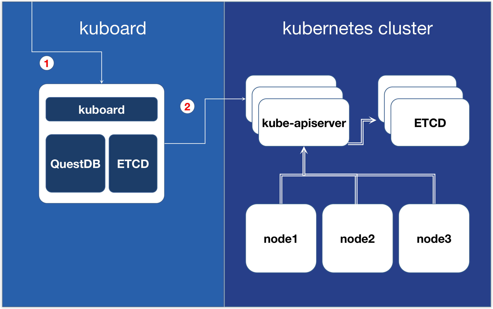
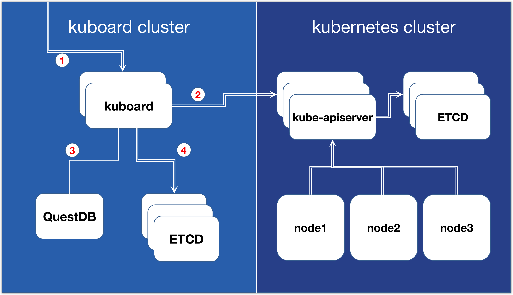

# 安装 Kuboard v3 - 高可用部署

* 普通部署模式可以满足绝大部分用户的需求；
* 普通部署模式不影响 Kubernetes 的高可用；
* 除普通部署模式外 Kuboard 提供高可用部署模式；

## 普通部署模式

相较于 Kuboard 的高可用部署模式，前面的几种安装模式都被认为是 Kuboard 的普通部署模式，包括：

* [安装 Kuboard v3 - 内建用户库](./install-built-in.html)
* [安装 Kuboard v3 - gitlab](./install-github.html)
* [安装 Kuboard v3 - github](./install-gitlab.html)
* [安装 Kuboard v3 - ldap](./install-ldap.html)
* [安装 Kuboard v3 - kubernetes](./install-k8s.html)

在普通部署模式下 Kuboard 通常只部署了一个容器实例，存在单点故障，因此 Kuboard 本身并不能保证高可用。但是在 Kuboard 出现故障时，并不影响 Kubernetes 的正常，因此，普通部署模式下安装的 Kuboard 是可以满足绝大部分用户的需求的。普通部署模式下，当 Kuboard 出现故障时，可以重新部署一个 Kuboard，并导入 Kubernetes 到新的 Kuboard 实例，即可恢复故障。

如下图所示，Kuboard 普通部署模式下，Kuboard 以及其依赖组件（包括 etcd / questdb）都与 Kuboard 部署在同一个容器实例中；

* 1. 用户访问 Kuboard 界面时，所有请求都被转发到该 Kuboard 容器实例；
* 2. Kuboard 在访问 Kubernetes API 时，只能指定一个 apiserver 的服务器地址。

Kubernetes 集群的高可用并不受 kuboard 影响，Kubernetes 实现高可用的方式，请参考 [Kubernetes 高可用](https://kuboard-spray.cn/guide/maintain/ha-mode.html)

  

在部分企业，对高可用的要求相对来说比较高，因此，Kuboard 自版本 `v3.5.0.0` 开始，提供了 Kuboard 的高可用部署模式。

## 高可用部署模式

Kuboard 高可用部署模式下，以集群的方式部署 Kuboard 实例，如下图所示：

* 1. 多个 Kuboard 实例以集群方式部署在负载均衡后面，任意一个 Kuboard 实例出现故障不会影响 Kuboard 的正常服务；
* 2. 导入集群时，可以将同一个集群的多个 kube-apiserver 的地址配置到集群信息中，这样，Kuboard 可以通过内嵌的负载均衡访问 kube-apiserver；
* 3. Kuboard 使用 QuestDB 存储审计日志，然而 QuestDB 目前并不支持高可用的集群部署，Kuboard 提供如下几种与 QuestDB 的连接方式：
  * 禁用审计日志，此时无需部署 QuestDB；
  * 忽略错误：独立部署单节点的 QuestDB，在 QuestDB 出现故障时，不记录审计日志；
  * 高一致性：独立部署单节点的 QuestDB，在 QuestDB 出现故障时，暂停 Kuboard 服务，待故障修复后恢复服务。
* 4. Kuboard 使用 ETCD 存储信息，高可用部署模式下，Kuboard 可以连接独立部署的 ETCD 集群：
  * 使用独立部署的 ETCD 集群存储 Kuboard 信息；
  * 与 Kubernetes 共享 ETCD 集群存储 Kuboard 信息。

  

Kuboard 高可用部署模式目前只提供给付费用户，[点击此处了解付费用户权益](/support/)。请扫描下面的微信二维码咨询：

  
  
扫码咨询高可用部署模式

