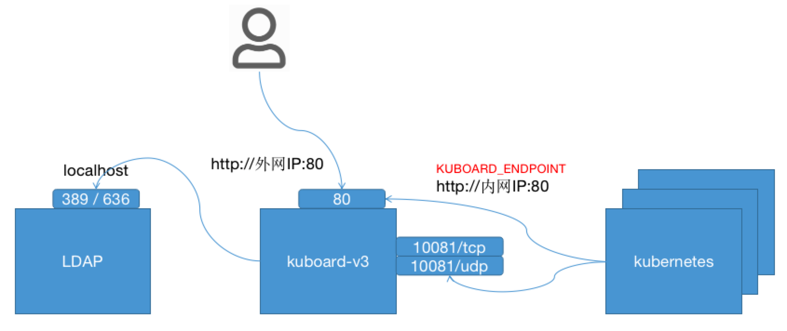
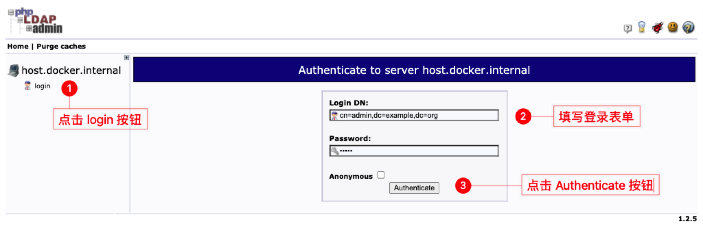
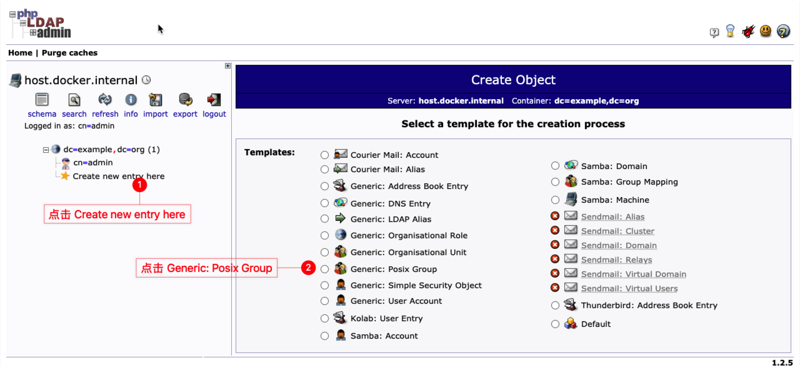
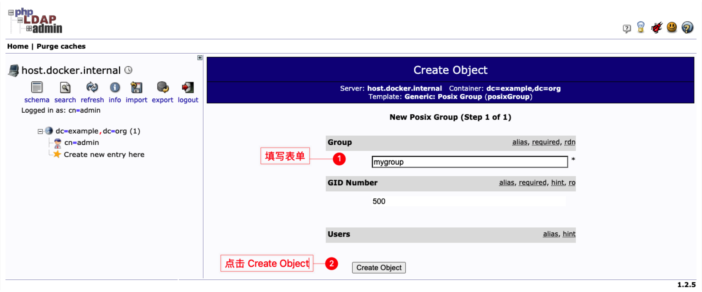
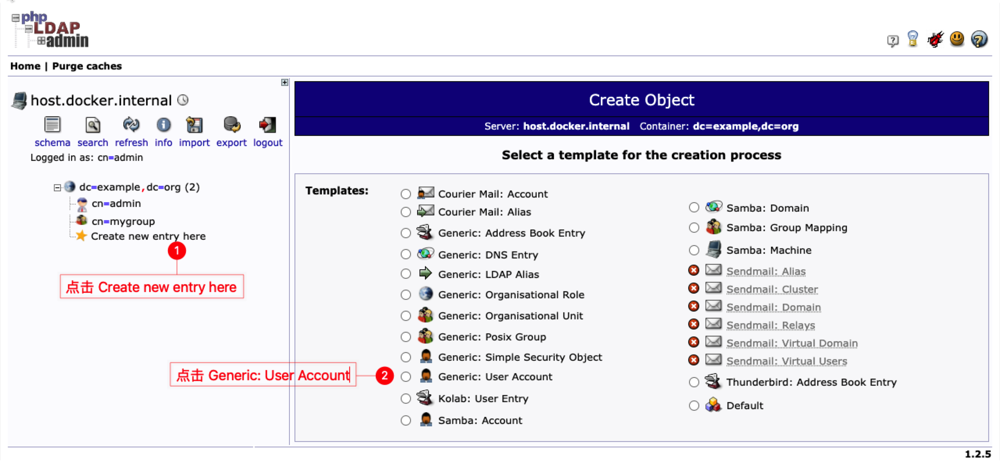
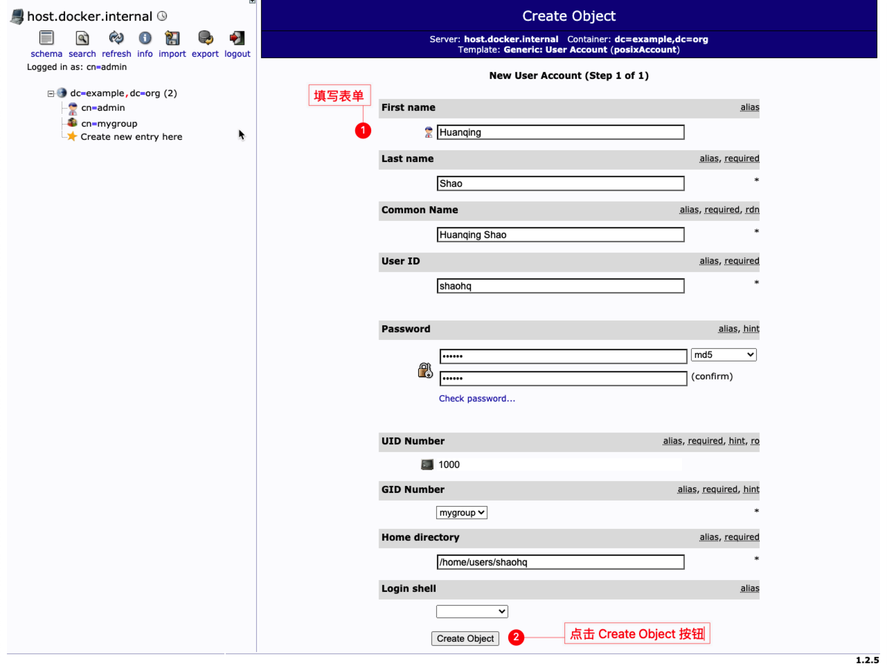
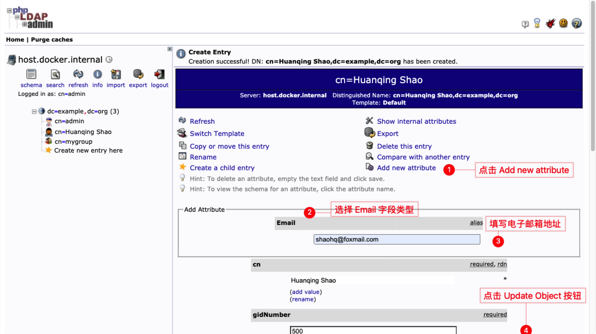
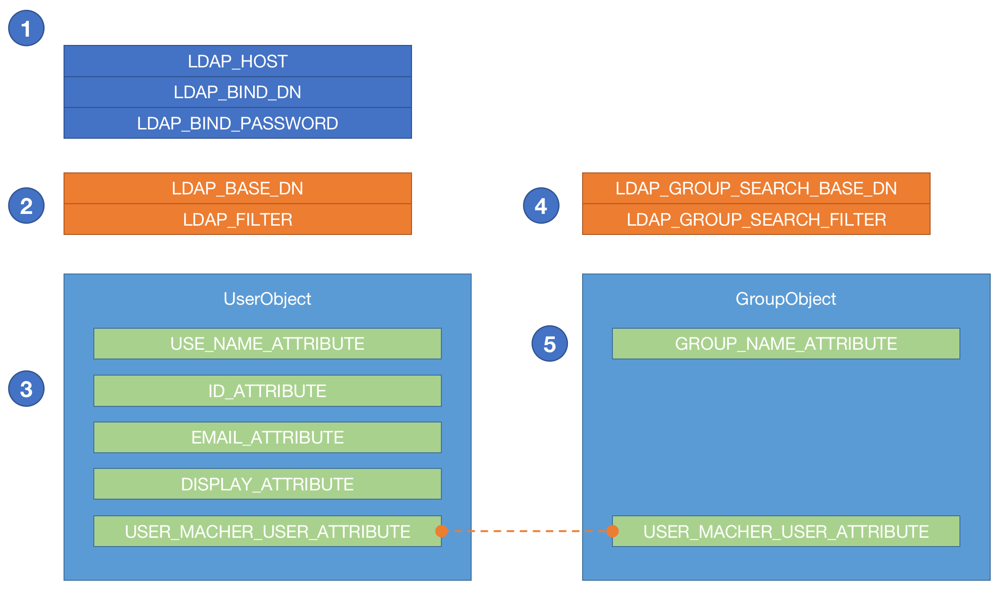

# 安装 Kuboard v3 - ldap

<AdSenseTitle/>


Kuboard 支持多种认证方式：

* 内建用户库
* GitLab Community Edition / GitLab Enterprise Edition / gitlab.com
* GitHub Enterprise / github.com
* LDAP

本文描述了如何配置 Kuboard v3 使用 LDAP 实现用户登录。

## 前提条件

* 用于安装 Kuboard v3.0 的机器已经安装了 docker，并且版本不低于 docker 19.03
* 您已经有自己的 Kubernetes 集群，并且版本不低于 Kubernetes v1.13

## 部署计划

在正式安装 kuboard v3 之前，需做好一个简单的部署计划的设计，在本例中，各组件之间的连接方式，如下图所示：


* 用户通过 http://外网IP:10080 访问 Kuboard v3；
* Kuboard 通过 `localhost:389` 和 `localhost:636` 访问 LDAP；
* 安装在 Kubernetes 中的 Kuboard Agent 通过 `内网IP:10080` 访问 Kuboard 的 Web 服务端口 10080 和 Kuboard Agent Server 端口 10081。




本例子中，假设：

* 您已经准备好了一个 Linux 服务器用于安装 Kuboard-V3

## 准备 LDAP

> 本章节将引导您搭建一个测试用的 LDAP，如果您使用已经有的 LDAP，可跳过本章节。

* 启动 Open LDAP

  > 下面启动 Open LDAP 的脚本仅用于测试，未考虑如何持久化，如何设置 TLS 等，更多信息请参考该脚本中所用容器的 [帮助文档](https://github.com/osixia/docker-openldap)
  ``` sh
  docker run -p 389:389 -p 636:636 --name my-openldap-container --detach osixia/openldap:1.4.0
  ```
  
* 启动 phpLDAPadmin

  ```sh
  docker run -p 6443:443 \
    --env PHPLDAPADMIN_LDAP_HOSTS=host.docker.internal \
    --detach osixia/phpldapadmin:0.9.0
  ```
  
* 登录 phpLDAPadmin
  
  在浏览器输入 `https://内网IP:10080:6443` ，按下图所示步骤登录 phpLDAPadmin：
  
  | 字段名称 | 字段值                     | 字段描述       |
  | -------- | -------------------------- | -------------- |
  | Login DN | cn=admin,dc=example,dc=org | 默认管理员用户 |
  | Password | admin                      | 管理员密码     |
  
  

* 添加用户组

  登录成功后，按照下图所示步骤，进入添加分组的表单：

  

  在表单中填写 `mygroup` 然后点击 ***Create Object*** 按钮，创建 `mygroup` 用户组，如下图所示：

  

  > 点击 ***Create Object*** 之后的界面中再次点击 ***Commit*** 按钮，才能完成对象的创建。

* 添加用户

  按照下图所示步骤，进入添加用户的表单：

  

  表单各字段填写说明：

  | 字段名称       | 字段值             |
  | -------------- | ------------------ |
  | First name     | Huanqing           |
  | Last name      | Shao               |
  | Common Name    | Huanqing Shao      |
  | User ID        | shaohq             |
  | Password       | 123456             |
  | GID Number     | mygroup            |
  | Home Directory | /home/users/shaohq |

  表单界面如下所示：

  

  点击上图中的 ***Create Object*** 按钮，然后再点击 ***Commit*** 按钮，将成功创建用户，并进入如下界面。按照如下步骤在该界面中为用户添加邮箱地址字段：

  * 点击 Add new attribute
  * 选择 Email 字段类型
  * 填写电子邮箱地址
  * 点击 Update Object 按钮

  

::: tip LDAP Demo

此时我们已经准备好了用于演示的 LDAP 环境：

* 快速安装了一个 LDAP 服务实例
* 创建了一个用户组 `mygroup`
* 创建了一个用户 `shaohq`，该用户归属于用户组 `mygroup`，其密码为 `123456`

:::

## 启动 Kuboard

使用如下命令启动 Kuboard v3：
``` sh
sudo docker run -d \
  --restart=unless-stopped \
  --name=kuboard \
  -p 10080:80/tcp \
  -p 10081:10081/udp \
  -p 10081:10081/tcp \
  -v /Users/shaohuanqing/temp/kuboard-data:/data \
  -e KUBOARD_LOGIN_TYPE="ldap" \
  -e KUBOARD_ENDPOINT="http://内网IP:10080" \
  -e KUBOARD_AGENT_SERVER_UDP_PORT="10081" \
  -e KUBOARD_AGENT_SERVER_TCP_PORT="10081" \
  -e KUBOARD_ROOT_USER="shaohq" \
  -e LDAP_HOST="host.docker.internal:389" \
  -e LDAP_BIND_DN="cn=admin,dc=example,dc=org" \
  -e LDAP_BIND_PASSWORD="admin" \
  -e LDAP_BASE_DN="dc=example,dc=org" \
  -e LDAP_FILTER="(objectClass=posixAccount)" \
  -e LDAP_ID_ATTRIBUTE="uid" \
  -e LDAP_USER_NAME_ATTRIBUTE="uid" \
  -e LDAP_EMAIL_ATTRIBUTE="mail" \
  -e LDAP_DISPLAY_NAME_ATTRIBUTE="cn" \
  -e LDAP_GROUP_SEARCH_BASE_DN="dc=example,dc=org" \
  -e LDAP_GROUP_SEARCH_FILTER="(objectClass=posixGroup)" \
  -e LDAP_USER_MACHER_USER_ATTRIBUTE="gidNumber" \
  -e LDAP_USER_MACHER_GROUP_ATTRIBUTE="gidNumber" \
  -e LDAP_GROUP_NAME_ATTRIBUTE="cn" \
  eipwork/kuboard:v3
  # 也可以使用镜像 swr.cn-east-2.myhuaweicloud.com/kuboard/kuboard:v3 ，可以更快地完成镜像下载。
  # 请不要使用 127.0.0.1 或者 localhost 作为内网 IP \
  # Kuboard 不需要和 K8S 在同一个网段，Kuboard Agent 甚至可以通过代理访问 Kuboard Server \
```

::: danger 
* KUBOARD_ENDPOINT 参数的作用是，让部署到 Kubernetes 中的 `kuboard-agent` 知道如何访问 Kuboard Server；
* KUBOARD_ENDPOINT 中也可以使用外网 IP；
* Kuboard 不需要和 K8S 在同一个网段，Kuboard Agent 甚至可以通过代理访问 Kuboard Server；
* 建议在 KUBOARD_ENDPOINT 中使用域名；
* 如果使用域名，必须能够通过 DNS 正确解析到该域名，如果直接在宿主机配置 `/etc/hosts` 文件，将不能正常运行；
:::

::: tip 参数说明
* 建议将此命令保存为一个 shell 脚本，例如 `start-kuboard.sh`，后续升级 Kuboard 或恢复 Kuboard 时，需要通过此命令了解到最初安装 Kuboard 时所使用的参数；
* 第 4 行，Kuboard v3.0 需要暴露 `80` 端口，如安装指令的第三行所示，默认映射到了宿主机的 `10080` 端口，您可以根据自己的情况选择宿主机的其他端口；
* 第 5、6 行，Kuboard v3.0 需要暴露 `10081` 端口 TCP / UDP，默认映射到了宿主机的 `10081` 端口，您可以根据自己的情况选择宿主机的其他端口；
* 第 7 行，Kuboard v3.0 的持久化数据存储在 `/data` 目录，默认映射到了宿主机的 `/root/kuboard-data` 路径，请根据您自己的情况进行调整；
* 第 8 行，将 Kuboard v3.0 与 GitLab 进行单点登录集成时，必须指定环境变量 `KUBOARD_LOGIN_TYPE` 为 `gitlab` （适用于 gitlab.com / gitlab-ee / gitlab-ce）；
* 第 9 行，必须指定 `KUBOARD_ENDPOINT` 环境变量为访问 Kuboard 界面的 URL；（如 [部署计划](#部署计划) 中所描述，本例子中，使用 `http://内网IP:10080` 作为通过执行此命令启动的 Kuboard 的访问 URL）；此参数不能以 `/` 结尾；
* 第 10、11 行，指定 KUBOARD_AGENT_SERVER 的端口为 `10081`，此参数与第 5、6 行中的宿主机端口应保持一致，修改此参数不会改变容器内监听的端口 `10081`；
* 第 12 行，必须指定 `KUBOARD_ROOT_USER`，使用该 GitLab 用户登录到 Kuboard 以后，该用户具备 Kuboard 的所有权限；
:::

### LDAP 相关参数

LDAP 相关的参数相对复杂，本章节以 Kuboard 集成 LDAP 时，对 LDAP 的查询顺序作为主线索，详细讲解 LDAP 的各个参数。

<p>
 
</p>

如上图所示：
* 第一步：连接 LDAP
  * 通过第 13 行 `LDAP_HOST` 参数找到 LDAP 服务器的地址；
  * 通过第 14、15 行 `LDAP_BIND_DN`、`LDAP_BIND_PASSWORD` 两个参数作为用户名密码创建与 LDAP 的连接；
* 第二步：查询用户信息
  * 通过第 16、17 行 `LDAP_BASE_DN`、`LDAP_FILTER`以及登录界面中输入的用户名，共三个参数查询到唯一的一个用户对象；
  * 其中，登录界面中输入的用户名将必须与第 18行 `LDAP_ID_ATTRIBUTE` 指定的 LDAP 对象中用户 ID 的字段名称项匹配；
* 第三步：映射用户信息
  * 将第 19、20、21 行 `LDAP_USER_NAME_ATTRIBUTE`、`LDAP_EMAIL_ATTRIBUTE`、`LDAP_DISPLAY_NAME_ATTRIBUTE` 所指定对象字段的取值作为用户名、电子邮件地址、用户全名的信息；
* 第四步：查询用户组信息
  * 将第 22、23 行 `LDAP_GROUP_SEARCH_BASE_DN`、`LDAP_GROUP_SEARCH_FILTER` 指定的参数用作检索用户组的条件；
  * 检索用户组时，第二步所得用户信息的 `LDAP_USER_MACHER_USER_ATTRIBUTE`（第 24 行） 所指定字段的值必须与 `LDAP_USER_MACHER_GROUP_ATTRIBUTE`（第 25 行） 所指定的用户组字段的取值相匹配；
* 第五步：映射用户组信息
  * 将第 26 行 `LDAP_GROUP_NAME_ATTRIBUTE` 所指定的用户组字段映射为用户组名称

通过上述五个步骤，Kuboard 可以从 LDAP 中检索到用户的基本信息，以及用户组信息，密码字段默认使用用户信息中的 `password` 字段。获得这些信息后，用户可以使用 LDAP 中的信息登录 Kuboard。

## 访问 Kuboard 界面

* 在浏览器中输入 `http://外网IP:10080`，将进入登录界面；
* 在登录界面中输入您在 LDAP 中的用户名、密码，并点击登录按钮，您将可以成功登录 Kuboard。
## 授权用户访问 Kuboard

默认情况下，只有 `KUBOARD_ROOT_USER` 参数指定的用户可以执行 Kuboard 中的所有操作，其他用户通过单点登录进入 Kuboard 系统后，除了退出系统，几乎什么事情也做不了。为了让单点登录的用户获得合适的权限，您需要在 Kuboard 中为对应的用户/用户组授权。请参考 [为单点登录的用户/用户组授权](./auth-user-sso.html)
