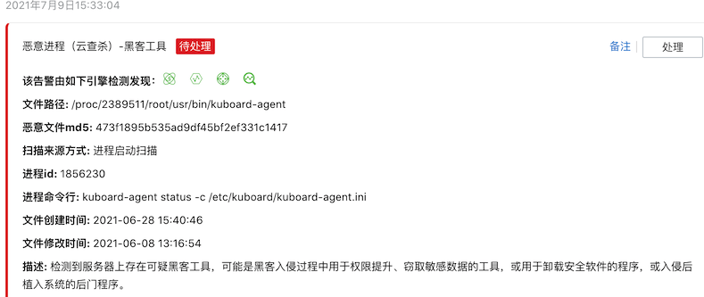

# 安装 Kubernetes 多集群管理工具 - Kuboard v3

<AdSenseTitle/>

## Kuboard v3.x 版本说明

Kuboard v3.x 支持 Kubernetes 多集群管理。如果您从 Kuboard v1.0.x 或者 Kuboard v2.0.x 升级到 Kuboard，请注意：
* 您可以同时使用 Kuboard v3.x 和 Kuboard v2.0.x；
* Kuboard v3.x 支持 amd64 (x86) 架构和 arm68 (armv8) 架构的 CPU；

点击此处可以查看 <KuboardDemo suffix="install" label="在线演示" color="#007af5"/>

## 兼容性

| Kubernetes 版本 | Kuboard 版本   | 兼容性 | 说明                                                         |
| --------------- | -------------- | ------ | ------------------------------------------------------------ |
| v1.22           | v3.x | 😄      | 已验证                            |
| v1.21           | v3.x | 😄      | 已验证                            |
| v1.20           | v3.x | 😄      | 已验证                            |
| v1.19           | v3.x | 😄      | 已验证                            |
| v1.18           | v3.x | 😄      | 已验证                            |
| v1.17           | v3.x | 😄      | 已验证                            |
| v1.16           | v3.x | 😄      | 已验证                            |
| v1.15           | v3.x | 😄      | 已验证                            |
| v1.14           | v3.x | 😄      | 已验证                            |
| v1.13           | v3.x | 😄      | 已验证                       |
| v1.12           | v3.x | 😐      | Kubernetes Api v1.12 不支持 dryRun， Kuboard 不支持 Kubernetes v1.12 |
| v1.11           | v3.x | 😐      | Kuboard 不支持 Kubernetes v1.11                                                         |

## 安装方式

基于如下原因，建议您以 docker run 的方式运行 Kuboard：
* 结构更清晰（Kuboard 作为多个集群的管理界面应该独立于任何集群之外，虽然安装在 Kubernetes 集群中的 Kuboard 也可以管理多个集群）；
* 登录 Kuboard 时使用不同的认证方式；
* 问题排查更简单；

请参考：

* [内建用户库认证](./install-built-in.html)  （支持双因子认证 ）<badge>推荐</badge>
* [GitLab 单点登录](./install-gitlab.html)
* [GitHub 单点登录](./install-github.html)
* [LDAP 认证](./install-ldap.html)

此外，您也可以通过一行命令，即可 [将 Kuboard 安装到 Kubernetes 集群中](./install-in-k8s.html) 

## 安全提示

自 Kuboard v3.2.0.0 开始，支持 `kubeconfig` 和 `kuboard-agent` 两种方式导入集群。

当您使用 kuboard-agent 方式导入集群，且您的服务器有主机安全扫描时，您可能会碰到类似如下的提示信息：

这是因为 kuboard-agent 这个程序是由 [https://github.com/fatedier/frp](https://github.com/fatedier/frp) 编译而来，frp 是的内网穿透工具，Kuboard 使用此工具将 k8s-apiserver 的端口映射到 kuboard 所在容器的内部端口（绑定到 127.0.0.1，对外不可访问），以实现 kuboard-agent 可以通过代理服务器与 kuboard 连接的效果。

与此相关的配置，您可以具体参考
* kuboard-agent 容器的 `/etc/kuboard/kuboard-agent.ini` 文件
* kuboard 容器的 `/etc/kuboard/kuboard-agent-server.ini` 文件

frp 作为一个广泛被认可（github 46800+ star）的内网穿透工具，并不存在恶意代码，只是因为其作为`内网穿透工具`的性质，才被主机安全扫描工具提示。由于 Kuboard 中 frp 端口映射并没有离开您自己掌控的网络环境，因此，您可以忽略这个安全扫描提示。

## 从 v2.0.x 升级到 v3.x

与 v2.0.x 相比，v3.x 不再部署在 Kubernetes 中，而是作为一个独立的容器运行。

* 由于运行模式不同，v2.0.x 与 v3.x 可以同时存在互不干扰。

* Kuboard v3.x 将 Kuboard 部署的大部分内容从 kube-system 名称空间迁移到 kuboard 名称空间，这也使得两个版本能够同时存在于同一个 Kubernetes 集群。

* 如果您最终决定从 Kuboard v2.0.x 迁移到 Kuboard v3，请在 Kuboard v2.0.x 的界面中卸载掉 Kuboard 套件，并在 Kuboard v3 中重新安装 Kuboard 套件。
