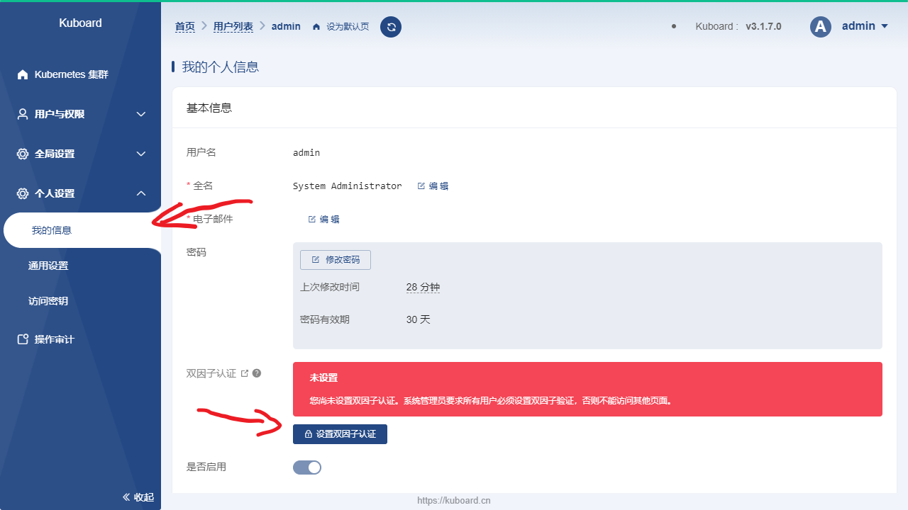
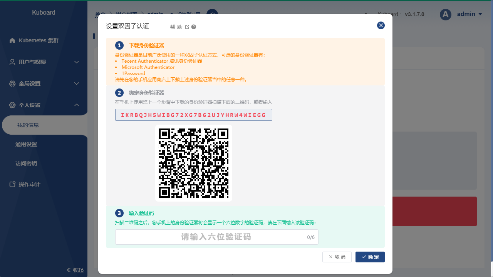
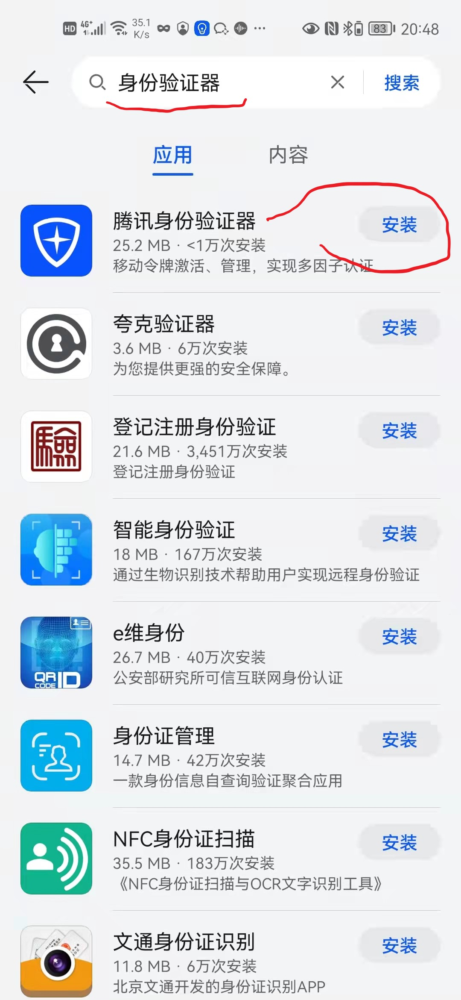
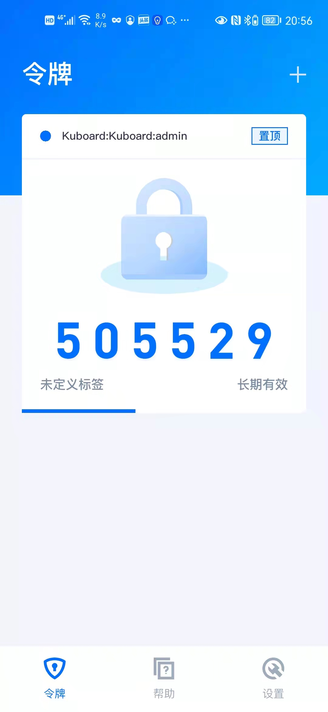
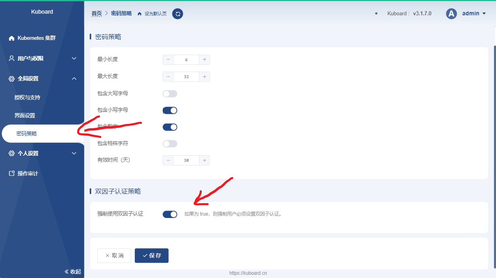

# 双因子认证

<AdSenseTitle/>

当您使用 [Kuboard 内建用户库](./install-built-in.html) 时，可以激活双因子认证以提高安全性。双因子认证可以提供基于时间的一次性验证码，避免他人在您不知情的情况下登录系统。本文描述了用户如何激活自己账号的双因子认证，同时也描述了 Kuboard 管理员如何强制所有用户激活双因子认证。

## 前提条件

* Kuboard 版本不低于 <b-badge variant="primary">v3.1.7.0</b-badge>
* 使用 [Kuboard 内建用户库](./install-built-in.html)

## 用户激活双因子认证

按照下面的步骤操作，可以激活双因子认证：

* 登录 Kuboard 后，导航到 `个人设置` --> `我的信息` 菜单，如下图所示：

  

* 在上图中，点击 `设置双因子认证` 按钮，将进入双因子设置界面，如下图所示：

  

* 打开手机上的 `应用商店`，并在应用商店中搜索 `身份验证器`，并使用 `腾讯身份验证器` 扫描上图中的二维码，过程如下所示：

  

    

      应用商店搜索并安装 身份验证器
      

        
      

    

    

      使用身份验证器扫描二维码
      

        
      

    

    

      获得令牌及一次性验证码
      

        
      

    

  

  ::: tip 身份验证器
  基于时间的身份验证器是普遍使用的双因子验证方式，有许多此类应用工具都是基于相同的标准提供基于时间的一次性验证码。经验证与 Kuboard 双因子验证相兼容的身份验证 APP 有：`腾讯身份验证器`、`MicroSoft Authenticator`、`Google Authenticator`、`1Password`、`夸克验证器` 等，推荐使用 `腾讯身份验证器`。
  :::

* 在 Kuboard 界面中输入手机 `身份验证器` APP 上获得的六位数字验证码，然后将进入如下界面：

  

  ::: tip 恢复码
  由于手机可能丢失、忘记携带等，您可以使用此步骤中保存的恢复码重置双因子认证。您也可以要求管理员帮助您重置自己的双因子认证。
  :::

* 此时，您已完成了 Kuboard 的双因子认证设置，在您下次登录 Kuboard 时，您将需要同时使用用户密码和 `身份验证器` 上的一次性验证码登录 Kuboard。

## 强制使用双因子认证

使用 `admin` 账号登录 Kuboard，切换到菜单 `全局设置` --> `密码策略`，勾选 `强制使用双因子认证`，并保存。此时，用户登录后必须完成双因子认证设置，才能正常使用 Kuboard。如下图所示：

