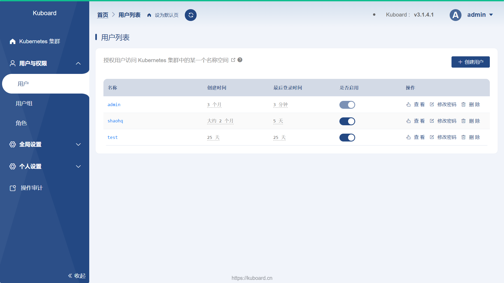

# 重置密码

<AdSenseTitle/>

如果您安装 Kuboard 时使用了 [内建用户库](./install-built-in.html) ，您可以通过本文所描述的方式重置您在 Kuboard 中的密码。

> [在 K8S 中安装 Kuboard v3](./install-in-k8s.html) 时，默认也是使用的内建用户库作为认证方式。

## 重置普通用户的密码

如果您是普通用户，忘记密码时，请联系管理员，由管理员通过菜单 `用户与权限` --> `用户` 为您重置密码，截图如下所示：



## 重置 admin 的密码

如果您忘记了管理员 admin 的密码，请登录 kuboard 的命令行终端，并执行命令 `kuboard-admin reset-password`。

* 登录 kuboard 命令行终端

  <b-card no-body>
  <b-tabs content-class="mt-3" card pills>
  <b-tab title="我使用 docker run 运行 Kuboard" active>

    如果您使用 docker run 命令运行 Kuboard，在 Kuboard 所在的服务器上执行如下指令，可以进入 Kuboard 容器的命令行界面
    ```sh
    docker exec -it kuboard /bin/bash
    ```
  </b-tab>
  <b-tab title="我的 Kuboard 安装在 K8S 中">
    
    如果您的 Kuboard 安装在 K8S 中，您可以使用该 K8S 的 kubectl 指令进入 Kuboard 容器的命令行界面
    ```sh
    kubectl exec -it -n kuboard $(kubectl get pods -n kuboard | grep kuboard-v3 | awk '{print $1}') -- /bin/bash
    ```
  </b-tab>
  </b-tabs>
  </b-card>

* 执行重置密码的命令

  在 Kuboard 容器的命令行界面中执行 `kuboard-admin reset-password` 命令，结果如下图所示：
  ```sh
  root@kuboard-v3-7bb6c5588c-47wvk:/# kuboard-admin reset-password
  设置日志级别为 info
  Using config file: /root/.kuboard/conf.yaml
  2021/07/29 20:41:11.471 |  info | etcd-endpoints: 192.168.32.89:2381
  2021/07/29 20:41:11.471 |  info | try to reset-password
  2021/07/29 20:41:11.479 |  info | 已将 admin 的密码重置为 Kuboard123
  ```

  至此，您已经成功重置了用户 `admin` 的密码为 `Kuboard123`