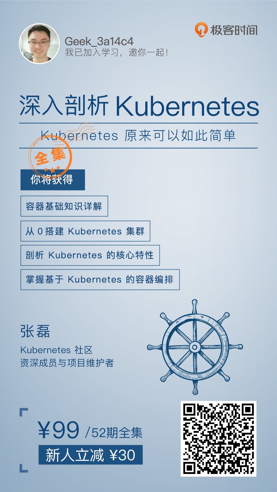

# Kubernetes 学习路径推荐

## **Kubernetes 入门**
  * [0. 学习Kubernetes基础知识](/learning/k8s-basics/kubernetes-basics.html) (10分钟)
    * [1. 部署第一个应用程序](/learning/k8s-basics/deploy-app.html) (5分钟)
    * [2. 查看 Pods / Nodes](/learning/k8s-basics/explore.html) (10分钟)
    * [3. 公布应用程序](/learning/k8s-basics/expose.html) (10分钟)
    * [4. 伸缩应用程序](/learning/k8s-basics/scale.html) (10分钟)
    * [5. 执行滚动更新](/learning/k8s-basics/update.html) (10分钟)
  * [6. 复习Kubernetes核心概念](/learning/k8s-basics/k8s-core-concepts.html) (10分钟)

## **Kubernetes 进阶**
  * [通过互联网访问您的应用](/learning/k8s-intermediate/ingress.html)
  * [使用 ConfigMap 配置您的应用程序](/learning/k8s-intermediate/config-map.html)
  * [使用私有 registry 中的 docker 镜像](/learning/k8s-intermediate/private-registry.html)
  * 持久化数据
    * [数据卷 Volume](/learning/k8s-intermediate/persistent/volume.html)
    * [存储卷 PV 和存储卷声明 PVC](/learning/k8s-intermediate/persistent/pv.html)
    * [存储类 StorageClass](/learning/k8s-intermediate/persistent/storage-class.md)

## **课程推荐**

作者认为，基础比较好的同学，在学完 **Kubernetes 入门** 部分的内容后，就可以根据 Kubernetes 的官网文档和 docker 的官网文档，结合实际项目将 Kubernetes 应用得很好。同时，作者也在逐步完善 **Kubernetes 进阶** 的学习内容，更好的帮助大家在项目中落地 Kubernetes。但是鉴于时间和进度的原因，短期内仍然不能很好的通过 www.kuboard.cn 满足 Kubernetes 爱好者迫切的学习意愿。

在这种情况下，作者向大家推荐一份视频课程。该课程价格为 99 元，新注册用户享有 30 元现金优惠，也就是只需要 69 元 即可购买该套课程。
点击此处购买 <a>深入剖析Kubernetes</a> ，或扫描图片中的二维码。

  </img>

