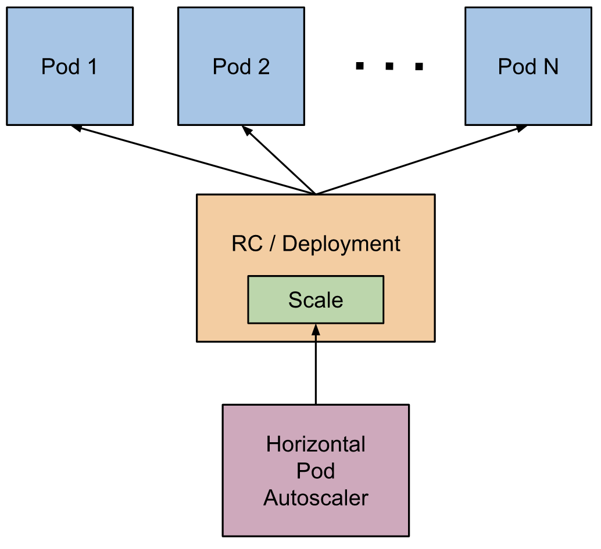

# 自动伸缩

<AdSenseTitle/>

本文翻译自 Kubernetes  [Horizontal Pod Autoscaler](https://kubernetes.io/docs/tasks/run-application/horizontal-pod-autoscale/)。

Horizontal Pod Autoscaler 根据观察到的 CPU 利用率（或某些由应用程序提供的 [custom metrics](https://git.k8s.io/community/contributors/design-proposals/instrumentation/custom-metrics-api.md)）自动调整控制器（Replication Controller / Deployment / ReplicaSet / StatefulSet）的 Pod 的数量。Horizontal Pod Autoscaler 不能应用于不可伸缩的对象，例如 DaemonSet。

Horizontal Pod Autoscaler 被实现为 Kubernetes 中的一个 API 对象及一个 [控制器](/learning/k8s-bg/architecture/controller.html)。API 对象定义了控制器的行为；控制器则周期性地调整 Deployment（或 Replication Contoller / ReplicaSet / StatefulSet）中的 Pod 副本数（replicas字段），使其匹配用户在 API 对象中定义的平均 CPU 利用率。


## Horizontal Pod Autoscaler 的工作方式

<p>
</img>
</p>

Horizontal Pod Autoscaler 被实现为一个控制循环，通过 controller manager 的参数 `--horizontal-pod-autoscaler-sync-period` 可以控制该循环的周期（默认值为 15 秒）。

在每个循环周期内，controller manager 所有 HorizontalPodAutoscaler 对象中指定的度量信息（metrics）。查询的方式可以是通过 resource metrics API （metrics-server，pod 的资源度量信息CPU/内存）或者 custom metrics API（所有其他度量信息）。

* 如果 HorizontalPodAutoscaler 中指定了使用 pod 的资源度量（例如 CPU）来说，则 controller 从 resource metrics API （通常使用 metrics-server）获取目标 Pod 的度量信息。如果 HorizontalPodAutoscaler 中指定的是资源利用率，则 controller 将度量值除以 Pod 中定义的容器的资源请求，得到一个以百分比表示的资源利用率；如果 HorizontalPodAutoscaler 中指定的是原始值，则直接使用从 resource metrics API 中获取的结果。此时，contoller 将所有目标 Pod 的资源利用率（或原始值）求平均，并计算出一个比例，用于调整期望副本数的值。
  > 请注意，如果某些 Pod 的容器没有设置 CPU 的 [资源请求](/learning/k8s-intermediate/config/computing-resource.html)，则 controller 不能计算该 Pod 的 CPU 利用率，contoller 也就不能 针对 HorizontalPodAutoscaler 中定义的 CPU 利用率执行任何操作。请参考 [算法](#算法) 章节，了解更多与之相关的内容。
* 对于 Pod 的自定义度量（custom metrics），controller 的工作机制与上述过程相似，区别在于，自定义度量只支持原始值，不支持资源利用率的值。
* 对于 object metrics 和 external metrics，controller 将会获取单个度量对象，并将其与目标值做对比，按照与上述方式相似的做法计算百分比。在 API `autoscaling/v2beta2` 这个版本中，在实际做对比之前，还可以将该取值除以 Pod 的数量。

HorizontalPodAutoscaler 通常从一系列 [聚合 API](/learning/k8s-advanced/extend/aggregation.html) 中获取度量信息（`metrics.k8s.io`，`custom.metrics.k8s.io`，`external.metrics.k8s.io` 等）。`metrics.k8s.io` 的接口通常由 metrics-server 提供，（通常，安装 Kuboard 之后，您已经安装了 metrics-server）。HorizontalPodAutoscaler 也可以从 Heapster 直接获取度量信息。

::: warning Deprecated
自 Kubernetes 1.11 开始，已经不推荐从 Heapster 中获取度量信息。
:::

### 算法

简单地说，Horizontal Pod Autoscaler 控制器基于期望的度量值和当前度量值之间的比例运作：
```
desiredReplicas = ceil[currentReplicas * ( currentMetricValue / desiredMetricValue )]
```
例如，当前的度量值是 `200m`，期望的度量值是 `100m`，则副本数将被翻倍，因为 `50.0 / 100.0 = 0.5`。如果这个比例足够靠近 1.0 （差值小于 `--horizontal-pod-autoscaler-tolerance` 参数，默认值为 0.1），控制器将不会执行自动伸缩。

如果指定了 `targetAverageValue` 或者 `targetAverageUtilization`，则 `currentMetricValue` 的计算方式是对 HorizontalPodAutoscaler 的伸缩目标中所有的 Pod 的度量求平均值。在检查容忍差异并确定最终的取值之前，Controller 会同时考虑 Pod 的就绪情况以及缺失度量信息的情况。

那些已设置了 deletion timestamp （例如，正在被关闭的 Pod）以及已经出于失败（Failed）状态的 Pod 的信息不会被纳入 HorizontalPodAutoscaler 的考量范围。

如果某个 Pod 缺失度量信息，则在计算度量值的时候会暂时搁置，但是在调整最终的伸缩数量时，会将其考虑进来。

当基于 CPU 度量进行伸缩时，如果某个 Pod 尚未就绪（例如，仍在初始化）或者在就绪之前就已经接收到了其 CPU 度量信息，则计算度量值的时候也会暂时搁置。

由于技术上的限制，HorizontalPodAutoScaler 控制器不能精确确定 Pod 首次就绪的时间，并以此为依据确定是否考虑该 Pod 的 CPU 度量。作为替代，HorizontalPodAutoScaler 控制器将在 Pod 启动后的特定长度的时间窗口（可通过参数 `--horizontal-pod-autoscaler-initial-readiness-delay` 配置，默认值是 30 秒）内检查 Pod 是否就绪，如果未就绪，则认为该 Pod “尚未就绪（not yet ready）”。一旦 Pod 进入就绪状态，控制器会将自 Pod 启动以来特定时间段（可通过 `--horizontal-pod-autoscaler-cpu-initialization-period` 参数配置，默认值是 5 分钟）内的任意转换为就绪状态的事件当做第一次就绪时间。

此时，控制器已经将一部分 Pod 暂时搁置，并依据剩余的 Pod 计算伸缩比例 `currentMetricValue / desiredMetricValue` 。

如果存在缺失度量信息的 Pod，HorizontalPodAutoScaler 控制器将以比较保守的方式重新计算平均值：向上伸缩（Scale Down）时，假设这些 Pod 消耗了 100% 的资源，向下伸缩（Scale Up）时，假设这些 Pod 消耗了 0% 的资源。这种计算方式将减少伸缩的尺度（副本数），因此是一种保守的计算方式。

进一步的来说，当 HorizontalPodAutoScaler 控制器尝试向上伸缩时，如果存在未就绪的 Pod 或者度量信息缺失的 Pod，控制器将采取这种相对保守的策略，假设这类 Pod 的资源使用率为 0%，以避免过度的向上伸缩。

在按照上述方式考虑了未就绪 Pod 和缺失度量值的 Pod 之后，控制器将重新计算资源利用率。如果新的资源利用率使得伸缩方向反转，或者在可以容忍的范围内，控制器将跳过此次伸缩，否则，控制器将使用新计算的资源利用率执行伸缩。

> 请注意，HorizontalPodAutoscaler 的 status 字段中显示的平均资源利用率，并没有将未就绪的 Pod 或缺失度量值的 Pod 纳入计算。

如果一个 HorizontalPodAutoScaler 中指定了多个度量值，上述计算过程将被应用到每一个指定的度量值上，并各自计算伸缩的目标副本数，最终较大的那个目标副本数将被选中。如果不能依据某个指定的度量值计算伸缩的目标副本数（例如，不能获取到 Pod 的度量值），而依据其他度量值所计算的结果建议执行向下伸缩，则控制器会跳过此次伸缩。此外，当有一个或多个度量值对应的期望副本数大于当前的副本数时，控制器将继续执行向上伸缩。

最后，在 HorizontalPodAutoscaler 控制器对目标执行伸缩操作之前，伸缩建议将被记录下来。控制器将会在特定时间窗口（通过 `--horizontal-pod-autoscaler-downscale-stabilization` 参数设置，默认值为 5 分钟）内，对所有记录下来的伸缩建议进行权衡，并选取窗口内最高的伸缩建议执行最终的伸缩操作。如此一来，向下伸缩将会逐步进行，以便使因为伸缩带来的度量值曲线的波动变得更加平滑。

## API 对象

Horizontal Pod Autoscaler 是 Kubernetes `autoscaling` API 组中的一个 API 资源。当前的稳定版本是 `autoscaling/v1`，只支持依据 CPU 进行自动伸缩。当前的 Beta 版本是 `autoscaling/v2beta2`，可以支持依据内存或自定义度量值进行伸缩。如果要在 `autoscaling/v1` 中使用 `autoscaling/v2beta2` 中新增支持的字段，可以将这些字段以注解（annotation）添加到 `autoscaling/v1` 的 API 对象中。

在创建 HorizontalPodAutoscaler 对象时，需确保其名称是有效的 [DNS subdomain name](/learning/k8s-intermediate/obj/names.html#dns-subdomain-names)。更多细节请参考 [HorizontalPodAutoscaler](https://kubernetes.io/docs/reference/generated/kubernetes-api/v1.18/#horizontalpodautoscaler-v1-autoscaling)

## kubectl 对 HorizontalPodAutoscaler 的支持

通其他 API 对象一样，`kubectl` 以一种标准的方式支持 HorizontalPodAutoscaler：
* 可以使用 `kubectl create` 命令创建新的 HorizontalPodAutoscaler；
* 可以使用 `kubectl get hpa` 查询 HorizontalPodAutoscaler 列表；
* 可以使用 `kubectl describe hpa` 获取 HorizontalPodAutoscaler 详情；
* 可以使用 `kubectl delete hpa` 删除 HorizontalPodAutoscaler 对象。

除此之外，`kubectl autoscale` 命令是特别为 HorizontalPodAutoscaler 准备，用于更便捷地创建 HorizontalPodAutoscaler。例如，执行 `kubectl autoscale rs foo --min=2 --max=5 --cpu-percennt=80` 可以为 ReplicationSet `foo` 创建一个 HorizontalPodAutoscaler，并将目标 CPU 利用率设置为 `80%` 并且副本数在 2 和 5 之间。关于 `kubectl autoscale` 更详细的文档请参考 [kubectl autoscale](https://kubernetes.io/docs/reference/generated/kubectl/kubectl-commands/#autoscale)

## 滚动更新与自动伸缩

Kubernetes 中，Deployment 对象可以执行 [滚动更新](/learning/k8s-basics/update.html)。HorizontalPodAutoscaler 则绑定到 Deployment 对象，根据观察到的度量信息调整 Deployment 的副本数（.spec.replicas 字段），由 Deployment 来负责调整实际的 Pod 数量。

HorizontalPodAutoscaler 不会直接操作 Deployment 所管理的 ReplicationSet，因此，您不能将 HorizontalPodAutoscaler 绑定到 ReplicationSet （ReplicationController）并期望执行滚动更新。因为，当滚动更新时创建一个新的 ReplicationSet（ReplicationController）之后，HorizontalPodAutoscaler 不能被绑定到新的 ReplicationSet（ReplicationController）。

## 对 cooldown/delay 的支持

当使用 HorizontalPodAutoscaler 管理一组副本的规模（数量多少）时，由于度量信息快速的动态变化，很可能会发生副本数频繁波动的情况。这种现象被称为 ***thrashing***。

自 Kubernetes v1.6 开始，集群管理员可以通过设置 `kube-controller-manager` 组件的 HPA 全局参数来应对这种现象。

自 Kubernetes v1.12 开始，新的算法更新后，不再需要向上伸缩的延迟等待了。

* `--horizontal-pod-autoscaler-downscale-stabilization`：此参数指定了自动那个伸缩器在本次伸缩执行完之后，执行下一次向下伸缩前需要等候的时长。默认值是 5分钟。

::: warning 注意
调整此参数时，集群管理员需要注意可能的后果：
* 如果延迟（cooldown）时间设置太长，可能导致 HorizontalPodAutoscaler 对工作载荷的变化响应不够及时；
* 如果延迟（cooldown）时间设置的太短，副本数仍将频繁波动。
:::

## 对多个度量值的支持

Kubernetes 1.6 开始支持基于多个度量值进行自动伸缩。您可以使用 `autoscaling/v2beta2` API 对象来为 HorizontalPodAutoscaler 指定多个度量值。此时，HorizontalPodAutoscaler 控制器将评估每一个度量值，并计算由此度量值得到的伸缩目标副本数。所有度量值得出的各个伸缩目标副本数中最大的那个将被最终采纳。

## 对自定义度量值的支持

::: tip Note
Kubernetes 1.2 添加了 alpha 特性，可支持通过特殊的注解（annotation）基于特定于应用程序的度量进行伸缩。在 Kubernetes 1.6 中移除了这些注解，并采用了新的自动伸缩接口。尽管旧的收集自定义度量的方法仍然可用，但是 HorizontalPodAutoscaler 不能再使用这些度量，之前的通过注解指定自定义度量进行伸缩的方式也不再生效。
:::

Kubernetes 1.6 增加了基于自定义度量进行自动伸缩的特性。您可以为在 `autoscaling/v2beta2` 中为 HorizontalPodAutoscaler 添加自定义度量用于自动伸缩。Kubernetes 将查询新的自定义度量 API 以获取合适的自定义度量值。

请查看下面的章节 [对 metrics API 的支持]了解更多细节。

## 对 metrics API 的支持

默认情况下， HorizontalPodAutoscaler 控制器从一系列接口中获取度量信息。为了使 HorizontalPodAutoscaler 控制器可以访问这些 API，集群管理员必须确保：

* [API aggregationn layer](https://kubernetes.io/docs/tasks/extend-kubernetes/configure-aggregation-layer/) 已被启用
* 对应的 API 已注册：
  * 对于资源度量，需要的 API 是 `metrics.k8s.io`，通常由 [metrics-server](https://github.com/kubernetes-incubator/metrics-server) 提供。可以作为集群的插件安装；
  * 对于自定义度量，需要的 API 是 `custom.metrics.k8s.io`，通常由第三方的自定义度量适配器提供。在此处可以查询到 [已经支持的自定义度量解决方案](https://github.com/kubernetes/metrics/blob/master/IMPLEMENTATIONS.md#custom-metrics-api)。如果您想要编写自己的自定义度量，请查看 [boilerplate](https://github.com/kubernetes-sigs/custom-metrics-apiserver)
  * 对于外部的度量，需要的 API 是 `external.metrics.k8s.io`，通常由上述的自定义度量适配器提供。
* `--horizontal-pod-autoscaler-use-rest-clients` 参数被设置为 `true` 或者未设置。将此参数设置为 fales 时，将切换到基于 Heapster 的自动伸缩，此做法已经不被推荐了。

关于这些度量接口路径的详细信息以及它们之间的区别，请查看你相关的设计文档
* [HPA V2](https://github.com/kubernetes/community/blob/master/contributors/design-proposals/autoscaling/hpa-v2.md)
* [custom.metrics.k8s.io](https://github.com/kubernetes/community/blob/master/contributors/design-proposals/instrumentation/custom-metrics-api.md)
* [external.metrics.k8s.io](https://github.com/kubernetes/community/blob/master/contributors/design-proposals/instrumentation/external-metrics-api.md)

## 对可配置自动伸缩行为的支持

自 Kubernetes v1.18 开始，`v2beta2` API 可以在 HPA `behavior` 字段中配置自动伸缩的行为。`behavior.scaleUp` 和 `behavior.scaleDown` 分别对应了向上伸缩的行为和向下伸缩的行为。对于 scaleUp 和 scaleDown，均可配置一个稳定的时间窗口（Stabilization Window），以避免目标副本数的频繁波动。类似的，伸缩策略可以控制自动伸缩过程中的副本数改变的速率。

### 伸缩策略

`behavior` 字段中可以指定一个或多个伸缩策略。当多个伸缩策略出现是，允许最大变更的伸缩策略将被默认选中。下面是一个向下伸缩的策略定义的 YAML 片段：

``` yaml
behavior:
  scaleDown:
    policies:
    - type: Pods
      value: 4
      periodSeconds: 60
    - type: Percent
      value: 10
      periodSeconds: 60
```

当 Pod 的数量高于 40 时，第二个策略将在向下伸缩时使用。例如，如果存在 80 个副本，并且向下伸缩的目标副本数时 10，则，在第一轮伸缩中，将缩减 8 个副本；在第二轮伸缩中，副本数变成了 72，它的 10% 是 7.2，向上取整为 8，第二轮将再次缩减 8 个副本。在每一轮的伸缩过程中，自动伸缩控制器都将基于当前的副本数重新计算将要调整的副本数。当副本数降低到小于 40 时，第一个策略将被使用，每次将要缩减 4 个副本。

`.spec.behavior.scaleDown.periodSeconds` / `.spec.behavior.scaleUp.periodSeconds` 字段指定了该策略的有效时间。第一个策略允许一分钟内最多缩减 4 个副本；第二个策略允许一分钟内最多缩减当前副本数的 10%。

此外，可以通过指定 `.spec.behavior.scaleDown.selectPolicy` / `.spec.behavior.scaleUp.selectPolicy` 字段可以指定选择策略的方式：
* 如果该字段被设置为 `Min`，将选择变更数最少的策略；
* 如果该字段被设置为 `Disabled`，将禁用该方向的自动伸缩。

### 稳定窗口（Stabilization Window）

稳定窗口的作用是，在度量值持续波动的情况下，避免副本数随着频繁变更。自动伸缩算法将考虑窗口期内所有计算出来的目标伸缩副本数。下面的例子中，指定了 `scaleDown` 的稳定窗口：

``` yaml
scaleDown:
  stabilizationWindowSeconds: 300
```

当度量值表明目标控制器（Deployment、StatefulSet 等）应该被向下伸缩时，自动伸缩算法将会查找 `stabilizationWindowSeconds` 指定的时间窗口内已计算出来的目标伸缩副本数，并使用这些数值里最大的一个作为伸缩的目标副本数。在上面的例子中，`stabilizationWindowSeconds=300`，因此，过去 5 分钟内所有的已计算出来的目标伸缩副本数都会被纳入考量。

### 默认行为

如果要使用自定义伸缩，并不一定要指定所有的字段，只需要指定那些需要自定义的字段就可以了。您在 HorizontalPodAutoscaler 的 `.spec.behavior` 中自定义的字段将会和默认值合并后再使用。默认值如下所示：

``` yaml
behavior:
  scaleDown:
    stabilizationWindowSeconds: 300
    policies:
    - type: Percent
      value: 100
      periodSeconds: 15
  scaleUp:
    stabilizationWindowSeconds: 0
    policies:
    - type: Percent
      value: 100
      periodSeconds: 15
    - type: Pods
      value: 4
      periodSeconds: 15
    selectPolicy: Max
```

对于向下伸缩来说，默认的稳定窗口（Stabilization Window）是 300 秒（或者 `--horizontal-pod-autoscaler-downscale-stabilization` 参数指定的值）。当前，默认值中只包含一个向下伸缩的伸缩策略，即允许移除当前所有正在运行的副本，这意味着，HorizontalPodAutoscaler 可以直接将副本数缩减到期望的目标值。

对于向上伸缩来说，默认值中指定了稳定窗口（Stabilization Window）为 0，当观测到的度量值表明需要执行向上伸缩，则 HorizontalPodAutoscaler 将立刻执行伸缩动作。默认值中还包括两个向上伸缩的策略，一个允许每 15 秒中添加和当前副本数同等数量的副本数，另一个允许每 15 秒中添加 4 个副本数。

### 例子：调整向下伸缩的稳定窗口

下面的例子指定了 HPA 使用 1 分钟作为向下伸缩的稳定窗口：

``` yaml
behavior:
  scaleDown:
    stabilizationWindowSeconds: 60
```

### 例子：限制向下伸缩的速度

下面的例子限定了 HPA 每分钟只能移除当前副本数的 10% 的副本：

``` yaml
behavior:
  scaleDown:
    policies:
    - type: Percent
      value: 10
      periodSeconds: 60
```

下面的例子中，增加了另外一个 Policy，以使得 HorizontalPodAutoscaler 可以一次性移除最后 5 个 Pod （策略选择方式为 Maximum）：

``` yaml
behavior:
  scaleDown:
    policies:
    - type: Percent
      value: 10
      periodSeconds: 60
    - type: Pods
      value: 5
      periodSeconds: 60
    selectPolicy: Max
```

### 例子：禁用向下伸缩

将 `selectPolicy` 字段设置为 `Disabled` 可以关闭该伸缩方向的自动伸缩。因此，如果要禁止向下伸缩，配置文件如下所示：

``` yaml
behavior:
  scaleDown:
    selectPolicy: Disabled
```

## 下一步

* 设计文档： [Horizontal Pod Autoscaling](https://git.k8s.io/community/contributors/design-proposals/autoscaling/horizontal-pod-autoscaler.md)
* kubectl autoscale command ： [kubectl autoscale](https://kubernetes.io/docs/reference/generated/kubectl/kubectl-commands/#autoscale)
* 使用 [Horizontal Pod Autoscaler](./walkthrough.html) 的例子
