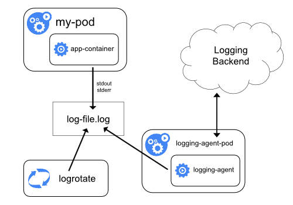
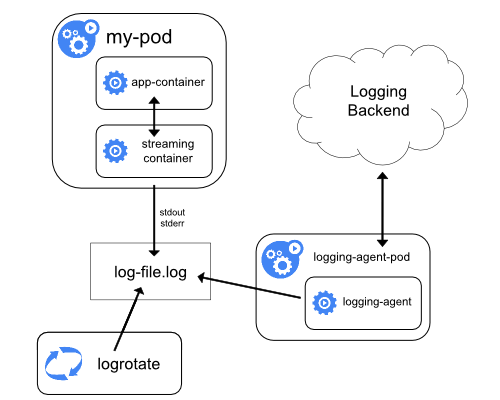
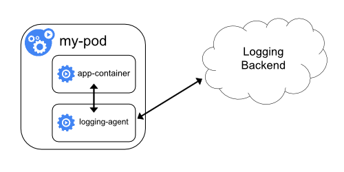
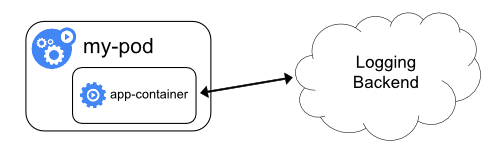

# 集群级别的日志

Kubernetes 中并不默认提供集群级别的日志，不过，有许多种途径可以和集群级别的日志整合。例如：
* 在每个节点上配置日志代理
* 在应用程序的 Pod 中包含一个专门用于收集日志的 sidecar 容器
* 从应用程序中直接推送日志到日志存储端


## 在节点上配置日志代理



如上图所示，通过在每个节点上配置一个节点级别的 logging-agent，您就可以实现集群级别的日志（cluster-level logging）。该 logging-agent 专门用来将节点上的日志文件中的日志推送到日志的后端存储。在 [节点日志的存储](./node.html#日志存储) 中，我们已经了解到，所有应用程序的标准输出都被使用 docker 的 [logging driver](https://docs.docker.com/engine/admin/logging/overview) 存储到了节点的 `/var/log/containers` 目录下（K8S 的默认配置）。因此，节点级别的 logging-agent 应该能够将该目录下的日志文件发送到日志后端。[系统组件的日志](./node.html#系统组件的日志) 可以考虑一下是否要推送到日志后端。

logging-agent 必须运行在每一个节点上，可以选择的实现方式有：
* DaemonSet <Badge type="success">推荐</Badge>
* Static Pod <Badge type="error">Deprecated</Badge>
* 节点上的一个原生进程 <Badge type="error">Deprecated</Badge>。

对于 Kubernetes 集群来说，使用节点级别的 logging-agent 实现集群级别的日志（cluster-level logging）是使用最广泛也最为推荐的一种做法，因为这种做法只为每个节点创建了一个 logging-agent，且无需对节点上的容器化应用程序做任何修改。当然，只有当应用程序使用 stdout 和 stderr 记录日志时，节点级别的 logging-agent 才能生效。Kubernetes 默认安装并不指定 logging-agent，但是Kubernetes默认打包了两种 logging-agent 以供选择：
* [Stackdriver Logging](https://kubernetes.io/docs/user-guide/logging/stackdriver) 配合 Google Cloud Platform
* [Elasticsearch](https://kubernetes.io/docs/user-guide/logging/elasticsearch) 

<!-- FIXME 设置 Elasticsearch 以收集日志-->

这两个选项都使用自定义配置了的 [fluentd](http://www.fluentd.org/) 作为节点上的 logging-agent。

## 在 sidecar 容器中配置 logging-agent

您可以按照如下方式使用 sidecar 容器，以收集日志：
* sidecar 容器跟踪应用程序的日志文件，并输出到 sidecar 容器自己的 stdout
* sidecar 容器运行一个 logging-agent，追踪应用程序的日志文件，并发送到日志后端

### sidecar输出到stdout



使用 sidecar 容器将应用程序的日志输出到 sidecar 容器自己的 `stdout` 和 `stderr` 之后，您可以直接利用已经在集群上运行的 kubelet 以及节点级别的 logging-agent 进一步将日志发送到日志后端。此时 sidecar 容器可以从日志文件读取、socket读取或者 journald 读取日志内容，其输出则是 sidecar 容器自己的 `stdout` 和 `stderr`。

使用这种方法：
* 您只需要对那些不能将日志输出到 `stdout` 和 `stderr` 的应用程序进行特殊配置即可，那些已经可以将日志输出到 `stdout` 和 `stderr` 的应用程序，则可以直接利用节点级别的 logging-agent。
* 由于重定向日志的逻辑非常简单，这种做法所带来的系统开销也是非常小的。
* 此外，`stdout` 和 `stderr` 由 kubelet 处理，您还可以直接使用支持 apiserver 的 kubernetes 管理工具来查看日志，例如 `kubectl logs`、Kubernetes Dashboard 或 Kuboard 的日志查看界面。

以下面的例子为例，该 Pod 中的容器将日志记录到两个日志文件中，且两个日志文件的日志格式不一样。YAML 文件如下所示：

``` yaml
apiVersion: v1
kind: Pod
metadata:
  name: counter
spec:
  containers:
  - name: count
    image: busybox
    args:
    - /bin/sh
    - -c
    - >
      i=0;
      while true;
      do
        echo "$i: $(date)" >> /var/log/1.log;
        echo "$(date) INFO $i" >> /var/log/2.log;
        i=$((i+1));
        sleep 1;
      done
    volumeMounts:
    - name: varlog
      mountPath: /var/log
  volumes:
  - name: varlog
    emptyDir: {}
```

如果将两个日志文件中完全不同的日志格式都通过一个 sidecar 容器重定向到其 `stdout` 中，最终的结果将非常混乱，你很难正确地对日志内容进行合适的处理。此时，可以考虑用两个 sidecar 容器，每个 sidecar 容器都追踪其中一个日志文件，并将日志重定向到各自的 `stdout` 中。

<<< @/.vuepress/public/statics/learning/logs/counter-sidecar-pod.yaml

* 执行如下命令以运行该 Pod

  ``` sh
  kubectl apply -f https://kuboard.cn/statics/learning/logs/counter-sidecar-pod.yaml
  ```

* 此时，您可以通过不同的两个容器的 `stdout` 查看到想要追踪的日志文件：
  
  查看第一个日志内容
  ``` sh
  #执行命令
  kubectl logs conter count-log-1
  # 输出结果如下
  0: Mon Jan  1 00:00:00 UTC 2001
  1: Mon Jan  1 00:00:01 UTC 2001
  2: Mon Jan  1 00:00:02 UTC 2001
  ...
  ```
  查看第二个日志内容
  ``` sh
  # 执行命令
  kubectl logs counter count-log-2
  # 输出结果如下
  Mon Jan  1 00:00:00 UTC 2001 INFO 0
  Mon Jan  1 00:00:01 UTC 2001 INFO 1
  Mon Jan  1 00:00:02 UTC 2001 INFO 2
  ...
  ```

此时，在无需额外配置的情况下，节点级别的 logging-agent 将自动把这些容器标准输出中的内容发送到您的日志后端。如果有必要，您也可以按照容器的不同使用不同的日志解析方法配置节点级别的 logging-agent。

::: tip 注意
尽管 `logging-agent` sidecar 容器只消耗很少的 CPU 和内存（大概千分之几个 CPU 内核和几兆内存的样子），将日志写入文件，然后重定向到 `stdout`，此时再被容器引擎写入到 `/var/log/containers` 目录，这种做法仍然会消耗双倍的磁盘空间。如果您的应用程序将日志写入一个单一的文件中，更好的做法是使用 `/dev/stdout` 作为写入日志的目标，而不是使用 sidecar 容器重定向日志的方法
:::

如果应用程序不能自行轮转日志文件，Sidecar 容器也可以用来轮转日志文件。例如，在一个 sidecar 容器中周期性的运行 logrotate 程序。不过，更好的办法是，直接将日志输出到 `stdout` 和 `stderr`，把日志轮转和日志保存的策略配置，交给 kubelet。

### sidecar容器中执行 logging-agent



如果节点级别的 logging-agent 不满足您的需要，您还可以考虑创建一个 sidecar 容器，并直接在该容器中运行一个为您的应用程序特别定制的 logging-agent。

::: tip 注意
在 sidecar 容器中使用 logging-agent 可能消耗比较多的资源。此外，您也不能够使用 `kubectl logs `命令或者 Kuboard 的命令行终端查看这些日志，因为这个已经不受 kubelet 控制了。
:::

下面的例子中，使用了 [Stackdriver](https://kubernetes.io/docs/tasks/debug-application-cluster/logging-stackdriver/)，并配合 fluentd 作为 logging-agent。本例子提供了两个配置文件：
* 第一个文件中包含了用于配置 fluentd 的内容
  ``` yaml
  apiVersion: v1
  kind: ConfigMap
  metadata:
    name: fluentd-config
  data:
    fluentd.conf: |
      <source>
        type tail
        format none
        path /var/log/1.log
        pos_file /var/log/1.log.pos
        tag count.format1
      </source>

      <source>
        type tail
        format none
        path /var/log/2.log
        pos_file /var/log/2.log.pos
        tag count.format2
      </source>

      <match **>
        type google_cloud
      </match>
  ```
* 第二个文件是一个使用 fluentd 作为 sidecar 容器的 Pod。该 Pod 挂载了上面的 ConfigMap 作为一个数据卷，fluentd 从该数据卷读取配置：
  ``` yaml
  apiVersion: v1
  kind: Pod
  metadata:
    name: counter
  spec:
    containers:
    - name: count
      image: busybox
      args:
      - /bin/sh
      - -c
      - >
        i=0;
        while true;
        do
          echo "$i: $(date)" >> /var/log/1.log;
          echo "$(date) INFO $i" >> /var/log/2.log;
          i=$((i+1));
          sleep 1;
        done
      volumeMounts:
      - name: varlog
        mountPath: /var/log
    - name: count-agent
      image: k8s.gcr.io/fluentd-gcp:1.30
      env:
      - name: FLUENTD_ARGS
        value: -c /etc/fluentd-config/fluentd.conf
      volumeMounts:
      - name: varlog
        mountPath: /var/log
      - name: config-volume
        mountPath: /etc/fluentd-config
    volumes:
    - name: varlog
      emptyDir: {}
    - name: config-volume
      configMap:
        name: fluentd-config
  ```

::: tip
这个例子中使用了 Stackdriver 和 fluentd-gcp 容器，都依赖于 Google Computing Platform。实际在您的使用过程中，应该替换成您所需要的 logging-agent。
:::

## 直接从应用程序容器发送日志到后端



要实现集群级别的日志，您也可以直接在每一个应用程序中将日志发送到日志后端，这种做法是 kubernetes 范围之外的，按照您通常的日志处理办法去做就可以了。
