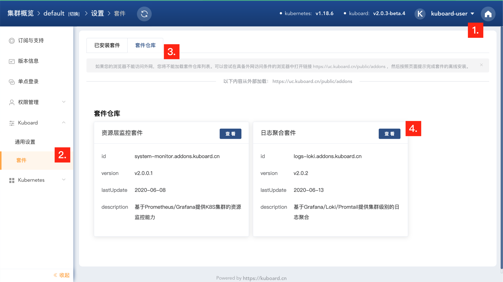

# Kuboard 日志聚合套件

Kuboard 通过套件能力，提供了一种基于 loki + grafana + promtail 的日志聚合方案，可以帮助用户快速搭建一套日志聚合平台，并且可以与 Kuboard 中工作负载的上下文整合到一起。

具体请进入您已经安装好的 Kuboard 界面，按照如下步骤可以找到日志聚合套件：

1. 点击右上角的圆形按钮，进入 ***设置*** 菜单
2. 点击左侧的 ***Kuboard*** --> ***套件*** 菜单
3. 点击 ***套件仓库***  Tab 页
4. 点击 ***日志聚合套件*** 的 ***查看*** 按钮，如下图所示：

::: tip 了解更多
进入 ***日志聚合套件*** 的详情页后，按照提示可以顺利完成套件的安装（支持在线安装、离线安装），并可以快速了解如何使用。
:::

