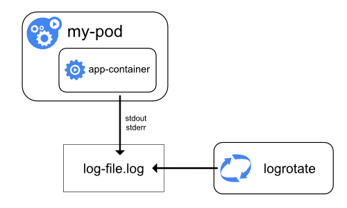

# 节点级别的日志

## 日志存储

容器化应用程序写入到 `stdout` 和 `stderr` 中的任何信息，都将被容器引擎重定向到某个地方。例如，Docker 容器引擎将 `stdout` 和 `stderr` 这两个输出流重定向到 [logging driver](https://docs.docker.com/engine/admin/logging/overview)，Kubernetes的默认配置中，最终 logging driver 最终把日志写入了一个 json 格式的文件。

::: tip
Docker 的 json logging driver 将每一行日志都当做一个单独的消息处理（即 json 文件中的一个对象），它并不直接支持多行的日志消息（multi-line message）。此时，您需要自行在日志代理层或者更高层将 json 日志中的多个对象合并成一个多行日志消息。

典型的多行日志消息有：Java语言中的 stackTrace，被打印成了多行，但是应该被认为是一条日志消息
:::

默认配置下，如果容器重启了，kubelet 只为该容器保留最后一份日志。如果 Pod 从节点上驱逐，当中所有的容器也将一并被驱逐，连同他们的日志也将被删除。

## 日志轮转

在节点级别的日志里，一个非常重要的考量是实现 log rotation（日志轮转），这样的话，日志文件就不会耗尽节点上的存储空间。Kubernetes当前并不负责对日志进行轮转，而是期望由 kubernetes 安装工具来配置一个合适的解决方案。例如，在使用 `kube-up.sh` 脚本安装的 kubernetes 集群中，配置了 [logrotage](https://linux.die.net/man/8/logrotate) 工具，该工具每小时执行一次日志轮转的操作。您也可以配置容器引擎，使其自动轮转应用程序的日志，例如，使用 Docker 的 `log-opt`。在 `kube-up.sh` 脚本中，后者被用在了 GCP 的 COS 镜像中，而前者则用在了任何其他环境。两种情况下，默认的配置是，日志文件达到 10MB 时进行轮转。

::: tip
`kube-up.sh` 脚本如何设置节点级别的日志轮转参数并不重要，因为我们更多人使用 `kubeadm` 安装了 Kubernetes。Kuboard 网站将在随后提供与此相关的配置信息。
:::

<!-- FIXME -->

当您在 [基本的日志](./basic.html) 章节中执行 [kubectl logs](https://kubernetes.io/docs/reference/generated/kubectl/kubectl-commands#logs) 命令时，节点上的kubelet 在接收到该请求时，直接读取了日志文件，并将日志文件的内容作为相应返回到 kubectl 的终端界面上。

::: tip
如果KUbernetes的外部系统执行了文件的轮转，只有最新日志文件中的内容可以通过 `kubectl logs` 命令返回。例如，如果假设日志文件刚刚达到 10MB， `logrotate` 执行了日志轮转，将所有日志挪到一个带时间戳的日志存档文件中，并清空了当前日志文件，此时 `kubectl logs` 将返回空的日志信息（因为当前日志文件为空）
:::

## 系统组件的日志

Kubernetes中存在两种类型的系统组件：
* 运行在容器中的系统组件
* 不运行在容器中的系统组件

例如：
* kubenetes scheduler 和 kube-proxy 运行在容器中
* kubelet 和容器引擎（例如 docker）不运行在容器中

在带有 `systemd` 的机器上，kubelet 和容器引擎将日志写入 Linux 系统的 `journald` 中。如果没有 `systemd`，kubelet 和容器引擎将日志写入目录 `/var/log` 中的 `.log` 文件。运行在容器中的系统组件则使用将日志写入目录 `/var/log` 中（绕过了默认的日志机制--即将日志写入`stdout` 和 `stderr`）。这些系统组件在记录日志是，都使用了 [klog](https://github.com/kubernetes/klog) 日志工具包。您可以通过 [development docs on logging](https://github.com/kubernetes/community/blob/master/contributors/devel/sig-instrumentation/logging.md) 查看他们关于日志的约定。

与容器化应用程序的日志相似，记录在 `/var/log` 目录下的系统组件的日志也应该进行轮转。在使用 `kube-up.sh` 脚本安装的集群中，这些日志文件将由 `logrotate` 工具进行轮转，轮转的时机是：每天或者每当日志文件超过 100MB 时。
