# 告警（钉钉）

Kuboard 监控套件已经支持如下配置：
* 配置 Email、WeChat 作为消息发送渠道；
* 配置告警联系人；
* 配置告警路由；
* 配置告警抑制规则；
* 配置告警消息模板；
* 配置告警规则；

## 前提

使用 Kuboard 监控套件的告警功能前，假设您已经完成了 `Kuboard 资源层监控套件` 的安装，且 `Kuboard 资源层监控套件` 不低于 v3.1.4，请参考 [监控](./monitor.html)

## 配置钉钉机器人

在钉钉的群聊中，可以添加智能群助手（钉钉群机器人），通过钉钉群机器人的接口，我们可以使用 Prometheus AlertManager 向群聊中发送告警消息。请参考下面的步骤创建钉钉群机器人：

* 打开钉钉PC客户端，创建一个钉钉群，把想要接收告警通知的人拉到群里来；
  > 手机端尚不支持创建钉钉群机器人，但是在配置好以后，手机端可以接收到告警消息。
* 点击群聊右上角的群设置按钮，如下图所示：
  
  

    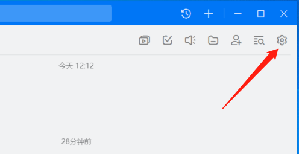
  

* 点击 `智能群助手`按钮，如下图所示：

  

    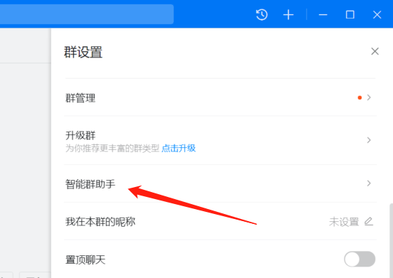
  

* 点击 `添加机器人` 按钮，如下图所示：

  

    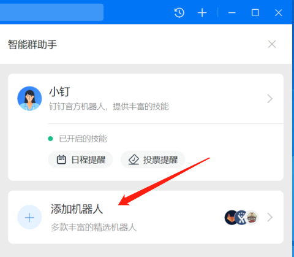
  

* 选择 `自定义` 类型的机器人，然后点击 `添加`，如下图所示：

  

    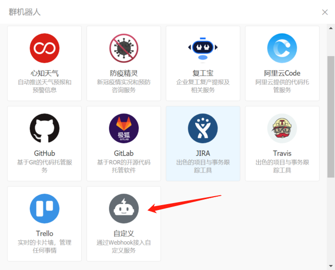
  

* 给你的机器人起一个好听的名字，比如 `Kuboard-Alert`，并在安全设置中勾选 `加签`，然后点击 `完成` 按钮，如下图所示：

  

    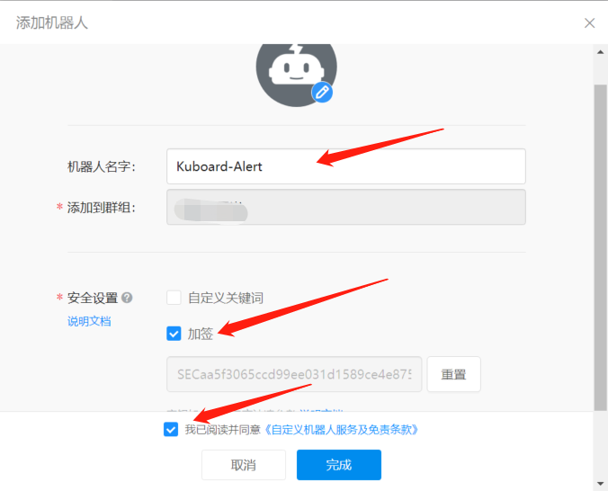
  

* 找到你刚才创建的机器人，并想尽一切办法复制 `Webhook` 和 `加签` 这两个字段，如下图所示：

  例如，我获取到的字段值如下所示，请保留 Webhook 中的 `access_token` 的值以及 `加签` 的值，后面会用到。

  | 字段名                                                   | 值             |
  | ---------- | :---------------------------------------------------------------: |
  | Webhook    | 
`https://oapi.dingtalk.com/robot/send?access_token=a8198f18894e805e683a0cb0b8e4b8c34854518770be2dbc485fe04dd02c5d4c`
 |
  | 加签       |  `SECaa5f3065ccd99ee031d1589ce4e875cc0d48fd00b9152188bf5c3fb8f47aad46`   |

  

    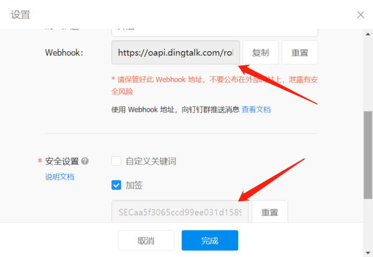
  

## 配置告警

本章节将简述如何配置 Kuboard 资源监控套件以通过钉钉发送告警消息。

* 导航到 `资源监控套件` 的安装页面
* 切换到 `告警发送配置` 标签页，并填写告警发送的接口参数，如下图所示：

  

    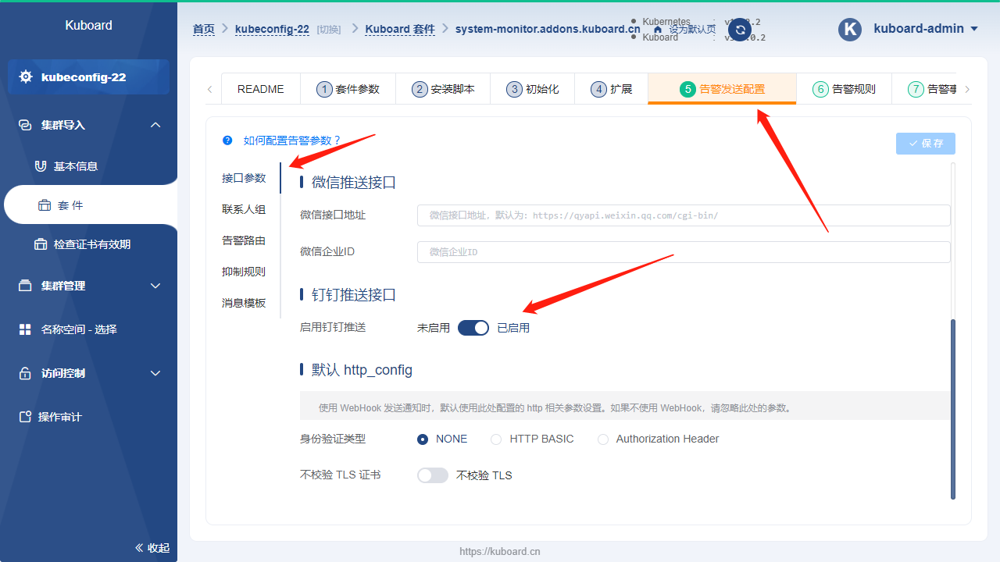
  

* 切换到 `联系人组` 标签页，点击 `添加钉钉机器人`，并填写相关信息，如下图所示：

  > 默认有三个联系人组，建议每个联系人组至少配置一个联系人邮件地址。

  * 将 [配置钉钉机器人](#配置钉钉机器人) 时获得的 `access_token` 以及 `加签` 填入对应位置。

  

    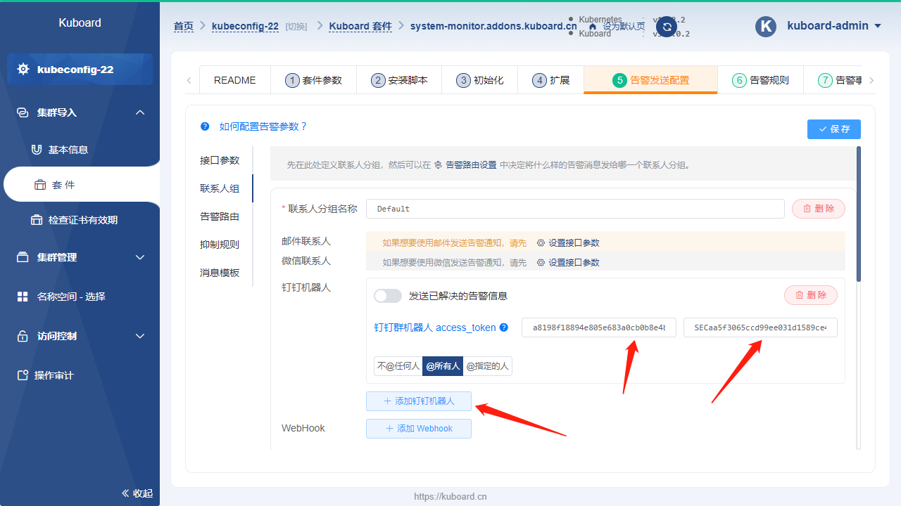
  

* 点击 `保存` 按钮，保存您做的配置修改。

* 切换到 `告警规则` --> `kubernetes-monitoring` --> `kubernetes-apps` 的标签页，在该标签页修改告警名称 `KubePodCrashLooping` 的持续时间为 `1m` （代表 1 分钟），如下图所示：

  

    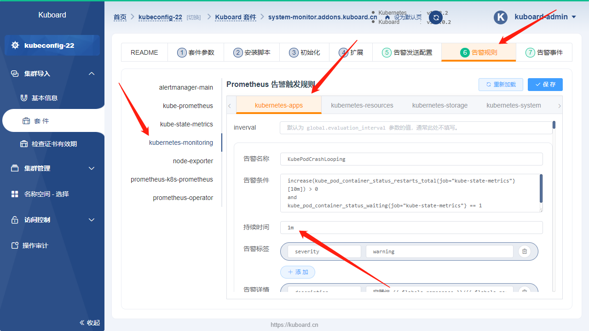
  

* 模拟错误
  
  在任意名称空间创建一个 Deployment，将其中的容器 image 设置为 `busybox`，命令行参数为空。此时，busybox 将在启动后就立刻退出，我们就可以模拟出应用程序不断崩溃重启的现象。

  

    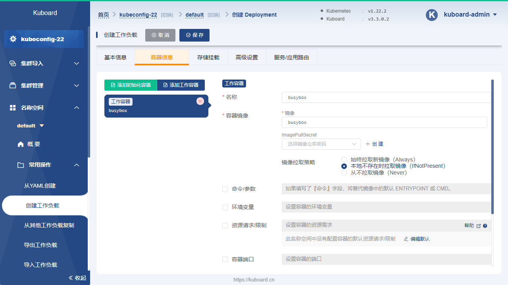
  

* 查看告警事件

  切换到 `告警事件` 标签页，如下图所示：

  > 大约 1 分钟后，KubePodCrashLooping 的事件将从 `PENDING` 状态切换到 `FIRING` 状态，表明告警事件已发送到 AlertManager

  

    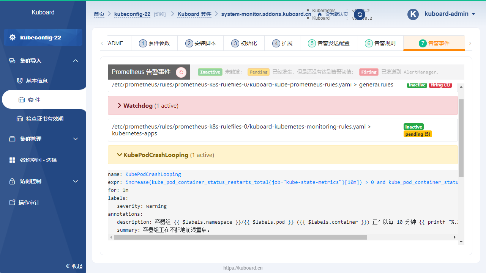
  

* 查看钉钉告警

  登录钉钉，可以查看该告警消息如下所示：

  > AlertManager 在收到告警事件后，大约需要等 1 分钟左右（取决于告警路由中的配置）才发送邮件给告警联系人。

  

    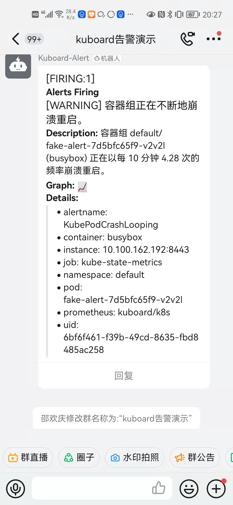
  

至此，我们已经完成了告警功能的最基本配置。
