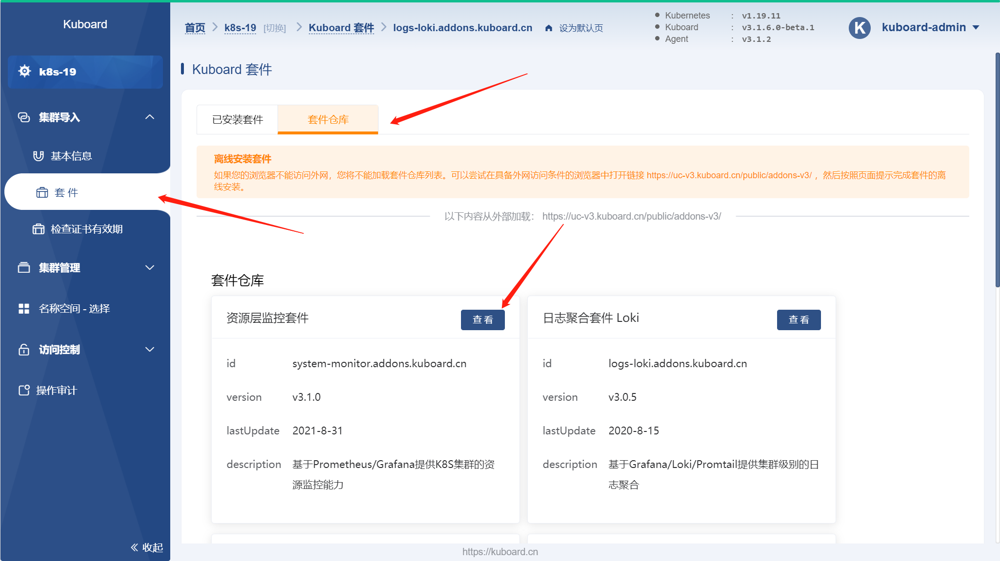
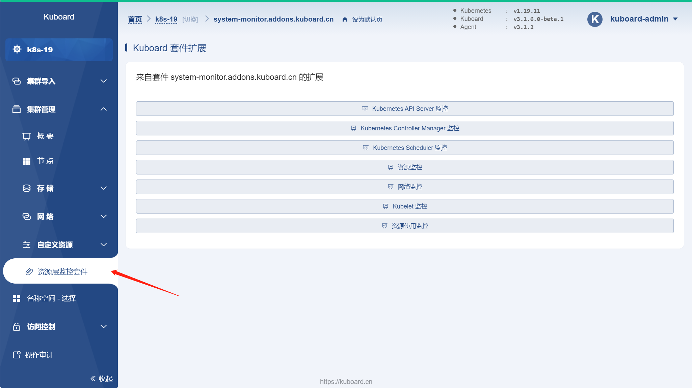
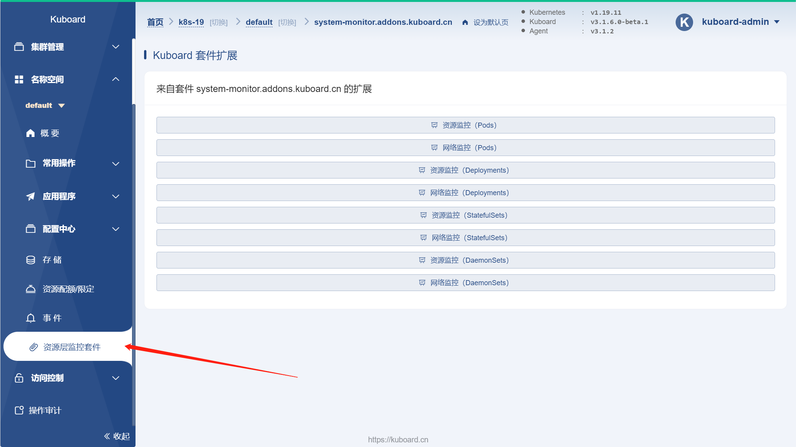
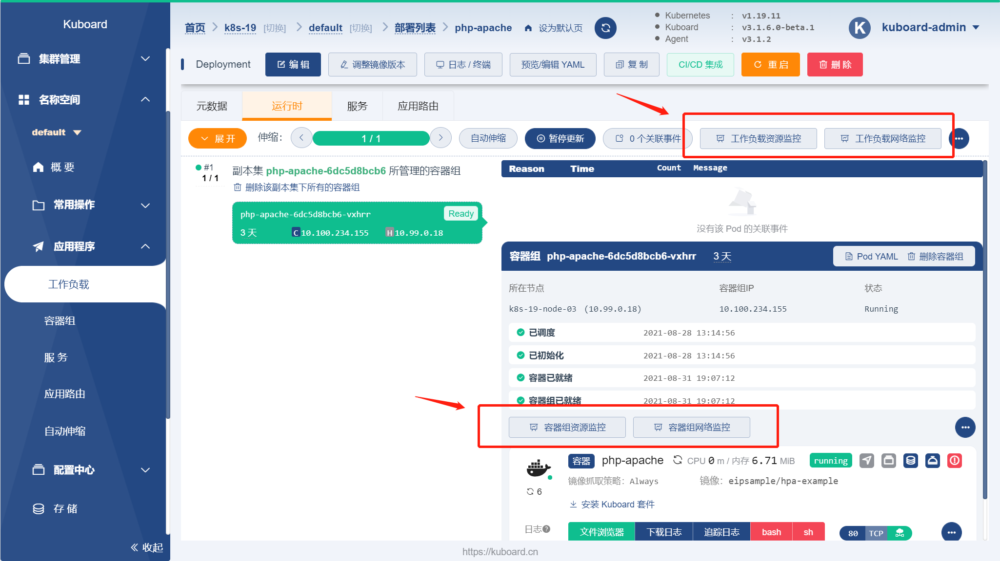

# 监控

本文描述了如何使用 Kuboard 监控套件对 Kubernetes 进行监控。Kuboard 监控套件基于 [https://github.com/prometheus-operator/kube-prometheus](https://github.com/prometheus-operator/kube-prometheus) 构建，主要的工作是对其做 Kuboard 套件进行适配修改的内容包括：
* 以 Kuboard 套件形式安装 kube-prometheus；
* 提供监控告警的配置界面。

## 前提

完成本文描述的过程，需要满足如下条件：
* Kubernetes 版本不低于 `v1.15`；
* Kuboard 版本不低于 `v3.1.6.0-beta.1`。

## 安装监控套件

在 Kuboard 界面中导航到 `集群导入` --> `套件` --> `套件仓库` --> `资源层监控套件`，然后在界面的引导下完成 `资源层监控套件` 的安装。如下图所示：

## 查看系统监控

资源监控套件在集群、名称空间、工作负载（Deployment、StatefulSet、DaemonSet）、容器组等不同层面上对 Kubernetes 进行全面的监控，监控的指标包括 CPU、内存、磁盘、网络等。

### 查看集群级别监控

在 Kuboard 界面中导航到 `集群管理` --> `资源层监控套件` 页面，在此页面可以找到集群级别不同类型资源的监控界面入口，如下图所示：

### 查看名称空间级别监控

在 Kuboard 界面中导航到 `名称空间` --> `default（或其他名称空间）` --> `资源层监控套件` 页面，在此页面可以找到名称空间级别不同类型资源的监控界面入口，如下图所示：

### 查看工作负载级别监控

在 Kuboard 界面中导航到 `名称空间` --> `default（或其他名称空间）` --> `工作负载` --> `工作负载详情` 页面，在此页面可以看到工作负载级别的监控和容器组级别的监控，如下图所示：

## 下一步

配置 [告警发送](./alert.html)