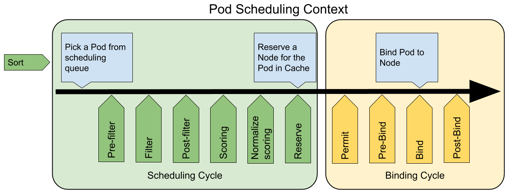

# 框架

> 参考文档：[Scheduling Framework](https://kubernetes.io/docs/concepts/configuration/scheduling-framework/)

<AdSenseTitle/>

**FEATURE STATE：** `Kubernetes v1.15` <Badge type="error">alpha</Badge>

Kubernetes v1.15 版本中引入了可插拔架构的调度框架，使得定制调度器这个任务变得更加的容易。调库框架向现有的调度器中添加了一组插件化的 API。该 API在保持调度程序“核心”保持简单且易于维护的同时，使得大部分的调度功能以插件的形式存在。参考 [Design proposal of the scheduling framework](https://github.com/kubernetes/enhancements/blob/master/keps/sig-scheduling/20180409-scheduling-framework.md) 可了解调度框架更多的技术细节。

## 工作流

调度框架定义了一组扩展点。用户可以实现扩展点定义的接口以定义自己的调度逻辑（我们称之为扩展），并将扩展注册到扩展点上，调度框架在执行调度工作流时，遇到对应的扩展点时，将调用用户注册的扩展。调度框架在预留扩展点时，都是有特定的目的，有些扩展点上的扩展可以改变调度程序的决策方法，有些扩展点上的扩展只是发送一个通知。

## 调度过程/绑定过程

参考 [调度](./) 中所描述的，每一次调度一个 Pod 时，都按照两个过程来执行：调度过程和绑定过程。

调度过程为 Pod 选择一个合适的节点，绑定过程则将调度过程的决策应用到集群中（在被选定的节点上运行 Pod）。调度过程和绑定过程合在一起，称之为 **调度上下文（scheduling context）**。

调度过程同步运行（同一时间点只为一个 Pod 进行调度），绑定过程可异步运行（同一时间点可并发为多个 Pod 执行绑定）。

调度过程和绑定过程在如下情况时，会中途退出：
* 调度程序认为当前没有该 Pod 的可选节点
* 内部错误

此时，Pod 将被放回到 待调度队列，并等待下次重试。

## 扩展点 Extension Points

下图展示了调度框架中的调度上下文及其中的扩展点。该图中 “Filter（过滤器）”与“Soring（评分）”的解释，请参考 [使用kube-scheduler调度](learning/k8s-advanced/schedule/#使用kube-scheduler调度)。

一个扩展可以注册多个扩展点，以便可以执行更复杂的有状态的任务。

<p style="max-width: 750px">
  
</p>

### Queue sort

Que sort 扩展用于对 Pod 的待调度队列进行排序，以决定先调度哪个 Pod。 Que sort扩展本质上只需要实现一个方法 `less(Pod1, Pod2)` 用于比较两个 Pod 谁更优先获得调度。同一时间点只能有一个 que sort 插件生效。

### Pre-filter

Pre-filter 扩展用于对 Pod 的信息进行预处理，或者检查一些集群或 Pod 必须满足的前提条件。如果 pre-filter 返回了 error，则调度过程终止。

### Filter

Filter 扩展用于排除那些不能运行该 Pod 的节点。对于每一个节点，调度器将按顺序执行 filter 扩展；如果任何一个 filter 将节点标记为不可选，则余下的 filter 扩展将不会被执行。调度器可以同时对多个节点执行 filter 扩展。

### Post-filter

Post-filter 是一个通知类型的扩展点。调用该扩展的参数是 filter 阶段结束后被筛选为 ***可选节点*** 的节点列表。可以在扩展中使用这些信息更新内部状态，或者产生日志或度量信息。

::: tip
如果想要在 "Scoring" 评分工作之前执行一些逻辑，应该实现 post-filter 扩展点。
:::

### Scoring

Scoring 扩展用于为所有可选节点评分。调度器将针对每一个节点调用 Soring 扩展。评分结果是一个范围内的整数。在 `normalize scoring` 阶段，调度器将会把每个 scoring 扩展对具体某个个节点的评分结果和该扩展的权重合并起来，作为最终评分结果。

### Normalize scoring

Normalize scoring 扩展在调度器对节点进行最终排序之前修改每个节点的评分结果。注册到该扩展点的扩展时在被调用时，将获得同一个插件中的 scoring 扩展的评分结果作为参数。调度框架每执行一次调度，都将调用所有插件中的一个 normalize scoring 扩展一次。

::: tip 译者注
如前所述，一个插件中可以包括多个扩展，每个扩展可以注册到调度框架中的一个扩展点。可以认为
* 插件是扩展的打包
* 扩展是针对扩展点的实现
* 扩展点是调度框架预先定义的可插拔可客户化的接口，必须有实现该扩展点接口的扩展注册到调度框架
:::

例如，假设 `BlinkingLightScorer` 插件注册了 scoring 扩展点，该扩展根据节点拥有的 "blinking lights" 数量对节点评分。（blinking light是假想的一个节点属性）

``` go
func ScoreNode(_ *v1.pod, n *v1.Node) (int, error) {
   return getBlinkingLightCount(n)
}
```

然而，Scoring 扩展对节点计算出来的 `NodeScoreMax`（节点实际的 `blinking light` 最大数）可能比评分结果允许的 `blinking light` 最大数要大。为了修正此问题，`BlinkingLightScorer` 插件同样要注册 Normalize scoring 扩展点，逻辑如下所示：

``` go
func NormalizeScores(scores map[string]int) {
   highest := 0
   for _, score := range scores {
      highest = max(highest, score)
   }
   for node, score := range scores {
      scores[node] = score*NodeScoreMax/highest
   }
}
```

如果任何一个 normalize-scoring 插件返回了错误，调度过程将终止。

::: tip
如果想要在 `Reserve` 之前执行某些逻辑，可以使用 `normalize-scoring` 扩展点。
:::

### Reserve

Reserve 是一个通知性质的扩展点。有状态的插件可以使用该扩展点获得如下通知：已在节点上为 Pod 预留资源。该事件发生在调度器将 Pod 绑定到节点之前，目的是避免调度器在等待 Pod 与节点绑定的过程中调度新的 Pod 到节点上时，发生实际使用资源超出可用资源的情况。（如前面所述，绑定 Pod 到节点上是异步发生的）

这是调度过程的最后一个步骤。Pod 进入 `reserved` 状态以后，要么在绑定失败时触发 [Unreserve](#unreserve) 扩展，要么在绑定成功时，由 [Post-bind](#post-bind) 扩展结束绑定过程。

### Permit

Permit 扩展用于阻止或者延迟 Pod 与节点的绑定。Permit 扩展可以做如下三项当中的一个选择：
* **approve**
  
  当所有的 permit 扩展都 `approve`（批准）了 Pod 与节点的绑定，调度器将继续执行绑定过程

* **deny**
  
  如果任何一个 permit 扩展 `deny`（拒绝）了 Pod 与节点的绑定，Pod 将被放回到待调度队列，此时将触发 [Unreserve](#unreserve) 扩展

* **wait** （等待超时时间）

  如果一个 permit 扩展返回了 `wait`（等待），则 Pod 将保持在 permit 阶段，直到被其他扩展 approve。如果超时事件发生，`wait` 状态变成 `deny`，Pod 将被放回到待调度队列，此时将触发 [Unreserve](#unreserve) 扩展

### Pre-bind

Pre-bind 扩展用于在 Pod 绑定之前执行某些逻辑。例如，pre-bind 扩展可以将一个基于网络的数据卷挂载到节点上，以便 Pod 可以使用。

如果任何一个 pre-bind 扩展返回错误，Pod 将被放回到待调度队列，此时将触发 [Unreserve](#unreserve) 扩展

### Bind

Bind 扩展用于将 Pod 绑定到节点上。
* 只有所有的 pre-bind 扩展都成功执行了，bind 扩展才会执行
* 调度框架按照 bind 扩展注册的顺序逐个调用 bind 扩展
* 具体某个 bind 扩展可以选择处理或者不处理该 Pod
* 如果某个 bind 扩展处理了该 Pod 与节点的绑定，**余下的 bind 扩展将被忽略**

### Post-bind

Post-bind 是一个通知性质的扩展：
* Post-bind 扩展在 Pod 成功绑定到节点上之后被动调用
* Post-bind 扩展式绑定过程的最后一个步骤，可以用来执行资源清理的动作

### Unreserve

Unreserve 是一个通知性质的扩展。如果为 Pod 预留了资源，Pod 有在被绑定过程中被拒绝绑定，则 unreserve 扩展将被调用。Unreserve 扩展应该释放已经为 Pod 预留的节点上的计算资源。

在一个插件中，reserve 扩展和 unreserve 扩展应该成对出现。

## 插件接口

向调度框架提供扩展，必须完成两个步骤：
* 向调度框架注册插件并完成配置
* 插件必须实现扩展点接口

扩展点接口的格式如下所示：

``` go
type Plugin interface {
   Name() string
}

type QueueSortPlugin interface {
   Plugin
   Less(*v1.pod, *v1.pod) bool
}

type PreFilterPlugin interface {
   Plugin
   PreFilter(PluginContext, *v1.pod) error
}

// ...
```

## 插件配置

可以通过配置启用或者禁用调度框架的插件。

调度框架的配置中，也可以包含插件自己所需要的配置。这些配置信息将在调度框架初始化插件的时候传递给插件。插件自己的配置信息可以是任何内容，由使用该配置的插件自己解析和使用该配置信息。

下面的例子中展示的配置启用了一个实现了 `reserve` 和 `preBind` 扩展点的插件，并且禁用了另外一个插件。同时为插件 `foo` 提供了一些配置信息

``` yaml
apiVersion: kubescheduler.config.k8s.io/v1alpha1
kind: KubeSchedulerConfiguration

...

plugins:
  reserve:
    enabled:
    - name: foo
    - name: bar
    disabled:
    - name: baz
  preBind:
    enabled:
    - name: foo
    disabled:
    - name: baz

pluginConfig:
- name: foo
  args: >
    foo插件可以解析的任意内容
```

扩展的调用顺序如下：
* 如果某个扩展点没有配置对应的扩展，调度框架将使用默认插件中的扩展
* 如果为某个扩展点配置且激活了扩展，则调度框架将先调用默认插件的扩展，再调用配置中的扩展。
* 默认插件的扩展始终被最先调用，然后按照 `KubeSchedulerConfiguration` 中扩展的激活 `enabled` 顺序逐个调用扩展点的扩展。
* 可以先禁用默认插件的扩展，然后在 `enabled` 列表中的某个位置激活默认插件的扩展。这种做法可以改变默认插件的扩展被调用时的次序

假设默认插件 `foo` 实现了 `reserve` 扩展点，此时我们要添加一个插件 `bar`，想要在 `foo` 之前被调用，则应该先禁用 `foo` 在按照 `bar` `foo` 的顺序激活。示例配置如下所示：

``` yaml
apiVersion: kubescheduler.config.k8s.io/v1alpha1
kind: KubeSchedulerConfiguration

...

plugins:
  reserve:
    enabled:
    - name: bar
    - name: foo
    disabled:
    - name: foo
```
