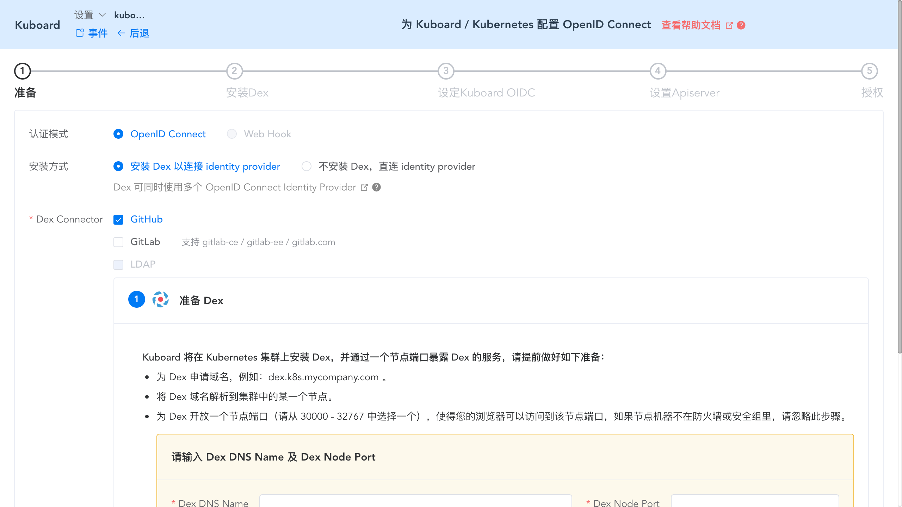
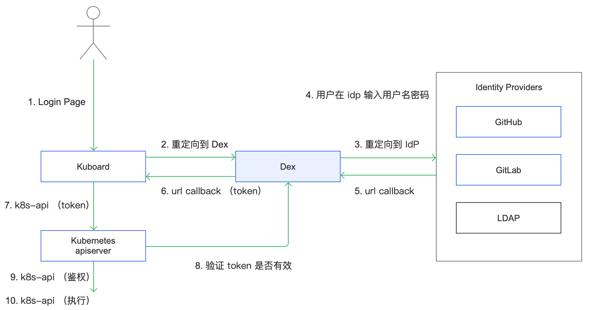
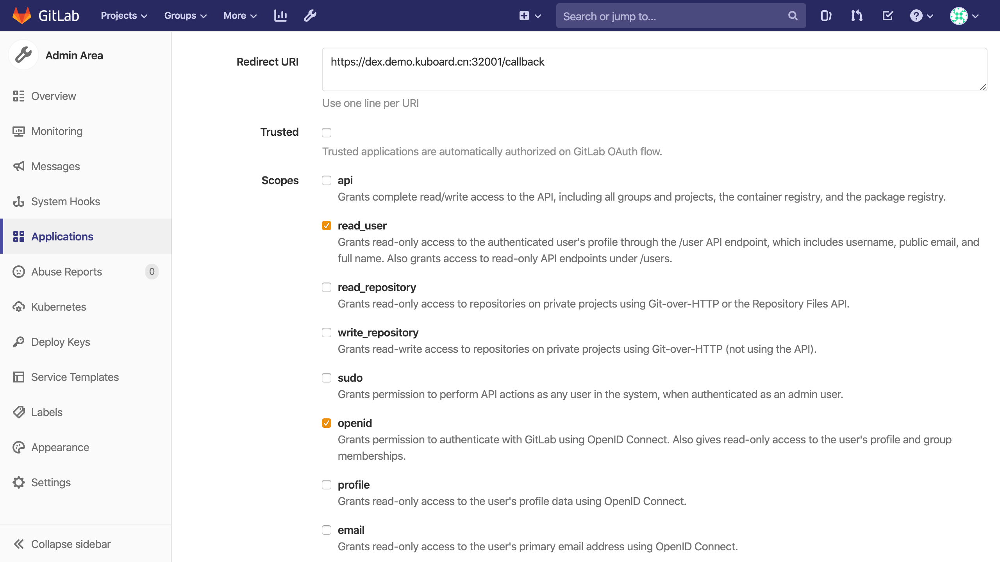
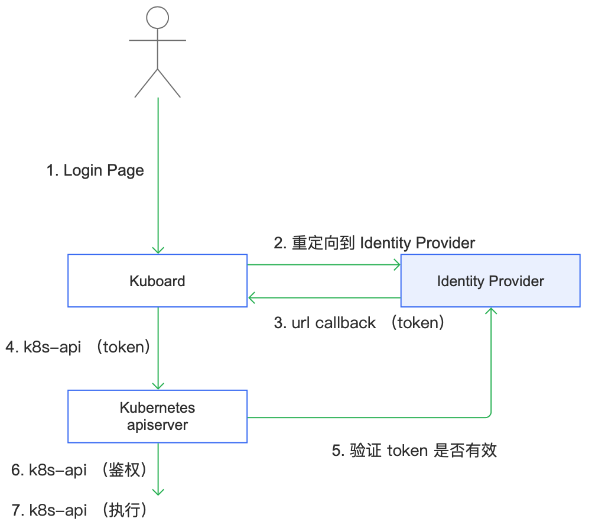
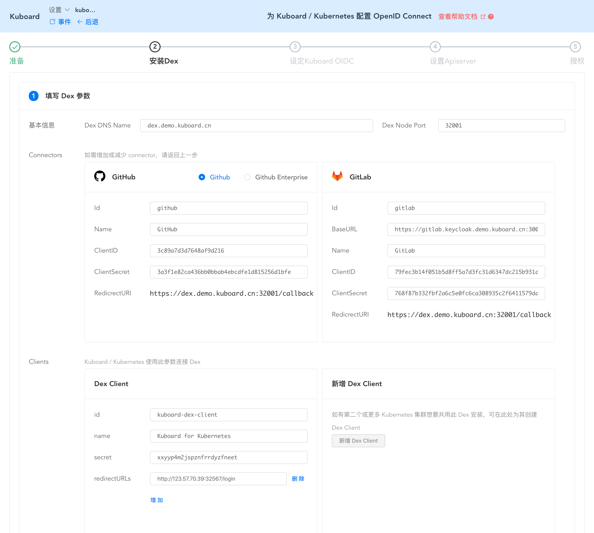

# Kubernetes Authentication 安装向导

<AdSenseTitle/>

本文描述了如何为已有 Kubernetes 集群安装认证模块，并可以通过 GitLab、GitHub、LDAP 中的已有账号登录 Kubernetes 集群。

<Course courseId="484058" />

## 前提条件

* 您已经安装了 Kubernetes 集群
  * 版本不低于 Kubernetes v1.13.0
  * 可参考 [安装Kubernetes单Master节点](/install/install-k8s.html)
* 您已经安装了 Kuboard
  * 版本不低于 Kuboard v1.0.6-beta.7
  * 可参考 [安装Kuboard](/install/install-dashboard.html)

## Kubernetes认证模块安装向导

Kubernetes 支持 [多种认证方式](./#认证策略) ，关于安装 Kubernetes 认证模块的资料比较少，基本上只有 Kubernetes 相关的商业化产品才提供这方面的能力，原因在于：

* 各企业对 Kubernetes 用户信息的管理方式和过程各不相同；
* 为了保持通用性，Kubernetes 并不内置用户/用户组的管理和分发流程，需要做许多集成开发和自定义配置的工作；
* Kubernetes dashboard 暂未支持第三方认证方式，kubectl 作为命令行工具，不能直接与 OpenID Connect 或 Webhook 等认证流程集成；
* Kubernetes 与第三方认证集成时，涉及到的组件、配置环节多且复杂，单纯依靠文档描述，仍然不能取得非常好的效果。

针对这个情况，Kuboard 提供了一个免费的解决方案，通过提供 Kubernetes 认证模块安装向导，帮助用户便捷的安装 Kubernetes 认证模块，轻松使用企业中已有账号系统（GitLab ce、GitLab ee、GitHub enterprise、LDAP 等）的账号登录 Kubernetes。

安装向导本身的指示性很强，直接按照向导的指示，就可以完成 Kubernetes 认证模块的安装。本文后面的章节将对向导中的每个步骤做更详细的阐述性说明，帮助大家除了理解怎么做之外，还能理解为什么这么做。

::: tip 多种认证方式并存

* Kubernetes 内建 ServiceAccount 的认证方式，
* 您应该为集群配置额外的认证方式用于认证普通用户，
* Kubernetes 在启动和运行时，不依赖于第三方认证模块：
  * 当第三方认证模块不可用时，Kubernetes仍然可以正常工作，您仍然可以使用 ServiceAccount登录 Kuboard / Kubectl
  * 当第三方认证模块可用时，您可以使用第三方账号系统的账号登录 Kuboard / Kubectl

:::

### 进入Kubernetes认证模块安装向导

当 Kuboard 版本不低于 v1.0.6-beta.7 时，可以通过 http://yournodeip:32567/authenticate-install 链接进入 Kuboard 认证模块安装向导。如下图所示：

> Kuboard v2.0.x 中，此链接仍然有效，界面风格与 v1.0.x 有差异，但是认证模块安装向导的功能相同。




## 安装认证模块

### 准备安装

Kuboard 目前支持的认证模式有：
* OpenID Connect
* Web hook <Badge type="warning">计划中</Badge>

当使用 OpenID Connect 模式进行用户认证时，Kuboard 可以通过 [Dex](https://github.com/dexidp/dex) 连接多种类型的 Identity Provider，也可以直连 Identity Provider。

#### Dex - Identity Provider

Dex 支持的 Identity Provider 有多种类型，请参考  [Dex](https://github.com/dexidp/dex) 文档，目前 Kuboard OpenID Connect 认证安装向导里支持的 Dex - Identity Provider 有：

* GitHub
  * Github.com
  * Github Enterprise
* GitLab
  * Gitlab.com
  * GitLab CE
  * GitLab

::: tip 为什么不直连 GitLab
* 尽管 GitLab 也实现了 OpenID Connect 协议，但是通过 GitLab OpenID Connect 直接获取的 jwt Token 中只包括 sub 和 sub_legacy 字段，没有 groups / username 等信息，Kubernetes OpenID Connect 不能直连 GitLab OpenID Connect。此时，Dex 作为 Kubernetes 与 GitLab 的桥接，Dex 在获得 GitLab Token 之后，额外再向 GitLab 接口获取到 username / groups / email 等信息之后，重新生成 jwt Token，用于 Kubernetes 的认证。请参考 [GitLab 文档](https://docs.gitlab.com/ee/integration/openid_connect_provider.html#shared-information)
* GitHub 在此问题上与 GitLab 相似。
* 如果通过 OpenID Connect 连接 GitLab/GitHub，目前最佳方案是使用 Dex 作为桥接。
* 也可以通过 Kubernetes Webhook 认证的方式连接 GitLab / GitHub，但是不在此文档讨论的范围内。
:::

下图描述了使用 Dex 连接 Identity Provider 时的认证过程，使用 Dex 连接 Identity Provider 的情况下，Kubernetes Authenticate 安装向导将引导您：

*  配置 Github、Gitlab
* 安装 Dex 到当前 Kubernetes 集群
* 配置 Kuboard OIDC 参数
* 配置 Kubernetes OIDC 参数
* 为 User/Group 授权

<p style="max-width: 800px;">
  
</p>

##### 配置GitLab Application

如果选择 GitLab 作为 Identity Provider：

* 需要在 GitLab 中为 Dex 创建 Application，此时，RedirectURL 参数请从 Kubernetes Authentication 安装向导的界面上获取，Scopes 请至少选择 `openid`、`read_user` 这两个 scope，如下图所示，
* 完成 GitLab Application 创建后，需要将 `Client ID`、`Client Secret` 两个字段回填到 Kubernetes Authentication 安装向导。



##### 配置 GitHub Application

* 请根据向导的提示，在 GitHub 中创建 OAuth Apps，并将 `Client ID`、`Client Secret` 两个字段回填到 Kubernetes Authentication 安装向导。

#### 直连 Identity Provider

直连 Identity Provider 时，已经验证的 Identity Provider 有：

* [keycloak](https://www.keycloak.org/)
* 安装在其他 Kubernetes 集群的 Dex
  * 某些情况下，企业可能管理多个 Kubernetes 集群，通过直连 Identity Provider 的形式，您只需要在一个 Kubernetes 集群上安装 Dex，其他集群共用这一个 Dex 服务。（每个集群各自安装一个 Dex 也未尝不可，但是，此时如果需要通过 Dex 调整后端 Identity Provider 的配置时，需要多个集群都修改一遍。）

下图描述了直连 Identity Provider 时，用户认证的过程。此时，Kubernetes Authenticate 安装向导将引导您：

* 配置 Kuboard OIDC 参数
* 配置 Kubernetes OIDC 参数

<p style="max-width: 500px;">
  
</p>

### 安装Dex

Kubernetes Authentication 安装向导中，请按照如下步骤完成 Dex 的安装：

* 填写参数，如下图所示：

  此步骤中的参数都无需修改，因为在前一个步骤 ***准备*** 环节，已经填写了，其他的参数由 Kubernetes Authentication 安装向导为您生成。

  如果您希望多个 Kubernetes 集群都使用这一个 Dex 实例，请在下图表单中新增一个 Dex Client 的信息。

  

* 保存上图表单后，点击 **安装** 按钮

  Kubernetes Authentication 安装向导将在此 Kubernetes 集群安装 Dex，如需要了解具体安装的内容，可在安装过程中预览 Dex 的安装文件，也可以参考 [Dex](https://github.com/dexidp/dex) 的文档，已了解更多关于 Dex 的知识。

* 完成 Dex 安装后，Kubernetes Authenticate 安装向导将引导您确认一些信息，点击 ***已确认*** 按钮，可进入下一个步骤，**设定 Kuboard OIDC**

### 设定Kuboard OIDC

#### 填写 Kuboard OIDC 参数表单

* 设定 Kuboard OIDC 参数时，可以选择两种认证方式：

  * 授权码方式
    * 授权码方式下，Kuboard 将引导用户跳转（重定向）到 Identity Provider 的登录界面，用户在 Identity Provider 的登录界面输入用户名密码之后，再被（重定向）到 Kuboard 的界面，此时 Kuboard 获得包含用户身份信息的 Token。
    * 关于授权码方式的介绍，可参考 [OAuth 2.0 的四种方式](http://www.ruanyifeng.com/blog/2019/04/oauth-grant-types.html)。
  * 密码方式
    * 密码方式下，用户直接在 Kuboard 登录界面输入用户名密码，Kuboard 界面将认证请求发送到 Identity Provider 的服务接口，直接获得包含用户身份信息的 Token。
    * 密码方式已验证的 Identity Provider 有：
      * 直连 [keycloak](https://www.keycloak.org/)
      * 需要连接其他 Identity Provider 的用户，请 [联系 Kuboard 团队](https://kuboard.cn/support/)
    * 关于授权码方式的介绍，可参考 [OAuth 2.0 的四种方式](http://www.ruanyifeng.com/blog/2019/04/oauth-grant-types.html)。

* 设定 Kuboard OIDC 参数时，oidc 相关的主要参数有 `issuer-url`、`client-id`、`client-secret`、`username-claim`、`username-prefix`、`groups-claim`、`groups-prefix`。这些参数与 Kubernetes OpenID Connect 的配置参数存在一一映射的关系，关于这些参数的详细说明，请参考 [Kubernetes OIDC 参数说明](https://kubernetes.io/docs/reference/access-authn-authz/authentication/#configuring-the-api-server)

  > 当您使用 Dex 连接 Github、GitLab 时，Kubernetes Authenticate 安装向导为您默认生成此表单的参数，无需修改，直接保存即可。

#### 应用 Kuboard OIDC 参数

保存 Kuboard OIDC 参数的表单以后，点击 ***应用 Kuboard OIDC 配置*** 的按钮，Kubernetes Authenticate 安装向导将对 Kubernetes 集群完成如下变更：

* 创建一个 ConfigMap ***kube-system/kuboard-authenticate-config*** ，将 Kuboard OIDC 参数保存到此表单中。

* 更新 Deployment ***kube-system/kuboard*** 的环境变量 `OIDC_USSER`，如下所示：

  ```yaml
    containers:
      - env:
          - name: OIDC_ISSUER
            value: 'https:\/\/dex.demo.kuboard.cn:32001'
  ```

* 创建 ClusterRole ***kuboard-authenticate*** 和 ClusterRoleBinding ***kuboard-authenticate-rolebinding***，授权匿名用户可以查看 ConfigMap ***kube-system/kuboard-authenticate-config***  的内容（Kuboard 登录界面上在用户未登录时，就需要使用这些参数）。

#### 检查 Identity Provider 是否可访问

将 Kuboard OIDC 参数应用到集群之后，Kubernetes Authenticate 安装向导将引导您检查这些参数的应用结果，您可能需要多点击几次刷新按钮才能看到最终的成功结果，因为 Kuboard Deployment 的环境变量修改之后，会重新启动一个新的 Kuboard Pod，新 Pod 启动之后，才能生效。

在验证 Kuboard 可以访问 Identity Provider 之后，点击 ***下一步*** 进入 **设置 Apiserver** 的环节。

### 设置Apiserver

设置 Apiserver 时，Kubernetes Authenticate 安装向导将引导您完成如下步骤：

* 确保 Apiserver 与 Identity Provider 的连通性；
* 配置 Kubernetes apiserver 的启动参数；
  * 启动参数的修改方法请参考 [修改 apiserver 启动参数](/install/faq/apiserver-params.html)
* 验证 Kubernetes apiserver 的 oidc 启动参数与 Kuboard OIDC 参数配置一致。

在完成 Apiserver 参数的配置之后，点击 ***下一步*** 进入 **授权** 环节。

> 到此为止，Kuboard 的登录界面已经可以引导您使用您配置的 OpenID Connect Identity Provider 进行用户认证，且，Kubernetes apiserver 也能识别登录后的用户身份。但是，您仍然不能进入 Kuboard 界面，或对 Kubernetes 执行任何操作，因为，您还没有为用户/用户组授权。

### 为User/Group授权

您可以在 Kuboard 界面中完成对用户/用户组的授权，而无需编写 ClusterRole、Role、ClusterRoleBinding、RoleBinding 等对象的 yaml 文件。

请记住，此时有如下限制：

* 由于 Kubernetes 不管理 User、UserGroup，且可以对接多种类型的 Identity Provider，Kuboard 在对用户、用户组授权时，不能查询用户列表、用户组列表（Kuboard 界面上只能显示 ClusterRoleBinding、RoleBinding 中出现了的用户、用户组的名字）；
* 您需要自行确保授权用户、用户组在 Identity Provider 中存在；
* 您需要在 Identity Provider 中维护用户、用户组之间的映射关系。

参考 [使用Kuboard管理ServiceAccount及RBAC](/learning/k8s-advanced/sec/kuboard.html)

::: tip kubectl

由于 Kubectl 是一个命令行工具，没有图形化 Web 界面，不能发起和完成 OIDC 认证流程（不能接收 OAuth 2 授权码等认证流程中的 web url 回调），完成此配置之后，如果要使用 Github、GitLab 等 Identity Provider 中的账号登录 Kubectl，您需要先登录 Kuboard，然后在 Kuboard 的当前用户界面上获得 kubectl 的配置参数，方可使用 kubectl 。

:::

## 下一步

至此，您已经可以使用 GitHub、GitLab等 Identity Provider 中的账号登录 Kuboard / Kubectl。下一步，您可以：

* 为不同的团队分配 kubernetes 名称空间，并授权他们只能在自己的名称空间内工作。
