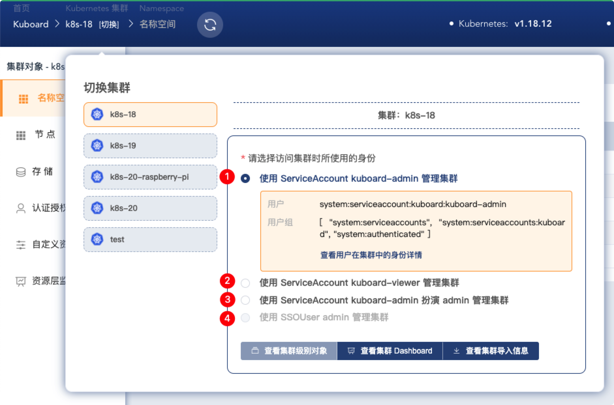

# 用户认证概述

<AdSenseTitle/>

> 参考文档： [Authenticating](https://kubernetes.io/docs/reference/access-authn-authz/authentication/)

## Users in Kubernetes

所有的 Kubernetes 集群都有两类用户：Kubernetes 管理的 Service Account 和普通用户。

普通用户由 Kubernetes 集群之外的独立服务管理，例如 keycloak、LDAP、OpenID Connect Identity Provider（Google Account、MicroSoft Account、GitLab Account）等。此类服务对用户的注册、分组、密码更改、密码策略、用户失效策略等有一系列管控过程，或者，也可以简单到只是一个存储了用户名密码的文件。Kubernetes 中，没有任何对象用于代表普通的用户账号，普通用户也不能通过 API 调用添加到 Kubernetes 集群。

与普通用户相对，[Service Account](/learning/k8s-advanced/sec/sa-admin.html) 是通过 Kubernetes API 管理的用户。Service Account 是名称空间级别的对象，可能由 ApiServer 自动创建，或者通过调用 API 接口创建。Service Account 都绑定了一组 `Secret`，Secret 可以被挂载到 Pod 中，以便 Pod 中的进程可以获得调用 Kubernetes API 的权限。

对 API Server 的每次接口调用都被认为是：
* 由一个普通用户或者一个 Service Account 发起
* 或者是由一个匿名用户发起。

这意味着，集群内外的任何一个进程，在调用 API Server 的接口时，都必须认证其身份，或者被当做一个匿名用户。可能的场景有：
* 集群中某一个 Pod 调用 API Server 的接口查询集群的信息
* 用户通过 kubectl 执行指令，kubectl 调用 API Server 的接口完成用户的指令
* 用户通过 Kuboard 界面管理集群，Kuboard 调用 API Server 的接口实现界面上的功能

::: tip 授权
* **认证过程** 指的是 API Server 如何识别发起 API 请求的用户（进程）的身份；
* **授权过程** 指的是 API Server 在识别请求发起者身份之后，判断发起者是否可以执行该接口请求。
:::

## 认证策略

Kubernetes 的认证策略（Authentication Strategies）是：通过 authentication plugin 认证发起 API 请求的用户身份，认证方式有 client certificates、bearer tokens、authenticating proxy、HTTP basic auth。当 API Server 接收到 HTTP 请求时，authentication plugin 会尝试将如下属性附加到请求：
* **Username**：唯一标识用户的一个字符串。例如 `kube-admin` 或者 `jane@example.com`
* **UID**：唯一标识用户的一个字符串，相较于 username，提供更强的一致性和唯一性。（某些 Identity Provider 可能允许用户更改 username）
* **Groups**：一组字符串，标识用户所属的用户组
* **额外字段**：Key,Value 都是 String 的 Map，包含一些 对 [authorizer](../authorizer/readme.html) 可能有用的信息

上述所有的字段对认证系统来说都是透明的，且只对 [authorizer](../authorizer/readme.html) 有意义（authentication plugin 将认证结果中的某些字段赋值到上述字段中，认证系统只是按照自己的方式正常工作，并不知道上述这些字段的存在）。这使得 Kubernetes 可以同时支持多种认证方式，在实际工作中，您通常应该至少配置两种认证方式：
* Service account tokens 用于认证 Service Account，
* 至少另外一种认证方式用于认证普通用户。

当多个认证模块被启用时，第一个成功对请求进行认证的模块将终止认证过程。API Server 并不确保认证模块的调用顺序。

Group `system:authenticated` 将被包含到所有已认证用户的 `Groups` 字段中。

Kubernetes 还可以使用 [authenticating proxy](https://kubernetes.io/docs/reference/access-authn-authz/authentication/#authenticating-proxy) 或者 [authentication webhook](https://kubernetes.io/docs/reference/access-authn-authz/authentication/#webhook-token-authentication) 集成其他的认证协议（例如：LDAP、SAML、Kerberos、alternate x509 shcemes 等）。

具体来说，Kubernetes 支持的认证方式有：
* [X509 Client Certs](https://kubernetes.io/docs/reference/access-authn-authz/authentication/#x509-client-certs)
* [Static Token File](https://kubernetes.io/docs/reference/access-authn-authz/authentication/#static-token-file)
* [Bootstrap Tokens](https://kubernetes.io/docs/reference/access-authn-authz/authentication/#bootstrap-tokens)
* [Static Password File](https://kubernetes.io/docs/reference/access-authn-authz/authentication/#static-password-file)
* [Service Account Tokens](https://kubernetes.io/docs/reference/access-authn-authz/authentication/#service-account-tokens) <Badge>Kuboard v1.0.0</Badge>
* [OpenID Connect Tokens](https://kubernetes.io/docs/reference/access-authn-authz/authentication/#openid-connect-tokens) <Badge>Kuboard v1.0.6-beta.7</Badge>
* [Webhook Token Authentication](https://kubernetes.io/docs/reference/access-authn-authz/authentication/#webhook-token-authentication)
* [Authenticating Proxy](https://kubernetes.io/docs/reference/access-authn-authz/authentication/#authenticating-proxy)

## 用户扮演

用户扮演 -- User Impersonation

通过添加特殊的请求头，可以使当前已被认证的用户扮演为另一个用户的身份执行该请求。例如，管理员可以使用这个特性临时扮演成另一个用户，以便调试授权策略。

带有用户扮演请求头的请求首先会被认证为该请求的实际请求者身份，然后再切换到被扮演的用户信息：
* 用户发起 kubernetes API 调用请求，并在请求中使用自己的认证信息（通常是请求头中的 Bearer Token）和用户扮演请求头；
* API Server 认证该用户的身份；
* API Server 校验该用户是否具备用户扮演的权限；
* 将该请求的用户信息替换为用户扮演请求头中的取值；
* 该请求的授权、使用过程都将依据用户扮演请求头中的信息进行执行；

具体来说，用户扮演请求头可以包含如下 HTTP 请求头：
* `Impersonate-User` ： 被扮演的用户；
* `Impersonate-Group` ： 被扮演用户所在的用户组。可不填，也可以出现多次以代表被扮演用户属于多个用户组；
* `Impersonate-Extra-( extra name )` ： 动态请求头，用于关联用户的额外字段。可不填。为了保持一致性， `( extra name )` 必须为小写字母，并且 [HTTP 请求头标签](https://tools.ietf.org/html/rfc7230#section-3.2.6) 所允许范围外的字符必须使用 utf8 或 [百分号编码](https://tools.ietf.org/html/rfc3986#section-2.1)

用户扮演请求头的样例如下：
```
Impersonate-User: jane.doe@example.com
Impersonate-Group: developers
Impersonate-Group: admins
Impersonate-Extra-dn: cn=jane,ou=engineers,dc=example,dc=com
Impersonate-Extra-acme.com%2Fproject: some-project
Impersonate-Extra-scopes: view
Impersonate-Extra-scopes: development
```

::: tip Kuboard v3 Impersonation
Kuboard v3 中，允许用户使用 ServiceAccount `kuboard-admin` 代理当前登录用户来访问 Kubernetes，此时，Kuboard v3 只用到了两种请求头：
* `Impersonate-User` ： 当前登录用户的用户名
* `Impersonate-Group` ： 当前登录用户所在的所有用户组
:::

使用 `kubectl` 命令时，可以通过 `--as` 参数来设置 `Impersonate-User` 请求头， 通过 `--as-group` 参数来设置 `Impersonate-Group` 请求头。例如：

```sh
kubectl drain mynode
```

假设当前用户没有权限执行 `drain` 操作，错误信息如下所示：

```sh
Error from server (Forbidden): User "clark" cannot get nodes at the cluster scope. (get nodes mynode)
```

设置 `--as` 和 `--as-group` 参数后：

```sh
kubectl drain mynode --as=superman --as-group=system:masters
```

输出信息如下：
```sh
node/mynode cordoned
node/mynode drained
```

如果要扮演另外一个用户、用户组，则执行操作的用户必须具备被扮演对象（`user`、`group` 等）的 `impersonate` 权限。对于已经激活了 RBAC 鉴权插件的集群，下面的 ClusterRole 可以用来授权用户扮演所需的权限：

```yaml
apiVersion: rbac.authorization.k8s.io/v1
kind: ClusterRole
metadata:
  name: impersonator
rules:
- apiGroups: [""]
  resources: ["users", "groups", "serviceaccounts"]
  verbs: ["impersonate"]
```

`Extra` 字段需要获得 `userextras` 资源对应的 subresource 权限。例如，用户需要具备如下角色授权才可以使用用户扮演请求头中的 `Impersonate-Extra-scopes` 请求头：

```yaml
apiVersion: rbac.authorization.k8s.io/v1
kind: ClusterRole
metadata:
  name: scopes-impersonator
rules:
# Can set "Impersonate-Extra-scopes" header.
- apiGroups: ["authentication.k8s.io"]
  resources: ["userextras/scopes"]
  verbs: ["impersonate"]
```

也可以通过 `resourceNames` 来限定用户可以使用的 `Impersonate-Extra-scopes` 请求头中的取值：

```yaml
apiVersion: rbac.authorization.k8s.io/v1
kind: ClusterRole
metadata:
  name: limited-impersonator
rules:
# Can impersonate the user "jane.doe@example.com"
- apiGroups: [""]
  resources: ["users"]
  verbs: ["impersonate"]
  resourceNames: ["jane.doe@example.com"]

# Can impersonate the groups "developers" and "admins"
- apiGroups: [""]
  resources: ["groups"]
  verbs: ["impersonate"]
  resourceNames: ["developers","admins"]

# Can impersonate the extras field "scopes" with the values "view" and "development"
- apiGroups: ["authentication.k8s.io"]
  resources: ["userextras/scopes"]
  verbs: ["impersonate"]
  resourceNames: ["view", "development"]
```

## Kuboard v1/v2 认证方式

Kuboard v1/v2 支持两种形式的认证：
* Service Account <Badge>Kuboard v1.0.0</Badge>
  * 在任意 Kubernetes 集群安装 Kuboard 之后，默认的 Kuboard 认证登录方式
  * 登录 Kuboard 后，在当前用户信息页可以获得使用当前用户身份登录 kubectl 的配置参数
* OpenID Connect <Badge>Kuboard v1.0.6-beta.7</Badge>
  * 在任意 Kubernetes 集群安装 Kuboard 之后，通过 [OpenID Connect 配置向导](./install.html) 可以激活此认证登录方式
  * 可以直连 OpenID Connect Provider，例如 keycloak
  * 可以通过 [Dex](https://github.com/dexidp/dex) 连接更多类型的 Identity Provider
    * 已经验证的有：
      * github.com
      * Github Enterprise
      * gitlab.com
      * GitLab CE
      * GitLab Enterprise
    * 正在验证的有：
      * LDAP
  * 通过 OpenID Connect 登录 Kuboard 后，在当前用户信息页可以获得使用当前用户身份登录 kubectl 的配置参数

上述两种认证方式可以并存，可以通过 Dex 同时连接多个 Identity Provider。Service Account的认证方式为 Kubernetes 内置认证方式，任何情况下都是可用的。OpenID Connect 依赖于集群之外的 Identity Provider 服务，即使在 Identity Provider 服务不可用的情况下，Kubernetes 仍然可以正常启动和工作，可以通过 Service Account 登录 Kuboard / Kubernetes，待 Indentity Provider 服务可用之后，就可以使用 OpenID Connect 登录 Kuboard / Kubernetes。

Kubernetes 的上述特性不会为系统引入额外的高可用故障点。

## Kuboard v3 认证方式

Kuboard v1/v2 的用户认证完全依赖于 Kubernetes 集群本身，正式因为这个原因，Kuboard v1/v2 的每个安装只能管理一个 Kubernetes 集群。

Kuboard v3 为了实现在同一个 Kuboard 界面中管理多个 Kubernetes 集群的能力，将登录 Kuboard 时的认证方式独立出来，并且，已经支持了如下几种认证方式：

* [内建用户库](/install/v3/install-built-in.html)
* [GitLab 认证](/install/v3/install-gitlab.html)
* [GitHub 认证](/install/v3/install-github.html)
* [LDAP 认证](/install/v3/install-ldap.html)

Kuboard v3 的上述几种认证方式，只是解决了用户登录 Kuboard 的问题。当用户需要在 Kuboard 中真正访问 Kubernetes 集群时，需要选择一种 Kubernetes 认可的认证方式以实现与 Kubernetes ApiServer 的交互，如下图所示，Kuboard 当前支持用户以四种方式中的一种通过 Kubernetes 的身份认证：



* 使用 ServiceAccount kuboard-admin 管理集群

  此时，Kuboard 使用 kuboard 名称空间下的 kuboard-admin ServiceAccount 的 Token 作为认证参数访问 Kubernetes ApiServer，该 ServiceAccount 在导入集群到 Kuboard 时自动创建，并且具备该集群的所有操作权限；

* 使用 ServiceAccount kuboard-viewer 管理集群

  此时，Kuboard 使用 kuboard 名称空间下的 kuboard-viewer ServiceAccount 的 Token 作为认证参数访问 Kubernetes ApiServer，该 ServiceAccount 在导入集群到 kuboard 时自动创建，并且具备该集群中所有名称空间的只读操作权限；

* 使用 ServiceAccount kuboard-admin 扮演 {user:当前登录用户} 管理集群

  此时，Kuboard 使用 kuboard 名称空间下的 kuboard-admin ServiceAccount 的 Token 作为认证参数访问 Kubernetes ApiServer，并且基于 [用户扮演](#用户扮演) 的特性扮演成当前登录 Kuboard 的用户名和用户组；

* 使用 SSOUser {user:当前登录用户} 管理集群

  此时，Kuboard 使用登录 Kuboard 时生成的 JWT 作为认证参数访问 Kubernetes ApiServer。如需要使用此特性，需要在 `集群导入页` 的引导下，完成 Kubernetes 集群与 Kuboard 之间的单点登录认证，具体实现机制请参考 [OpenID Connect Tokens](https://kubernetes.io/docs/reference/access-authn-authz/authentication/#openid-connect-tokens) 。

::: tip 授权

当您以上述后两种方式访问 Kubernetes 集群时，Kubernetes 将您识别成登录 Kuboard 时所用的用户名以及用户组，此时，您需要在 Kubernetes 当中为您所在的用户名或用户组授权，才能执行对应的操作，否则是没有任何权限的。

:::
