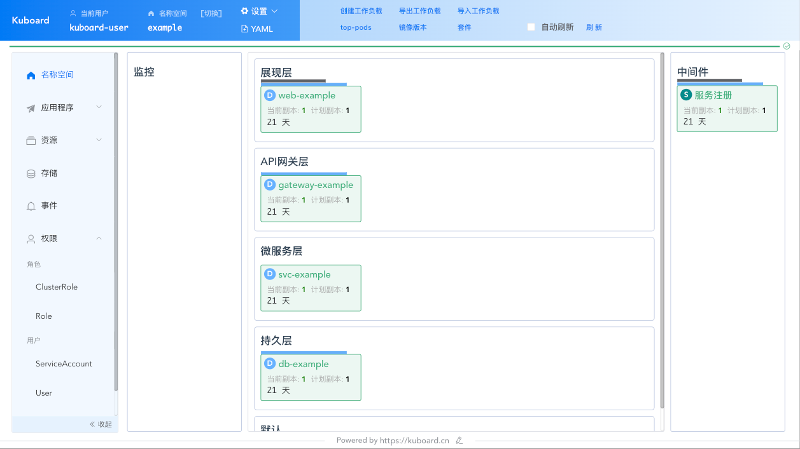
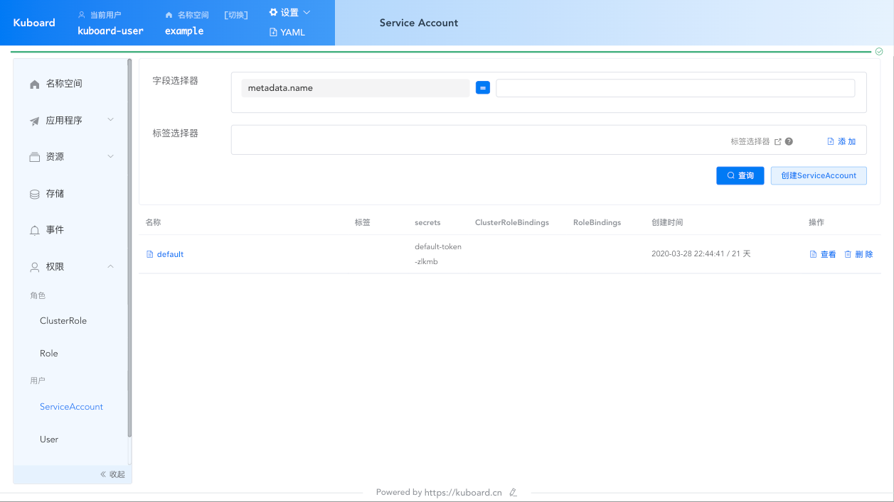
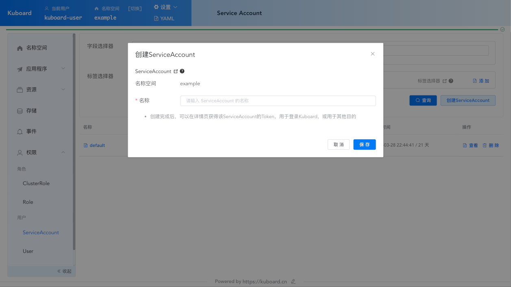
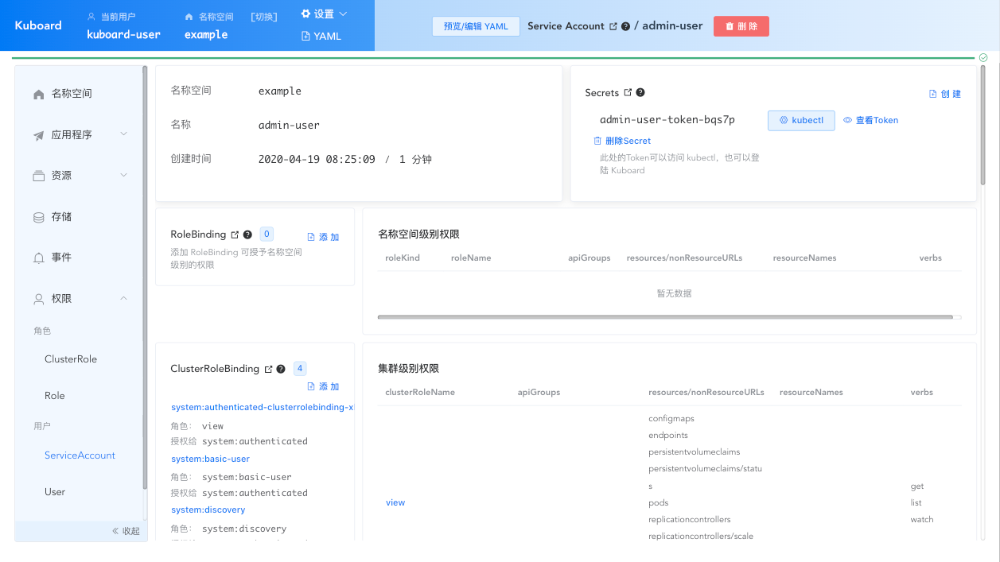
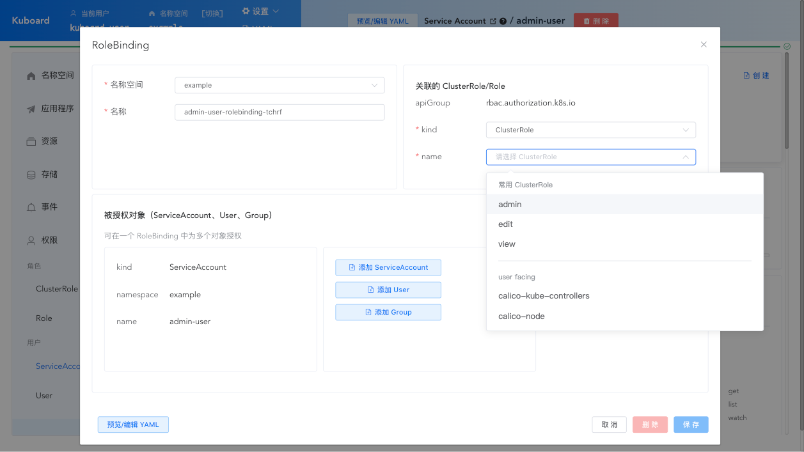
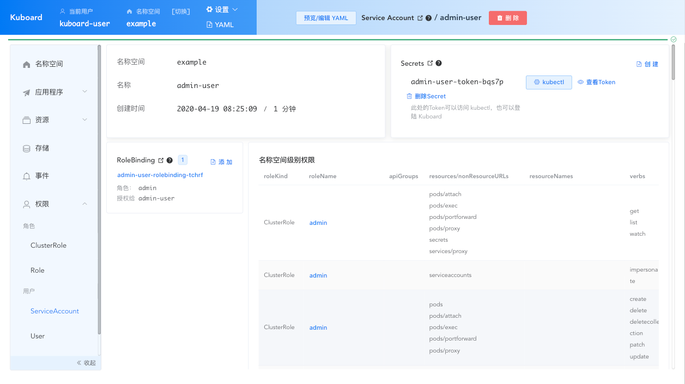

# 使用Kuboard管理ServiceAccount及RBAC

<AdSenseTitle/>

## 前提

* 您已经 [安装了 Kuboard](/install/install-dashboard-upgrade.html) <Badge>Kuboard v1.0.9.3</Badge>
* 使用 [管理员用户 ](/install/install-dashboard.html#获取token)登录 Kuboard

## 为名称空间创建管理员用户

::: tip 用户名密码？
* 本文档以 [ServiceAccount](/learning/k8s-advanced/sec/sa-admin.html#user-accounts-vs-service-accounts) 为例
* 用户名密码（OpenID Connect）的登录方式请参考 [使用 GitHub/GitLab 账号登录 Kubernetes](/learning/k8s-advanced/sec/authenticate/install.html)
:::

按照下面的步骤，可以快速为 Kubernetes 中的某个名称空间创建管理用户

* 进入 Kuboard 名称空间页面，如下图所示：

  

* 点击上图左侧菜单中的 ***权限管理*** -> ***ServiceAccount***  按钮，进入 ServiceAccount 列表页面，如下图所示：

  

* 点击上图中的 ***创建ServiceAccount*** 按钮，如下图所示：

  填写 **名称** 后，保存 *ServiceAccount*

  

* 完成创建后，将自动进入 ServiceAccount 详情页，如下图所示：

  * 图中，可以看到 Kubernetes 默认为 ServiceAccount 授予的 ***集群级别权限***
  * 可以为一个 Service Account 创建多个 Secret
  * 也可以删除 Service Account 的原有 Secret

  > 当您使用 Service Account 作为 Kuboard / Kubernetes Dashboard 的登录方式时，这个特性就显得非常有用，您可以定期更换 ServiceAccount 的 Secret Token，以增强系统的安全性。

  

* 点击上图中 ***RoleBinding*** 后的 ***添加*** 按钮，如下图所示：

  并在 ***关联的 ClusterRole/Role*** 选择：

  * kind :  ClusterRole
  * name : admin

  ::: tip 授权范围
  * 如果创建 `ClusterRoleBinding`，则，用户可以访问集群中的所有名称空间；
  * 如果创建 `RoleBinding`，则，用户只能访问 RoleBinding 所在名称空间；
    * 可以在名称空间 a 中创建一个 RoleBinding，关联名称空间 b 中的 ServiceAccount 和某一个 ClusterRole，以授权名称空间 b 中的 ServiceAccount 访问名称空间 a，如此，以使得该 ServiceAccount 可以访问多个指定的名称空间。
  :::

  ::: tip 预置角色
  Kubernetes 集群默认预置了三个面向用户的 ClusterRole：
  * `view` 可以查看 K8S 的主要对象，但是不能编辑
  * `edit` 具备`view` 的所有权限，同时，可以编辑主要的 K8S 对象
  * `admin` 具备 `edit` 的所有权限，同时，可以创建 Role 和 RoleBinding （在名称空间内给用户授权）

  这三个 ClusterRole 均为 [Aggregated ClusterRole](./rbac/api.html#aggregated-clusterroles)，可以通过聚合的方式向其添加新的访问权限，请参考 [为 viewer 增加查看容器日志的权限](./rbac/logs.html)
  :::

  

* 点击上图中的 ***保存*** 按钮，完成后如下图所示：

  可以观察到已经为 *admin-user* 这个 *ServiceAccount* 授予了名称空间内部的 *admin* 角色，对应的权限可以在 ***名称空间级别权限*** 中查看

  

* 点击上图中的 ***查看Token*** 按钮，如下图所示：

  **此 Token 可以用来登录 Kuboard 界面**

  

## 下一步

[在 kubectl 中使用 ServiceAccount 的 Token 管理 Kubernetes 集群](/install/install-kubectl-sa.html)
