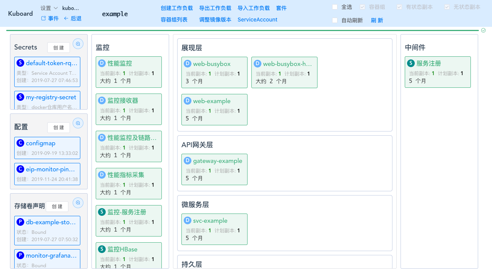
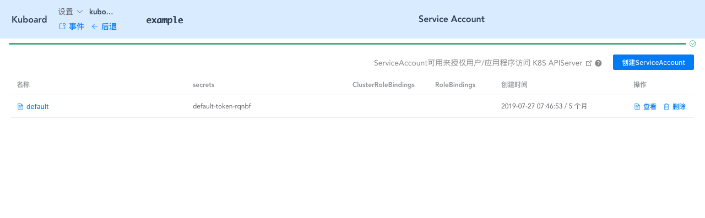
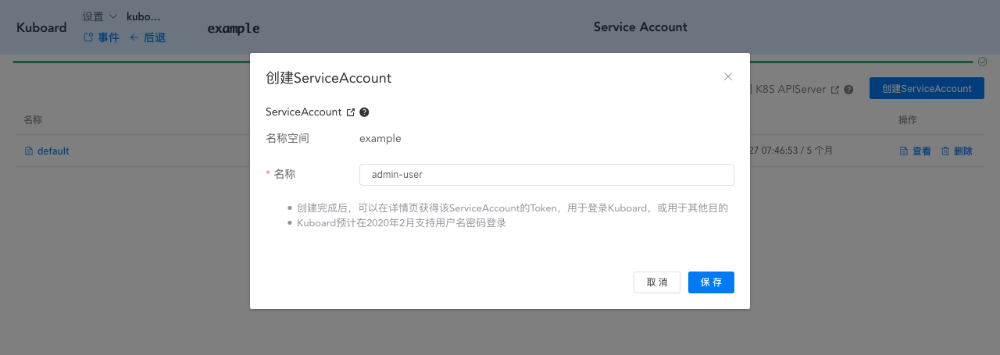
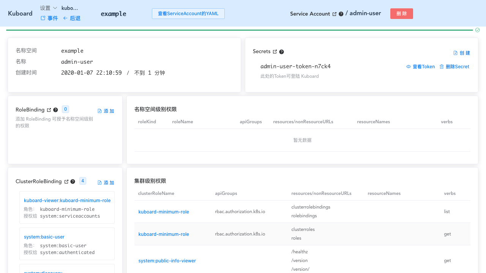
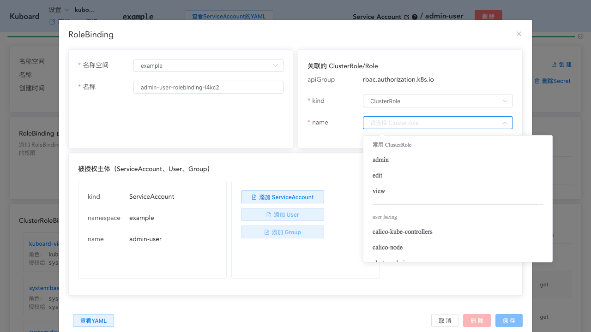
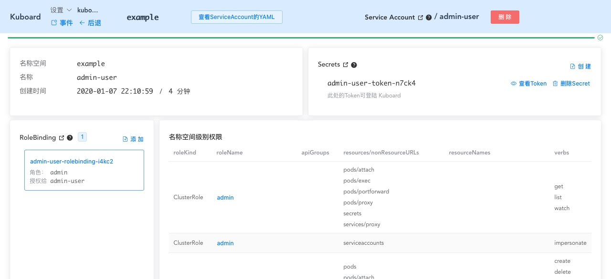
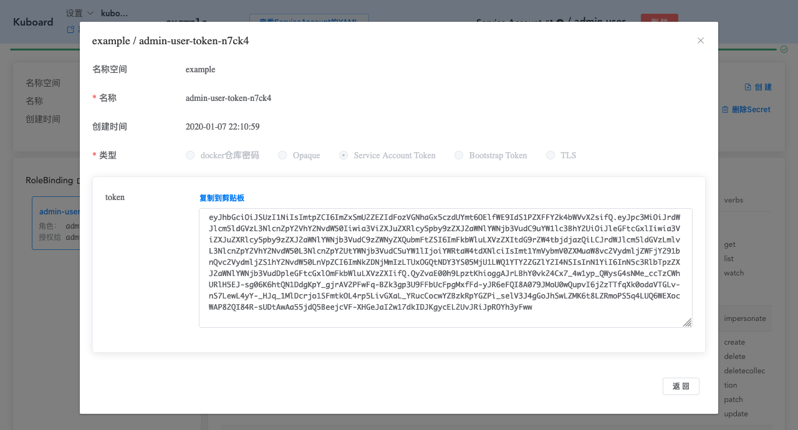

# 使用Kuboard管理ServiceAccount及RBAC

<AdSenseTitle/>

首先，确保您已经 [安装了 Kuboard](/install/install-dashboard-upgrade.html) <Badge>Kuboard v1.0.6</Badge>，并且使用 [管理员用户](/install/install-dashboard.html#获取token)) 登录Kuboard

## 为名称空间创建管理员用户

::: tip 用户名密码？
* 本文档以 [ServiceAccount](/learning/k8s-advanced/sec/sa-admin.html#user-accounts-vs-service-accounts) 为例
* 用户名密码（OpenID Connect）的登录方式请参考 [使用 GitHub/GitLab 账号登录 Kubernetes](/learning/k8s-advanced/sec/authenticate/install.html)
:::

<Course courseId="484058" />

按照下面的步骤，可以快速为 Kubernetes 中的某个名称空间创建管理用户

* 进入 Kuboard 名称空间页面，如下图所示：

  

* 点击上图中的 ***ServiceAccount*** 按钮，进入 ServiceAccount 列表页面，如下图所示：

  

* 点击上图中的 ***创建ServiceAccount*** 按钮，如下图所示：

  填写 **名称** 后，保存 *ServiceAccount*

  

* 完成创建后，将自动进入 ServiceAccount 详情页，如下图所示：

  图中，可以看到 Kubernetes 默认为 ServiceAccount 授予的 ***集群级别权限***

  

* 点击上图中 ***RoleBinding*** 后的 ***添加*** 按钮，如下图所示：

  并在 ***关联的 ClusterRole/Role*** 选择：

  * kind :  ClusterRole
  * name : admin

  

* 点击上图中的 ***保存*** 按钮，完成后如下图所示：

  可以观察到已经为 *admin-user* 这个 *ServiceAccount* 授予了名称空间内部的 *admin* 角色，对应的权限可以在 ***名称空间级别权限*** 中查看

  

* 点击上图中的 ***查看Token*** 按钮，如下图所示：

  **此 Token 可以用来登录 Kuboard 界面**

  

## 下一步

[在 kubectl 中使用 ServiceAccount 的 Token 管理 Kubernetes 集群](/install/install-kubectl-sa.html)
