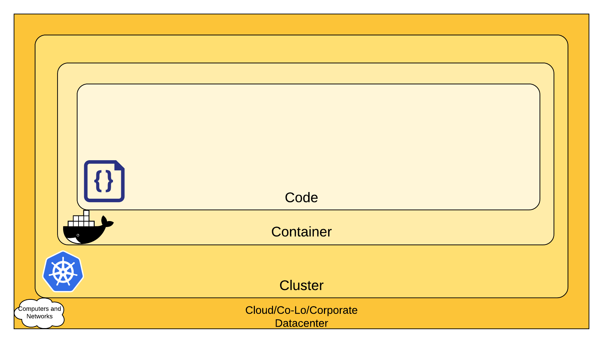

# 云原生安全概述

本文档主要参考了 Kubernetes 官方文档：[Overview of Cloud Native Security](https://kubernetes.io/docs/concepts/security/overview/)

<AdSenseTitle/>

本文概述了云原生环境中 Kubernetes 的安全需要考量的主要方面。

## 云原生 4C 安全模型

云原生 4C 安全模型，是指在四个层面上考虑云原生的安全：
* Cloud（云或基础设施层）
* Cluster（Kubernetes 集群层）
* Container（容器层）
* Code（代码层）

如下图所示，云原生的每一层安全防护都是基于其外层防护之上的。没有Cloud层、Cluster层、Container层的安全防护，Code层的防护将形同虚设。因为，您在代码层所做的任何安全防护，都不能保护其外层（Cloud层、Cluster层、Container层）经受住安全入侵的攻击。

下面我们将逐个介绍每一层安全防护需要考量的内容。

## Cloud 云或基础设施层安全

通常，Kubernetes 集群都认为其所依赖的基础设施（云、服务器、或者企业的数据中心）是安全和可信的。如果基础本身不安全（或者没有进行合理的安全防护配置），将无法保证构建在其上的组件是安全的。每一个云供应商都给出了相关的安全建议。

### 云安全

如果您的 Kubernetes 集群运行在您自己的硬件上，您需要自行考虑基础设施层面的安全防护。下表给出了部分云供应商提供的安全文档：

| IaaS 供应商  |  链接   |
| ----------- | ----------- |
| 阿里云       | [https://www.alibabacloud.com/trust-center](https://www.alibabacloud.com/trust-center)       |
| 亚马逊云     | [https://aws.amazon.com/security/](https://aws.amazon.com/security/)        |
| 微软 Azure   | [https://docs.microsoft.com/en-us/azure/security/azure-security](https://docs.microsoft.com/en-us/azure/security/azure-security)        |

### 基础设施安全

与 Kubernetes 相关的基础设施安全建议：

| 关注点       |  建议        |
| ----------- | ----------- |
| APIServer的网络（控制节点） | 空直接点上所有端口都不应该暴露在互联网上 |
| 节点的网络 | 工作节点的端口应该只允许接受来自控制节点的网络访问，同时可以暴露一些 Service 的节点端口。工作节点应该尽可能不暴露在公网上 |
| ETCD的网络 | ETCD（Kubernetes的数据存储）应该只允许控制节点访问。尽可能使用 ETCD 的 TLS 连接（基于 kuboard-spray安装的集群已经确保了这一点）。更多信息请参考 [ETCD 文档](https://github.com/etcd-io/etcd/tree/master/Documentation) |
| ETCD 加密 | 如果可能，尽量加密存储 etcd 数据所使用的磁盘 |

## Cluster 集群层安全

Kubernetes 集群的安全主要考虑如下两方面因素：
* 集群组件的安全防护
* 集群中运行的应用程序的安全防护

### 集群的组件

如果您希望保护您的集群组件以避免非法访问，请参考文档 [集群的安全防护](./secure-a-cluster)

### 集群中应用的安全（您的应用程序）

不同类型的应用程序可能会暴露不同的易受安全攻击的点，因此，您最好是有针对性地进行安全防护。例如：如果您在集群上运行了应用A和应用B，其中应用A是一个关键应用，而应用B很容易受到攻击而导致资源（CPU/内存）耗尽，在这种情况下，如果您不限制应用B的最大资源（CPU/内存）使用量，应用A也会被应用B所牵连。

下表罗列了在 Kubernetes 集群中运行应用程序时应该主要关注的安全因素以及相关建议：

| 关注点       |  建议       |
| ----------- | ----------- |
| 用户认证（API Server） | [用户认证概述](./authenticate/) |
| RBAC授权（API Server） | [授权用户访问名称空间](./rbac/auth-namespace) |
| 密文管理（以及存储加密） | [Secret概述](/learning/k8s-intermediate/config/secrets/)  [Encrypting Secret Data at Rest](https://kubernetes.io/docs/tasks/administer-cluster/encrypt-data/) |
| Pod Security Standards | [Pod Security Standards](./pss) |
| Quality Of Service（集群资源管理） | [Configure Quality of Service for Pods](https://kubernetes.io/docs/tasks/configure-pod-container/quality-service-pod/)   [管理容器的计算资源](/learning/k8s-intermediate/config/computing-resource.html) |
| Network Policies | [网络策略 Network Policies](/learning/k8s-intermediate/service/np.html) |
| Ingress TLS | [为 Ingress 配置 HTTPS 证书](/learning/k8s-intermediate/service/ingress.html#实战-使用-ingress-访问-web-应用) |

## Container 容器层安全

本文档将不会展开容器安全的话题，下面是一些建议以及可以参考的链接：

| 关注点       |  建议       |
| ----------- | ----------- |
| 容器安全扫描以及操作系统相关的安全性 | 在容器镜像的构建阶段，您应该对容器执行安全扫描，以便发现和修复已知的安全漏洞 |
| 镜像签名 | 使用已签名的第三方容器镜像，以确保您使用的镜像来源是可靠的。 |
| 避免使用 root 用户 | 在容器中使用非 root 用户，并避免过度授权 |
<!-- | 使用安全隔离性更强的容器运行时配置 | 选择隔离性更好的 [container runtime class](https://kubernetes.io/docs/concepts/containers/runtime-class/) | -->

## Code 代码层安全

应用程序的代码是最容易受到攻击，同时也是您掌控面最大的地方。以下是一些建议：

| 关注点       |  建议       |
| ----------- | ----------- |
| 使用 TLS    | 如果您的代码需要 TCP 通信，请使用 TLS 传输协议。 |
| 减少通信端口 | 只暴露必须的服务通信端口或者性能信息采集端口 |
| 第三方依赖安全性 | 定期扫描应用程序的第三方依赖库，以排除潜在的安全漏洞 |
| 静态代码分析 | 执行代码安全扫描，以排除潜在的安全漏洞 |
| 动态漏洞扫描 | 使用漏洞扫描工具发现可能的安全漏洞，例如 SQL注入、CSRF、XSS 等 |