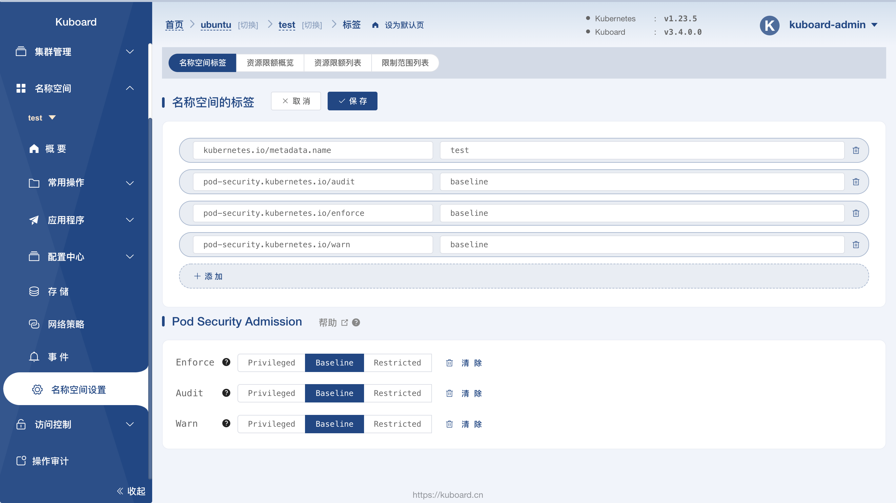

# 为名称空间设置 Pod Security Standards

你可以通过为名称空间设置标签来强制实施 [Pod 安全标准](./pss)。

前提条件：
- Kubernetes 版本不低于 v1.22
- 确保 `PodSecurity` [特性门控](/zh/docs/reference/command-line-tools-reference/feature-gates/#feature-gates-for-alpha-or-beta-features)已被启用。

## 通过名称空间标签来要求实施 `baseline` Pod 容器标准

下面的清单定义了一个 `my-baseline-namespace` 名称空间，其中

- *阻止*任何不满足 `baseline` 策略要求的 Pods；
- 针对任何无法满足 `restricted` 策略要求的、已创建的 Pod 为用户生成警告信息，
  并添加审计注解；
- 将 `baseline` 和 `restricted` 策略的版本锁定到 v1.23。

```yaml
apiVersion: v1
kind: Namespace
metadata:
  name: my-baseline-namespace
  labels:
    pod-security.kubernetes.io/enforce: baseline
    pod-security.kubernetes.io/enforce-version: v1.23

    # 我们将这些标签设置为我们所 _期望_ 的 `enforce` 级别
    pod-security.kubernetes.io/audit: restricted
    pod-security.kubernetes.io/audit-version: v1.23
    pod-security.kubernetes.io/warn: restricted
    pod-security.kubernetes.io/warn-version: v1.23
```

## 使用 `kubectl label` 为现有名称空间添加标签

:::tip Note
在添加或变更 `enforce` 策略（或版本）标签时，准入插件会测试名称空间中的每个
Pod 以检查其是否满足新的策略。不符合策略的情况会被以警告的形式返回给用户。
:::

在刚开始为名称空间评估安全性策略变更时，使用 `--dry-run` 标志是很有用的。
Pod 安全性标准会在 _dry run（试运行）_
模式下运行，在这种模式下会生成新策略如何处理现有 Pod 的信息，
但不会真正更新策略。

```shell
kubectl label --dry-run=server --overwrite ns --all \
    pod-security.kubernetes.io/enforce=baseline
```

### 应用到所有名称空间

如果你是刚刚开始使用 Pod 安全性标准，一种比较合适的初始步骤是针对所有名称空间为类似
`baseline` 这种比较严格的安全级别配置审计注解。

```shell
kubectl label --overwrite ns --all \
  pod-security.kubernetes.io/audit=baseline \
  pod-security.kubernetes.io/warn=baseline
```

注意，这里没有设置 enforce 级别，因而没有被显式评估的名称空间可以被识别出来。
你可以使用下面的命令列举那些没有显式设置 enforce 级别的名称空间：

```shell
kubectl get namespaces --selector='!pod-security.kubernetes.io/enforce'
```

### 应用到单个名称空间

你也可以更新特定的名称空间。下面的命令将 `enforce=restricted` 策略应用到
`my-existing-namespace` 名称空间，将 restricted 策略的版本锁定到 v1.23。

```shell
kubectl label --overwrite ns my-existing-namespace \
  pod-security.kubernetes.io/enforce=restricted \
  pod-security.kubernetes.io/enforce-version=v1.23
```

## 使用 Kuboard 设置名称空间 `pod-security`

Kuboard 版本不低于 `v3.4.0.0`

在 Kuboard 界面中，导航到集群名称空间的 `名称空间` --> `名称空间设置` 菜单项，点击 `编辑` 按钮，可以设置 Pod Security Admission 的参数，如下图所示：

