---

layout: LearningLayout
description: Kuboard v3 两阶段授权。本文描述了如何使用 Kuboard v3 管理RBAC授权规则，并授权用户访问名称空间列表。
meta:
  - name: keywords
    content: Kuboard v3两阶段授权

---

# 授权用户访问名称空间

本文描述了如何授予用户/用户组访问 Kubernetes 的一个名称空间。

## 前提条件

* 已安装 Kuboard v3，版本不低于 `v3.1.1.0`

## 两阶段授权

Kuboard v3 中，采用两阶段授权的方式控制用户/用户组在 Kuboard / Kubernetes 中的权限。

第一阶段授权，控制当前用户：

* 可以操作哪个集群
* 以什么样的身份操作该集群

第二阶段授权，控制用户：

* 在集群内具备什么样的权限

本文描述了如何在 Kuboard 界面中为用户组 `mygroup` 授权，允许该用户组中的用户以 `admin` 角色访问集群 `k8s-21` 中的 `default` 名称空间。使用该用户组下 `test` 用户登录 Kuboard 后，首页界面如下所示：

> 假设用户 `test` 以及用户组 `mygroup` 已经实现创建好

* `test` 用户所查询到的集群列表结果为空；
* 点击右上角的用户名，可以显示当前登录用户的基本信息以及其所属的用户组；

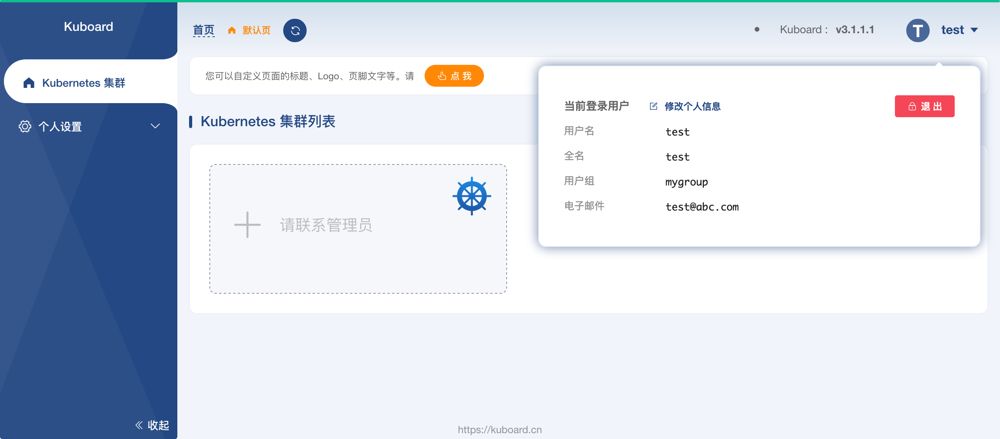

## 第一阶段授权

* 使用管理员账号登录 Kuboard 首页，并导航到 `用户与权限` -> `角色` -> `sso-user`，如下图所示：

  `sso-user` 为安装 Kuboard 时默认创建的第一阶段授权的角色，该角色具备 `KubernetesCluster.act-as-impersonate-user` 的 `GET` 权限，允许与此角色关联的用户/用户组以 `使用 ServiceAccount kuboard-admin 扮演` 的身份操作 Kubernetes 集群。

  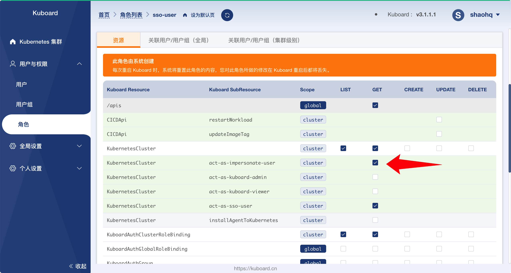

* 切换到 `关联用户/用户组（集群级别）` 标签页，并点击 `创建角色绑定（集群级别）`

  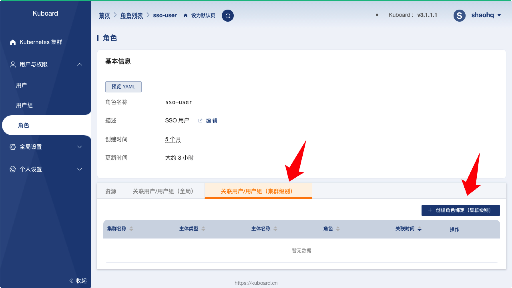

  填写表单，如下图所示：

  | 字段名          | 填写内容 | 备注               |
  | --------------- | -------- | ------------------ |
  | 主体类型        | 用户组   |                    |
  | 用户组          | mygroup  |                    |
  | Kubernetes 集群 | k8s-21   | 选择已经激活的集群 |

  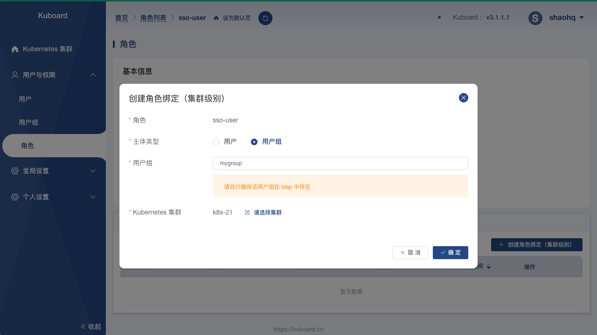

* 此时，用 `test` 账号登录 Kuboard 首页，此时用户已经可以在 Kubernetes 集群列表中查看到被授权的 `k8s-21` 这个集群，如下图所示：

  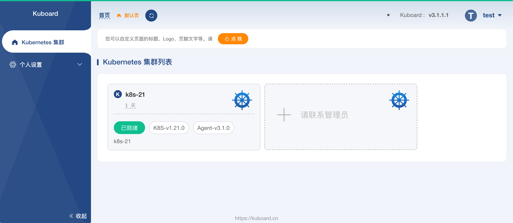

  点击该集群，弹出对话框中：

  * 可以激活 `使用 ServiceAccount kuboard-admin 扮演 test` 这个选项
  * 名称空间列表中的所有名称空间都为不可访问的状态

  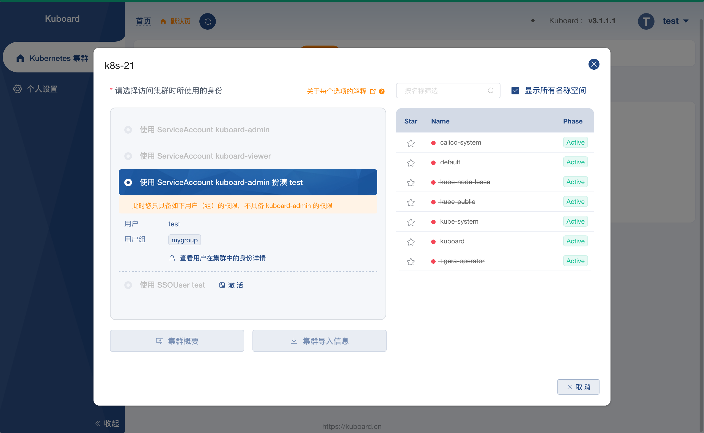

## 第二阶段授权

* 以管理员用户登录到 Kuboard 首页，点击集群列表中的集群 `k8s-21`，进入集群页面，并切换到 `访问控制` -> `第一阶段授权` 页面，如下图所示：

  在此页面中，可以查看到该集群已经授权给 `mygroup` 用户组（操作步骤参考前文）。

  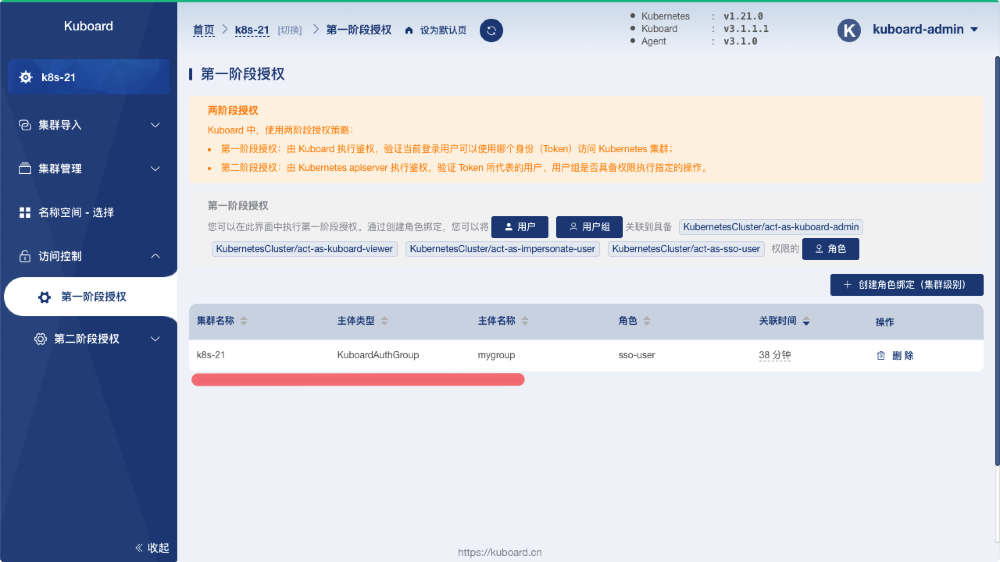

* 切换到 `访问控制` -> `第二阶段授权` -> `用户组`，如下图所示：

  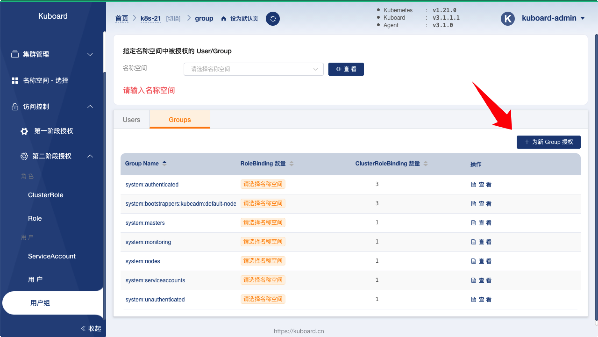

  点击图中 `为新 Group 授权` 按钮，并填入 `mygroup` 作为被授权的用户组名称，然后点击确定按钮，如下图所示：

  

* 在 `Group` 详情页面，切换到 `default` 名称空间，并点击 RoleBinding 后面的 `添加` 按钮，如下图所示：

  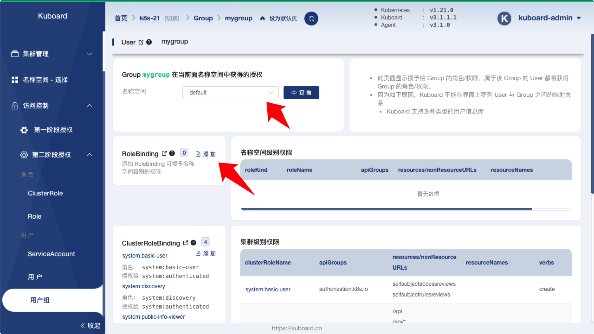

  在弹出对话框中，`关联的 ClusterRole/Role` 字段选择 `ClusterRole` 、`admin`，并点击保存按钮，如下图所示：

  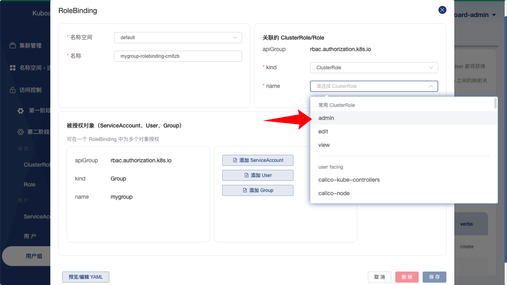

  点击保存后，可以看到该用户组在 `default` 名称空间中的权限，如下图所示：

  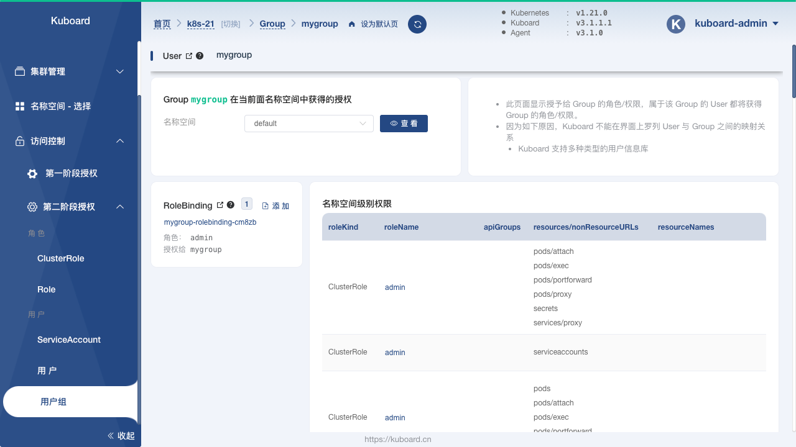

## 进入名称空间

完成前述 第一阶段授权、第二阶段 两个步骤后，以 `test` 用户登录 Kuboard 界面，并点击首页的 `k8s-21` 集群，在弹出框中可以看到 `default` 名称空间已经变成了已授权的状态，点击 `default` 可以进入该名称空间，如下图所示：

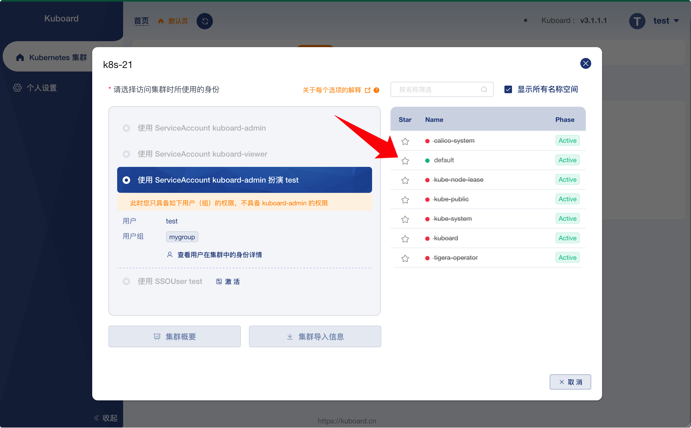

## selfsubjectaccessreviews

Kuboard 客户端需要调用 Kubernetes 的 `/apis/authorization.k8s.io/v1/selfsubjectrulesreviews` 接口用于确定界面上哪些菜单显示，哪些菜单不显示。极少部分情况下，您的集群可能没有授予 `system:authenticated` 用户组该权限，例如阿里云托管的 K8S 集群。

在这种情况下，Kuboard （v3.1.1.8及以上版本）将在界面上做出如下提示：

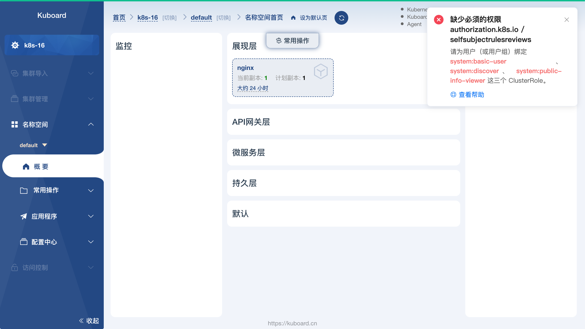

解决此问题的办法是，将 `system:basic-user`、`system:discover`、`system:public-info-viewer` 这三个 ClusterRole 绑定到您的用户或者用户组，步骤如下：

* 点击右上角的用户名，确认当前用户所属的用户组，如下图所示：

  图中，用户属于 `administrators` 用户组。如果您的界面上显示，当前用户属于多个用户组，您只需要挑选其中一个用户组与 `system:basic-user`、`system:discover`、`system:public-info-viewer` 这三个 ClusterRole 绑定。

  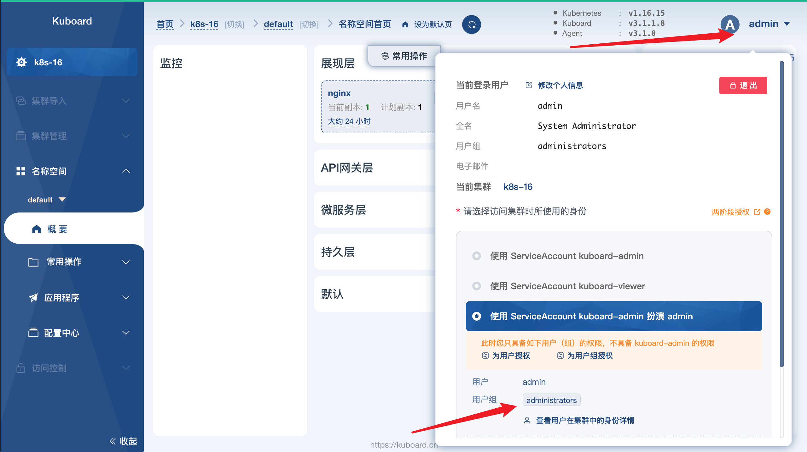

* 使用 Serviceaccount kuboard-admin 的身份切换到菜单 ***访问控控制*** --> ***用户组***，如下图所示：

  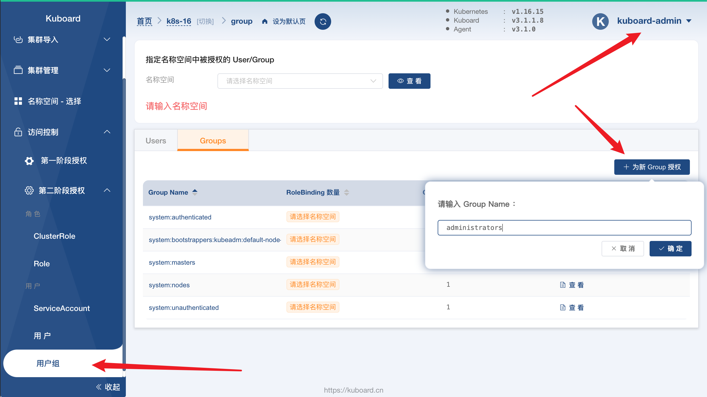

* 在上图中，点击 ***为新 Group 授权*** 并填写 Group Name `administrators`，然后点击确定，将跳转到如下界面：

  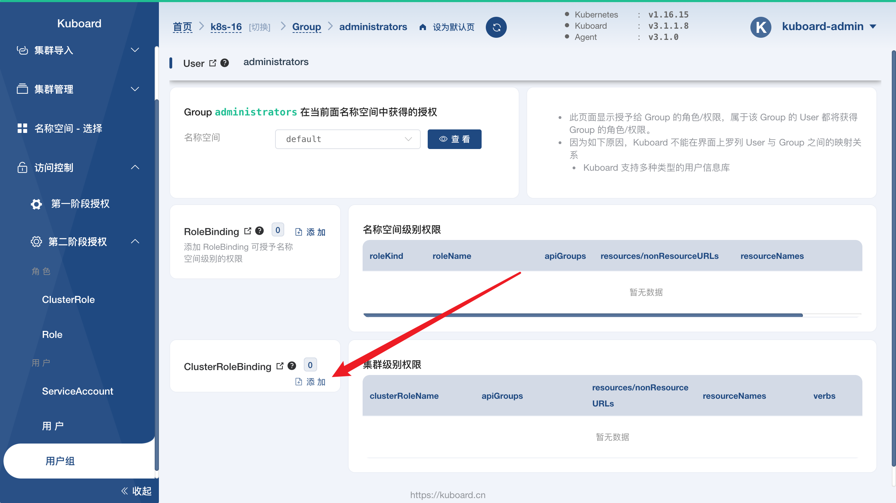

* 点击上图中 ***ClusterRoleBinding*** 后面的 ***添加*** 按钮，如下图所示：

  在关联的 ClusterRole 里选择名称为 `system:basic-user` 的 ClusterRole，并点击 ***保存*** 按钮，此步骤将创建一个 ClusterRoleBinding，将用户组 `administrators` 与 ClusterRole `system:basic-user` 关联到一起。

  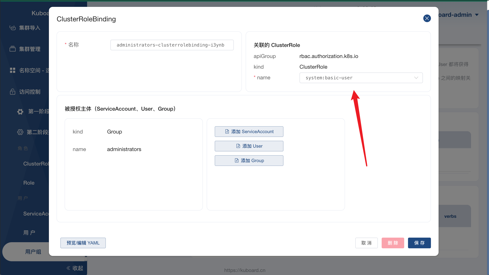

* 重复上述步骤，再创建两个 ClusterRoleBinding，并将 `administrators` 与 `system:discover` 以及 `system:public-info-viewer` 关联起来。

完成上述步骤后，您在使用被授权用户访问 Kuboard 界面就可以正常了。