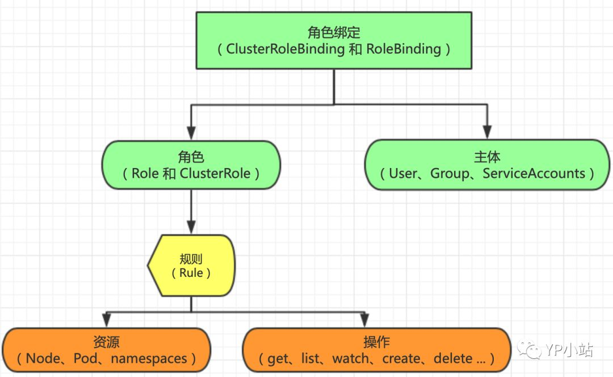

# RBAC Example

<AdSenseTitle/>

> 本文转载自 [YP小站](https://mp.weixin.qq.com/s/-CfC_-1XOZHZZD_pHEaX0Q)


## 什么是 Kubernetes RBAC

`基于角色的访问控制（Role-Based Access Control, 即 "RBAC"）`：使用 “rbac.authorization.k8s.io” API Group 实现授权决策，允许管理员通过 Kubernetes API 动态配置策略。

RBAC 从 `Kubernetes v1.6 处于beta版本`，从 `v1.8 开始`，RBAC已作为 `稳定的功能`。启用 RBAC，请使用 `--authorization-mode=RBAC` 启动 API Server。

## API 概述

本节将介绍`RBAC API`所定义的`四种顶级类型`。用户可以像使用其他Kubernetes API资源一样 （例如通过kubectl、API调用等）与这些资源进行交互。例如，命令 `kubectl create -f (resource).yml` 可以被用于以下所有的例子，当然，读者在尝试前可能需要先阅读以下相关章节的内容。

## RBAC 简易概览图

<p style="max-width: 640px;">
  </img>
</p>

## ClusterRole 与 Role 

```
Role（角色）`：是一系列权限的集合，例如一个角色可以包含读取 Pod 的权限和列出 Pod 的权限。Role `只能用来给某个特定 namespace 中的资源作鉴权`。对 namespace 、集群级资源 和 非资源类的 API（如 /healthz）使用 `ClusterRole
```

`ClusterRole`：对象可以授予与 Role 对象相同的权限，但由于它们属于集群范围对象，也可以使用它们授予对以下几种资源的访问权限：

- 集群范围资源（例如节点，即 node）
- 非资源类型 endpoint（例如 /healthz）
- 授权多个 Namespace

下面例子描述了 default namespace 中的一个 Role 对象的定义，用于授予对 pod 的读访问权限

``` yaml
kind: Role
apiVersion: rbac.authorization.k8s.io/v1beta1
metadata:
  namespace: default
  name: demo-role
rules:
- apiGroups: [""] # 空字符串""表明使用 core API group
  resources: ["pods"]
  verbs: ["get", "watch", "list", "create", "delete"]
```

下面例子中 ClusterRole 定义可用于授予用户对`某一个 namespace`，或者 `所有 namespace`的 secret（取决于其绑定方式）的读访问权限

```yaml
kind: ClusterRole
apiVersion: rbac.authorization.k8s.io/v1beta1
metadata:
  # ClusterRole 是集群范围对象，没有 "namespace" 区分
  name: demo-clusterrole
rules:
- apiGroups: [""]
  resources: ["secrets"]
  verbs: ["get", "watch", "list", "create", "delete"]
```

## ClusterRoleBinding 与 RoleBinding

`RoleBinding`：把 Role 或 ClusterRole 中定义的各种权限映射到 User，Service Account 或者 Group，从而让这些用户继承角色在 namespace 中的权限。

`ClusterRoleBinding`：让用户继承 ClusterRole 在整个集群中的权限。

`RoleBinding` 可以引用在同一命名空间内定义的Role对象。

```yaml
# 以下角色绑定定义将允许用户 "jane" 从 "default" 命名空间中读取pod
kind: RoleBinding
apiVersion: rbac.authorization.k8s.io/v1beta1
metadata:
  name: read-pods
  namespace: default
subjects:
- kind: User
  name: jane
  apiGroup: rbac.authorization.k8s.io
roleRef:
  kind: Role
  name: pod-reader
  apiGroup: rbac.authorization.k8s.io
```

`RoleBinding` 对象也可以引用一个 `ClusterRole` 对象用于在 `RoleBinding` 所在的命名空间内授予用户对所引用的`ClusterRole` 中定义的命名空间资源的访问权限。这一点允许管理员在整个集群范围内首先定义一组通用的角色，然后再在不同的命名空间中复用这些角色。

例如，尽管下面示例中的 RoleBinding 引用的是一个 ClusterRole 对象，但是用户”dave”（即角色绑定主体）还是只能读取”development” 命名空间中的 secret（即RoleBinding所在的命名空间）

```yaml
# 以下角色绑定允许用户"dave"读取"development"命名空间中的secret。
kind: RoleBinding
apiVersion: rbac.authorization.k8s.io/v1beta1
metadata:
  name: read-secrets
  namespace: development # 这里表明仅授权读取"development"命名空间中的资源。
subjects:
- kind: User
  name: dave
  apiGroup: rbac.authorization.k8s.io
roleRef:
  kind: ClusterRole
  name: secret-reader
  apiGroup: rbac.authorization.k8s.io
```

最后，可以使用 `ClusterRoleBinding` 在集群级别和所有命名空间中授予权限。下面示例中所定义的 `ClusterRoleBinding` 允许在用户组 ”manager” 中的任何用户都可以读取集群中任何命名空间中的 secret 。

```yaml
# 以下`ClusterRoleBinding`对象允许在用户组"manager"中的任何用户都可以读取集群中任何命名空间中的secret。
kind: ClusterRoleBinding
apiVersion: rbac.authorization.k8s.io/v1beta1
metadata:
  name: read-secrets-global
subjects:
- kind: Group
  name: manager
  apiGroup: rbac.authorization.k8s.io
roleRef:
  kind: ClusterRole
  name: secret-reader
  apiGroup: rbac.authorization.k8s.io
```

## 对资源的引用

大多数资源由代表其名字的字符串表示，例如 ”pods”，就像它们出现在相关API endpoint 的URL中一样。然而，有一些Kubernetes API还 包含了”子资源”，比如 `pod` 的 `logs`。在Kubernetes中，pod logs endpoint的URL格式为：

```
GET /api/v1/namespaces/{namespace}/pods/{name}/log
```

在这种情况下，”pods”是命名空间资源，而”log”是pods的子资源。为了在RBAC角色中表示出这一点，我们需要使用斜线来划分资源 与子资源。如果需要角色绑定主体读取pods以及pod log，您需要定义以下角色：

```yaml
kind: Role
apiVersion: rbac.authorization.k8s.io/v1beta1
metadata:
  namespace: default
  name: pod-and-pod-logs-reader
rules:
- apiGroups: [""]
  resources: ["pods", "pods/log"]
  verbs: ["get", "list"]
```

通过 `resourceNames` 列表，角色可以针对不同种类的请求根据资源名引用资源实例。当指定了 `resourceNames` 列表时，不同动作 种类的请求的权限，如使用 ”get”、”delete”、”update”以及”patch”等动词的请求，将被限定到资源列表中所包含的资源实例上。例如，如果需要限定一个角色绑定主体只能 ”get” 或者 ”update” 一个 `configmap` 时，您可以定义以下角色：

```yaml
kind: Role
apiVersion: rbac.authorization.k8s.io/v1beta1
metadata:
  namespace: default
  name: configmap-updater
rules:
- apiGroups: [""]
  resources: ["configmap"]
  resourceNames: ["my-configmap"]
  verbs: ["update", "get"]
```

值得注意的是，如果设置了 `resourceNames`，则请求所使用的动词不能是 `list、watch、create或者deletecollection`。由于资源名不会出现在 `create、list、watch和deletecollection` 等API请求的URL中，所以这些请求动词不会被设置了`resourceNames` 的规则所允许，因为规则中的 `resourceNames` 部分不会匹配这些请求。


## 例子

- 绑定用户能查看所有 namespace

  ```yaml
  apiVersion: rbac.authorization.k8s.io/v1
  kind: ClusterRole
  metadata:
    # 鉴于ClusterRole是集群范围对象，所以这里不需要定 义"namespace"字段
    name: view-namespace-clusterrole
  rules:
  - apiGroups:
    - ""
    resources:
    - namespaces
    - namespaces/status
    verbs:
    - get
    - list
    - watch
  ```

- 定义 `develop-role` 用户对 `default` 命名空间详细权限

  ```yaml
  apiVersion: rbac.authorization.k8s.io/v1
  kind: Role
  metadata:
    name: develop-role
    namespace: default
  rules:
  - apiGroups:
    - ""
    resources:
    - endpoints
    - serviceaccounts
    - configmaps
    - persistentvolumeclaims
    - persistentvolumes
    - services
    - replicationcontrollers
    - replicationcontrollers/scale
    verbs:
    - get
    - list
    - watch
  - apiGroups:
    - ""
    resources:
    - pods
    - pods/log
    - pods/status
    - pods/exec
    verbs:
    - create
    - delete
    - deletecollection
    - patch
    - update
    - get
    - list
    - watch
  - apiGroups:
    - ""
    resources:
    - bindings
    - events
    - limitranges
    - namespaces/status
    - replicationcontrollers/status
    - resourcequotas
    - resourcequotas/status
    verbs:
    - get
    - list
    - watch
  - apiGroups:
    - ""
    resources:
    - namespaces
    verbs:
    - get
    - list
    - watch
  - apiGroups:
    - apps
    resources:
    - daemonsets
    - statefulsets
    verbs:
    - get
    - list
    - watch
  - apiGroups:
    - apps
    resources:
    - deployments
    - deployments/scale
    - replicasets
    - replicasets/scale
    verbs:
    - get
    - list
    - watch
    - update
  - apiGroups:
    - autoscaling
    resources:
    - horizontalpodautoscalers
    verbs:
    - get
    - list
    - watch
  - apiGroups:
    - batch
    resources:
    - cronjobs
    - jobs
    verbs:
    - get
    - list
    - watch
  - apiGroups:
    - extensions
    resources:
    - daemonsets
    - statefulsets
    - ingresses
    - networkpolicies
    verbs:
    - get
    - list
    - watch
  - apiGroups:
    - extensions
    resources:
    - deployments
    - deployments/scale
    - replicasets
    - replicasets/scale
    - replicationcontrollers/scale
    verbs:
    - get
    - list
    - watch
    - update
  - apiGroups:
    - policy
    resources:
    - poddisruptionbudgets
    verbs:
    - get
    - list
    - watch
  - apiGroups:
    - networking.k8s.io
    resources:
    - networkpolicies
    verbs:
    - get
    - list
    - watch
  ```

## 默认角色 与 默认角色绑定

`API Server` 会创建一组默认的 `ClusterRole` 和 `ClusterRoleBinding` 对象。这些默认对象中有许多包含 `system:` 前缀，表明这些资源由 `Kubernetes基础组件”拥有”`。对这些资源的修改可能`导致非功能性集群`（non-functional cluster）。一个例子是 `system:node ClusterRole` 对象。这个角色定义了 `kubelet` 的权限。如果这个角色被修改，可能会导致`kubelet` 无法正常工作。

所有默认的 `ClusterRole` 和 `ClusterRoleBinding` 对象都会被标记为 `kubernetes.io/bootstrapping=rbac-defaults`。

## 面向用户的角色

通过命令 `kubectl get clusterrole` 查看到并不是所有都是以 `system:前缀`，它们是`面向用户的角色`。这些角色包含`超级用户角色（cluster-admin`），即旨在利用 `ClusterRoleBinding（cluster-status）`在集群范围内授权的角色， 以及那些使用 `RoleBinding（admin、edit和view）`在特定命名空间中授权的角色。

- `cluster-admin`：`超级用户权限`，允许对任何资源执行任何操作。在 ClusterRoleBinding 中使用时，可以完全控制集群和所有命名空间中的所有资源。在 RoleBinding 中使用时，可以完全控制 RoleBinding 所在命名空间中的所有资源，包括命名空间自己。
- `admin`：`管理员权限`，利用 RoleBinding 在某一命名空间内部授予。在 RoleBinding 中使用时，允许针对命名空间内大部分资源的读写访问， 包括在命名空间内创建角色与角色绑定的能力。但`不允许对资源配额（resource quota）`或者`命名空间本身`的`写访问`。
- `edit`：允许对某一个命名空间内大部分对象的读写访问，但不允许查看或者修改角色或者角色绑定。
- `view`：允许对某一个命名空间内大部分对象的只读访问。不允许查看角色或者角色绑定。由于可扩散性等原因，`不允许查看 secret 资源`。

> 核心组件角色、其它组件角色 和 控制器（Controller）角色 这里不在一一列出。具体见 [参考链接](https://kubernetes.io/docs/reference/access-authn-authz/rbac/#controller-roles)。

## Permissive RBAC

所谓 `Permissive RBAC` 是指授权给所有的 `Service Accounts` 管理员权限。`不推荐的配置`

```sh
$ kubectl create clusterrolebinding permissive-binding \
  --clusterrole=cluster-admin \
  --user=admin \
  --user=kubelet \
  --group=system:serviceaccounts
```

## 创建用户 shell 脚本

```sh
#!/usr/bin/env bash
# 注意修改KUBE_APISERVER为你的API Server的地址

KUBE_APISERVER=$1
USER=$2
USER_SA=system:serviceaccount:default:${USER}
Authorization=$3
USAGE="USAGE: create-user.sh <api_server> <username> <clusterrole authorization>\n
Example: https://192.168.1.2:6443 brand"
CSR=`pwd`/user-csr.json
SSL_PATH="/opt/kubernetes/ssl"
USER_SSL_PATH="/opt/kubernetes/create-user"
SSL_FILES=(ca-key.pem ca.pem ca-config.json)
CERT_FILES=(${USER}.csr $USER-key.pem ${USER}.pem)

if [[ $KUBE_APISERVER == "" ]]; then
   echo -e $USAGE
   exit 1
fi
if [[ $USER == "" ]];then
    echo -e $USAGE
    exit 1
fi

if [[ $Authorization == "" ]];then
    echo -e $USAGE
    exit 1
fi

# 创建用户的csr文件
function createCSR(){
cat>$CSR<<EOF
{
  "CN": "USER",
  "hosts": [],
  "key": {
    "algo": "rsa",
    "size": 2048
  },
  "names": [
    {
      "C": "CN",
      "ST": "BeiJing",
      "L": "BeiJing",
      "O": "k8s",
      "OU": "System"
    }
  ]
}
EOF

# 替换csr文件中的用户名
sed -i "s/USER/$USER_SA/g" $CSR
}

function ifExist(){
if [ ! -f "$SSL_PATH/$1" ]; then
    echo "$SSL_PATH/$1 not found."
    exit 1
fi
}

function ifClusterrole(){
kubectl get clusterrole ${Authorization} &> /dev/null
if (( $? !=0 ));then
   echo "${Authorization} clusterrole there is no"
   exit 1
fi
}

# 判断clusterrole授权是否存在
ifClusterrole

# 判断证书文件是否存在
for f in ${SSL_FILES[@]};
do
    echo "Check if ssl file $f exist..."
    ifExist $f
    echo "OK"
done

echo "Create CSR file..."
createCSR
echo "$CSR created"
echo "Create user's certificates and keys..."
cd $USER_SSL_PATH
cfssl gencert -ca=${SSL_PATH}/ca.pem -ca-key=${SSL_PATH}/ca-key.pem -config=${SSL_PATH}/ca-config.json -profile=kubernetes $CSR| cfssljson -bare $USER_SA

# 创建 sa
kubectl create sa ${USER} -n default

# 设置集群参数
kubectl config set-cluster kubernetes \
--certificate-authority=${SSL_PATH}/ca.pem \
--embed-certs=true \
--server=${KUBE_APISERVER} \
--kubeconfig=${USER}.kubeconfig

# 设置客户端认证参数
kubectl config set-credentials ${USER_SA} \
--client-certificate=${USER_SSL_PATH}/${USER_SA}.pem \
--client-key=${USER_SSL_PATH}/${USER_SA}-key.pem \
--embed-certs=true \
--kubeconfig=${USER}.kubeconfig

# 设置上下文参数
kubectl config set-context kubernetes \
--cluster=kubernetes \
--user=${USER_SA} \
--namespace=development \
--kubeconfig=${USER}.kubeconfig

# 设置默认上下文
kubectl config use-context kubernetes --kubeconfig=${USER}.kubeconfig

# 创建 namespace
# kubectl create ns $USER

# 绑定角色
# kubectl create rolebinding ${USER}-admin-binding --clusterrole=admin --user=$USER --namespace=$USER --serviceaccount=$USER:default
kubectl create clusterrolebinding ${USER}-binding --clusterrole=${Authorization} --user=${USER_SA}

# kubectl config get-contexts

echo "Congratulations!"
echo "Your kubeconfig file is ${USER}.kubeconfig"
```
