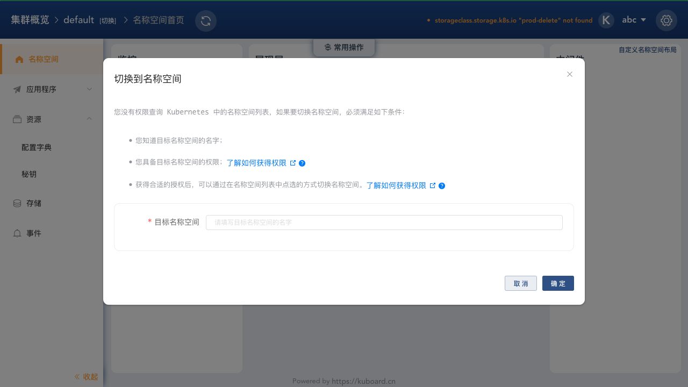
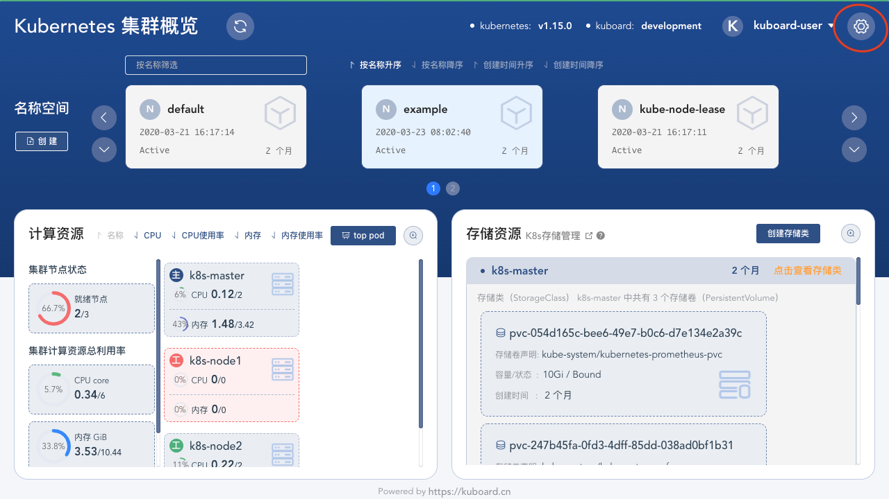
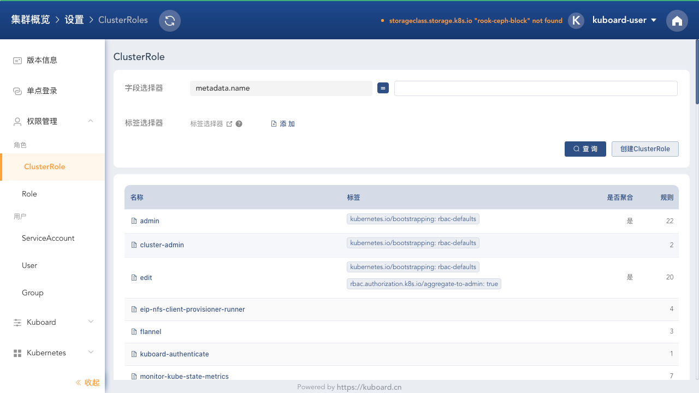
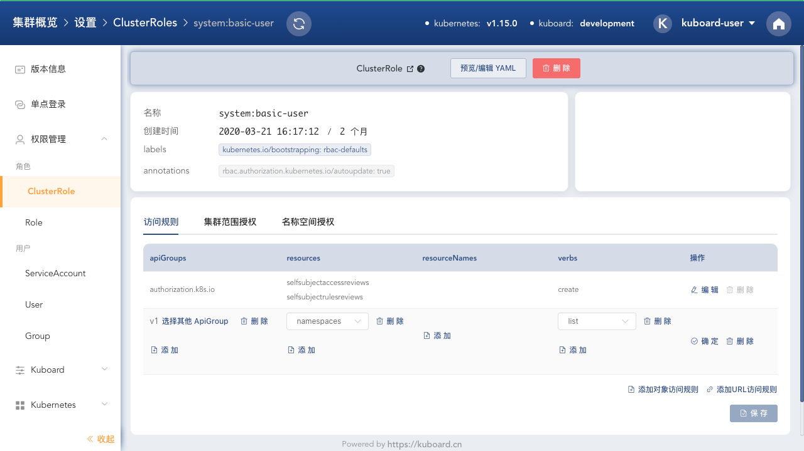
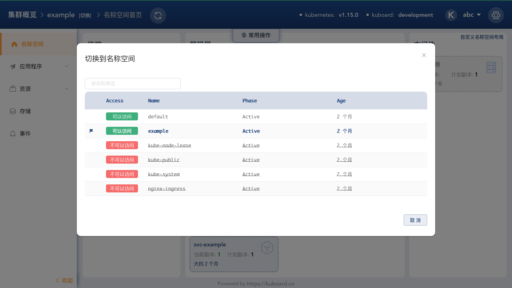

# 授权用户访问名称空间列表

<AdSenseTitle/>

## 背景

在 Kuboard 中为某一个用户 [授权访问指定名称空间](../kuboard.html) 后，默认情况下，该用户在切换名称空间时，需要自行输入目标名称空间的名称，如下图所示：

这种情况，需要用户记住并输入名称空间的名字，使用时不是特别便捷。事实上，只要为用户授予查询名称空间列表的权限，Kuboard 中切换名称空间的这个对话框就可以展示名称空间列表，供用户选择，如下图所示：

本文描述了如何为用户授权查询名称空间列表。

## 前提

* 您已经 [安装了 Kuboard](/install/install-dashboard-upgrade.html) <Badge>Kuboard v2.0.0-beta.2</Badge>
* 使用 [管理员用户 ](/install/install-dashboard.html#获取token)登录 Kuboard
* 已经为某一个用户 [授权访问指定名称空间](../kuboard.html)

## 授权步骤

* 使用 kuboard-user 登录Kuboard，并进入集群概览页，如下图所示：

  > 必须使用具备 cluster-admin 权限的用户才能完成此授权操作。

  [了解如何使用 kuboard-user 登录 Kuboard](/install/install-dashboard.html#获取token)

  

* 在集群概览页中，点击右上角的 **设置** 按钮，并在左侧菜单中导航到 **权限管理** --> **ClusterRole**，如下图所示：

  

* 在 **ClusterRole** 列表中找到 **system:basic-user** 并进入其详情页，如下图所示：

  

* 为 **system:basic-user** 添加 list namespace 的权限，如下图所示：

  > **v1** apiGroup 在下拉列表的第一个；

  点击 **确定** 按钮，然后点击 **保存** 按钮，完成授权过程。

  ::: tip system:basic-user

  **system:basic-user** 是 Kubernetes 中的一个默认 ClusterRole，该 ClusterRole 被绑定到所有的已认证用户 **system:authenticated**，完成此授权后，任何已经登录 Kubernetes 的用户都可以查询到名称空间列表（只读操作）。

  :::

  

## 通过列表选择的形式切换名称空间

完成上述授权之后，只具备部分名称空间访问权限的用户在切换名称空间时，就可以通过在列表中选择的方式进行切换了。如下图所示：

退出 **kuboard-user**，使用只具备部分名称空间访问权限的用户登录 Kuboard，并点击左上角 **[切换]** 按钮：

::tada: :tada: :tada: 您已可以通过列表选择的形式切换名称空间了。

