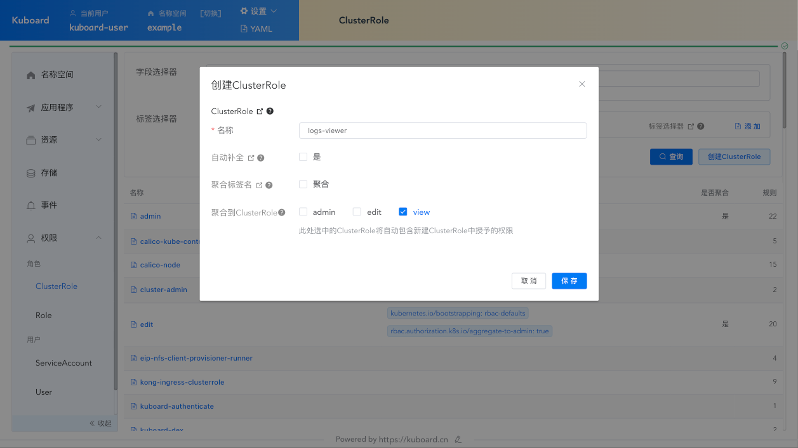
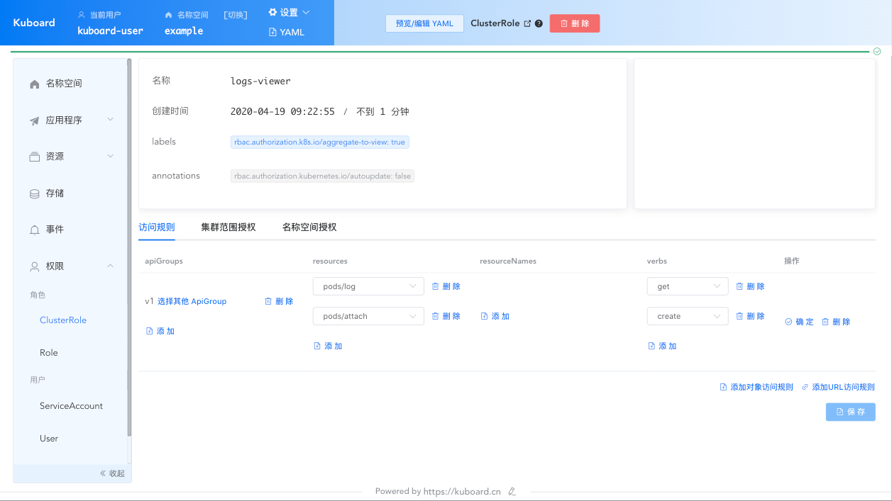
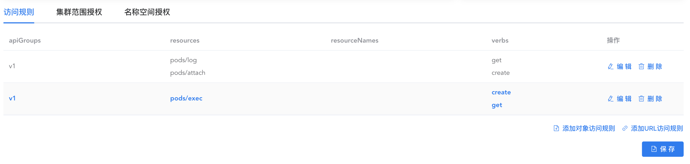

# 授权 kuboard-viewer 查看日志

本文描述了如何为 kuboard-viewer 用户添加查看日志的权限。

## 前提

* 您已经安装了 kubernetes
* 您已经安装了 [Kuboard](/install/install-dashboard.html)，版本号不低于 v1.0.9.3

## 步骤

* 以 kuboard-user 用户登录 Kuboard 界面；
  
  参考 [获取Token并访问Kuboard](/install/install-dashboard.html#获取Token)
  
* 进入 `kube-system` 名称空间页面（或任意名称空间）；

* 点击左侧菜单的 ***权限*** -> ***ClusterRole*** 按钮，进入 ClusterRole 列表页面；

* 点击 ***创建 ClusterRole*** 按钮，如下图所示：

  填写表单如下：

  | 字段名称           | 字段类型 | 填写内容    | 字段描述                                                     |
  | ------------------ | -------- | ----------- | ------------------------------------------------------------ |
  | 名称               | String   | logs-viewer | ClusterRole 的名称，请填写一个方便您自己记忆的名称。         |
  | 自动补全           | Boolean  | 否          | 如果勾选，API Server 每次启动时，将检查此 ClusterRole 是否存在，内容是否被篡改。 |
  | 聚合标签名         | Boolean  | 否          | 如果填写，则此 ClusterRole 中的权限来自于指定标签所选中 ClusterRole 中定义权限的合集。 |
  | 聚合到 ClusterRole | String   | view        | logs-viewer 中定义的权限将聚合到 view 这个 ClusterRole 中。  |

  

* 点击 ***保存*** 按钮，保存后在如下界面填写：

  | 字段名称      | 填写内容                  | 字段描述                                                     |
  | ------------- | ------------------------- | ------------------------------------------------------------ |
  | apiGroups     | v1                        | 资源对象所属的 apiGroups                                     |
  | resources     | pods/log pods/attach | 查看日志必须访问 pods/log 和 pods/attach 这两个资源          |
  | resourceNames |                           | 不指定，则可以访问任意 Pod 的日志                            |
  | verbs         | get           | 必须具备对 pods/log 和 pods/attach 进行 get 操作的权限 |

  

* 点击 ***保存*** 按钮，退出后，以 `kuboard-viewer` 的身份登录 Kuboard

  参考 [获取Token并访问Kuboard](/install/install-dashboard.html#获取Token)

  此时，`kuboard-viewer` 将具备权限访问 Pod 的日志；

::: tip 备注
这样操作能够成功的原因是：
* 在安装 Kuboard 的 yaml 文件中，创建了 `kuboard-viewer`，并通过 ClusterRoleBinding 将其绑定到了 `view` 这个 ClusterRole，这意味着 `kuboard-viewer` 具备集群级别的查看权限，您也可以：
  * [创建 ServiceAccount 并授权其访问指定的名称空间](../kuboard.html)；
  * [安装 OpenID Connect](/learning/k8s-advanced/sec/authenticate/install.html) 以使用自建 github / gitlab 的账号登录 Kuboard；
* `view` 这个 ClusterRole 在安装 Kubernetes 时，由 kubernetes 自己初始化，其中不包括查看日志所需的权限；
* `view` 这个 ClusterRole 是一个 [聚合 ClusterRole](/learning/k8s-advanced/sec/rbac/api.html#aggregated-clusterroles)，这意味着我们可以通过定义新的 ClusterRole，为 `view` 增加权限
* 本操作中，定义的 `logs-viewer` 包含了查看日志所需要的权限，并将其聚合到了 `view` ClusterRole，因此， `kuboard-viewer` 就可以查看容器组的日志了。
:::

## 命令行终端

如果需要访问命令行终端，还需要增加 `pods/exec` 的 `get`、`create` 权限，如下图所示：

