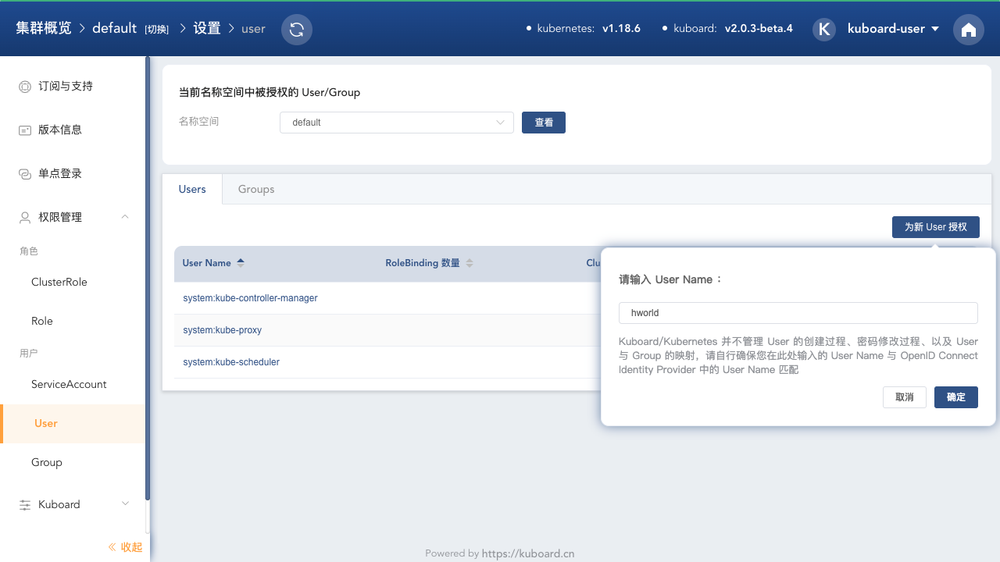
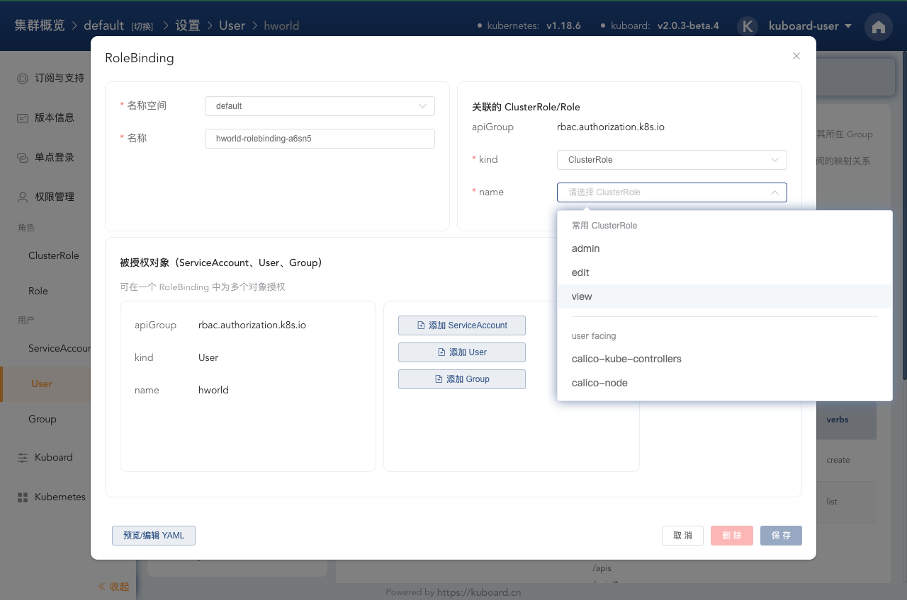
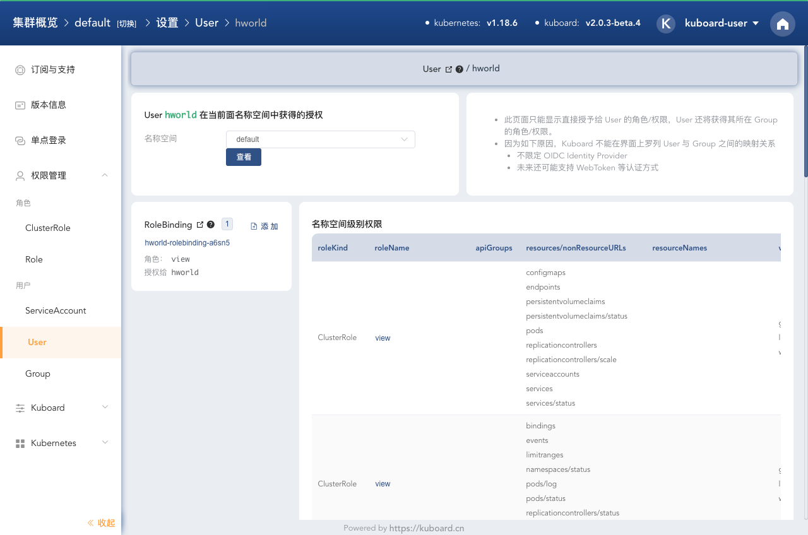

# 授权用户访问名称空间

本文描述了如何授予用户访问 Kubernetes 的一个名称空间。

## 前提条件

完成 [ Kubernetes Authentication 安装向导](/learning/k8s-advanced/sec/authenticate/install.html) 或者 [Kubernetes Authentication LDAP](/learning/k8s-advanced/sec/authenticate/ldap.html) 的安装

## 步骤描述

授权用户访问 default 名称空间的步骤如下：

* 打开 Kuboard 界面并使用 `kuboard-user` 登录，点击右上角的圆形按钮，进入设置菜单，点击右侧菜单栏的 ***权限管理*** / ***User*** 菜单，界面如下图所示：

  

* 点击上图中的 ***为新 User 授权*** 按钮，如下图所示：

  输入 User Name 为 `hworld` （或者您自己的用户名），此处的用户名为完成 [ Kubernetes Authentication 安装向导](/learning/k8s-advanced/sec/authenticate/install.html) 或者 [Kubernetes Authentication LDAP](/learning/k8s-advanced/sec/authenticate/ldap.html) 的安装后，登录 Kuboard 时所使用的第三方（GitHub/GitLab/LDAP）的用户名。

  

* 点击上图中的 ***确定*** 按钮，进入如下界面：

  此界面中显示了该用户关联的 RoleBinding 及 ClusterRoleBinding。

  

  ::: tip RoleBinding v.s. ClusterRoleBinding

  * RoleBinding 必须在名称空间内创建，作用范围是其所在的名称空间；
  * RoleBinding 可以关联 ServiceAccount、User、Group 等所有类型的 Subject；
  * RoleBinding 可以关联其他名称空间（与RoleBinding不在同一名称空间）的 ServiceAccount，例如，名称空间 A 中有一个 ServiceAccount `sa1`；在名称空间 B 中创建一个 RoleBinding，其 Subject 为名称空间 A 中的 `sa1`，其角色为 ClusterRole `admin`；此时，`sa1` 可以以 `admin` 的角色访问名称空间 B；但是，ClusterRole `admin` 中关于节点等对象的授权（查询节点列表、查看节点详情等），`sa1` 并不能执行，因为 RoleBinding 的作用域为其所在的名称空间，而节点属于集群级别的对象；
  * ClusterRoleBinding 只能关联 ClusterRole；
  * ClusterRoleBinding的作用域是整个集群。如果用户通过 ClusterRoleBinding 关联了 ClusterRole `admin`，则该用户可以以 `admin` 的身份访问集群中的所有名称空间，也可以访问 ClusterRole `admin` 中授权的集群级别的对象。

  :::

* 点击上图中 ***RoleBinding*** 后面的 ***添加*** 按钮，将打开创建 RoleBinding 的对话框，

  选择 ***常用 ClusterRole*** 中的 ***view*** ，如下图所示：

  

* 点击上图中的 ***保存*** 按钮，将完成 RoleBinding 的创建，如下图所示：

  此时，用户已经可以以 `view` 的身份访问名称空间 `default` 了。

  

:tada:  :tada: :tada:
