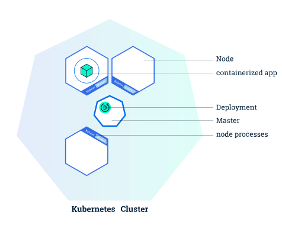
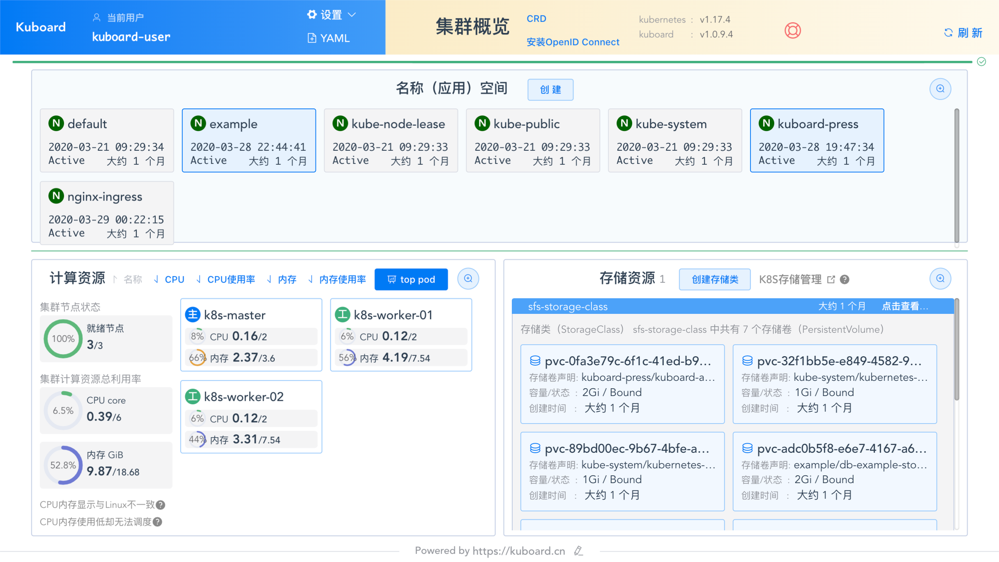
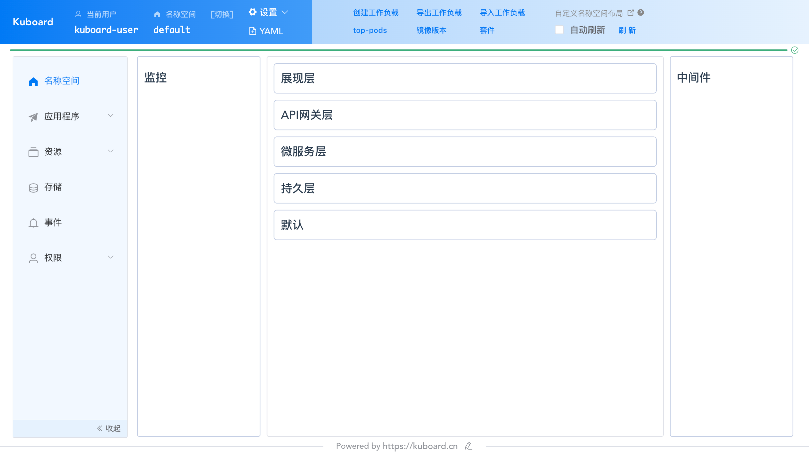
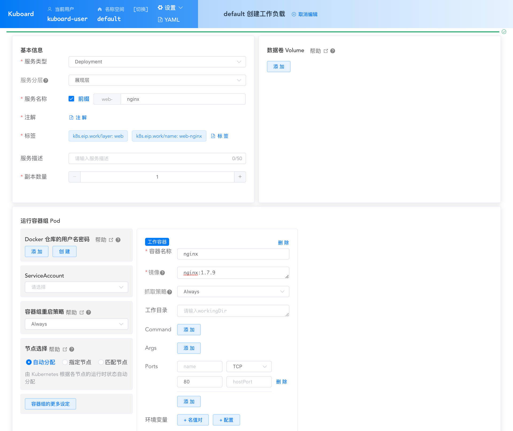
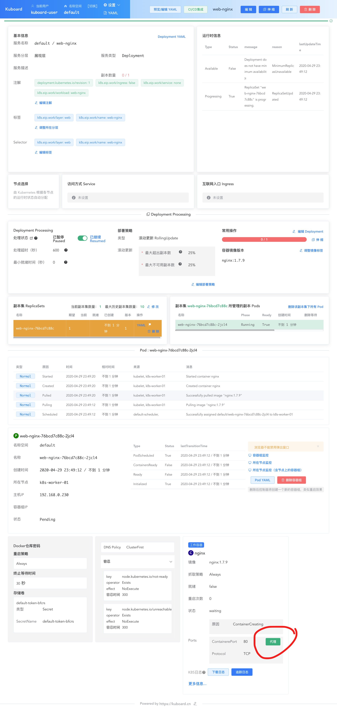
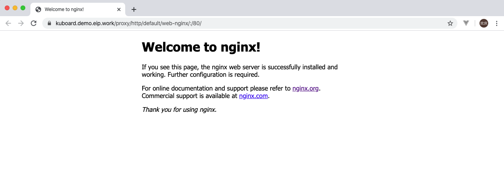

# 1.部署一个应用程序

<AdSenseTitle/>

本文翻译自 Kubernetes  [Using kubectl to Create a Deployment](https://kubernetes.io/docs/tutorials/kubernetes-basics/deploy-app/deploy-intro/) ，并有所改写

### 前提

假设您已经

* 完成 Kubernetes 集群的安装，请参考文档 [安装 Kubernetes 单Master节点](/install/install-k8s.html)
* 完成 Kuboard 的安装，请参考文档 [安装 Kuboard](/install/install-dashboard.html)

### 目标

- 使用 kubectl 在 k8s 上部署第一个应用程序。

::: tip
* kubectl 是 k8s 的客户端工具，可以使用命令行管理集群。
* 如果参考文档 [安装 Kubernetes 单Master节点](/install/install-k8s.html)，您可以在 master 节点的 root 用户使用 kubectl 操作您的集群
* 您也可以尝试 [从客户端电脑远程管理 Kubernetes](/install/install-kubectl.html)
:::

### Kubernetes 部署

在 k8s 上进行部署前，首先需要了解一个基本概念 **Deployment** 

**Deployment** 译名为 **部署**。在k8s中，通过发布 Deployment，可以创建应用程序 (docker image) 的实例 (docker container)，这个实例会被包含在称为 **Pod** 的概念中，**Pod** 是 k8s 中最小可管理单元。

在 k8s 集群中发布 Deployment 后，Deployment 将指示 k8s 如何创建和更新应用程序的实例，master 节点将应用程序实例调度到集群中的具体的节点上。

创建应用程序实例后，Kubernetes Deployment Controller 会持续监控这些实例。如果运行实例的 worker 节点关机或被删除，则 Kubernetes Deployment Controller 将在群集中资源最优的另一个 worker 节点上重新创建一个新的实例。**这提供了一种自我修复机制来解决机器故障或维护问题。**

在容器编排之前的时代，各种安装脚本通常用于启动应用程序，但是不能够使应用程序从机器故障中恢复。通过创建应用程序实例并确保它们在集群节点中的运行实例个数，Kubernetes Deployment 提供了一种完全不同的方式来管理应用程序。

## 在 Kubernetes 上部署第一个应用程序



上图是在第一篇文章的基础上，添加上了Deployment、Pod和Container。

Deployment 处于 master 节点上，通过发布 Deployment，master 节点会选择合适的 worker 节点创建 Container（即图中的正方体），Container 会被包含在 Pod （即蓝色圆圈）里。

## 实战：部署 nginx Deployment

本套教程提供了两种实战方式：

* 使用 kubectl
* 使用 Kuboard


<b-card>
<b-tabs content-class="mt-3">
  <b-tab title="使用kubectl" active>

**创建 YAML 文件**

创建文件 nginx-deployment.yaml，内容如下：

<CodeSwitcher :languages="{comment:'有注释',nocomment:'无注释'}" :isolated="true">
<template v-slot:comment>

```yaml
apiVersion: apps/v1	#与k8s集群版本有关，使用 kubectl api-versions 即可查看当前集群支持的版本
kind: Deployment	#该配置的类型，我们使用的是 Deployment
metadata:	        #译名为元数据，即 Deployment 的一些基本属性和信息
  name: nginx-deployment	#Deployment 的名称
  labels:	    #标签，可以灵活定位一个或多个资源，其中key和value均可自定义，可以定义多组，目前不需要理解
    app: nginx	#为该Deployment设置key为app，value为nginx的标签
spec:	        #这是关于该Deployment的描述，可以理解为你期待该Deployment在k8s中如何使用
  replicas: 1	#使用该Deployment创建一个应用程序实例
  selector:	    #标签选择器，与上面的标签共同作用，目前不需要理解
    matchLabels: #选择包含标签app:nginx的资源
      app: nginx
  template:	    #这是选择或创建的Pod的模板
    metadata:	#Pod的元数据
      labels:	#Pod的标签，上面的selector即选择包含标签app:nginx的Pod
        app: nginx
    spec:	    #期望Pod实现的功能（即在pod中部署）
      containers:	#生成container，与docker中的container是同一种
      - name: nginx	#container的名称
        image: nginx:1.7.9	#使用镜像nginx:1.7.9创建container，该container默认80端口可访问
```

</template>
<template v-slot:nocomment>

```yaml
apiVersion: apps/v1
kind: Deployment
metadata:
  name: nginx-deployment
  labels:
    app: nginx
spec:
  replicas: 1
  selector:
    matchLabels:
      app: nginx
  template:
    metadata:
      labels:
        app: nginx
    spec:
      containers:
      - name: nginx
        image: nginx:1.7.9
```

</template>
</CodeSwitcher>


**应用 YAML 文件**

``` sh
kubectl apply -f nginx-deployment.yaml
```

**查看部署结果**

``` sh
# 查看 Deployment
kubectl get deployments

# 查看 Pod
kubectl get pods
```

  </b-tab>
  <b-tab title="使用Kuboard">

**打开 Kuboard 集群概览界面**，如下图所示：




**点击 default 名称空间**




点击 **创建工作负载**

​	并填写表单如下：

| 字段名   | 填写内容    | 备注                                                    |
| -------- | ----------- | ------------------------------------------------------- |
| 服务类型 | Deployment  |                                                         |
| 服务分层 | 展现层      | Kuboard使用这个字段确定将部署显示在微服务架构的哪个分层 |
| 服务名称 | nginx       | 服务分层的前缀 + 服务名 组成最终的 K8S Deployment name  |
| 服务描述 | Nginx部署   | 显示在微服务分层架构图中便于识别的名字，可以是中文      |
| 副本数量 | 1           | replicas                                                |
| 容器名称 | nginx       |                                                         |
| 镜像     | nginx:1.7.9 |                                                         |
| 抓取策略 | Always      | 每次创建 Pod 都尝试抓取镜像                             |
| Ports    | TCP : 80    | 该容器组监听 TCP 80 端口                                |




点击 ***保存***

点击 ***应用***

点击 ***完成***

此时可查看到该应用的部署结果，如下图所示：



点击上图中的 ***代理*** 按钮，可以直接测试部署结果。更多细节请参考 [Kuboard Proxy](/guide/proxy)， 此功能要求 Kuboard 版本不低于 `v1.0.9.4`。

通过代理访问已部署的 nginx 服务时，默认显示结果如下所示：



  </b-tab>
</b-tabs>
</b-card>

可分别查看到一个名为 nginx-deployment 的 Deployment 和一个名为 nginx-deployment-xxxxxxx 的 Pod

~~任务二达成，至此你已经成功在k8s上部署了一个实例的nginx应用程序，

~~想要知道 Deployment（部署）、Pod（容器组） 和 Node(节点) 之间的关系吗？

~~let‘s go-> [查看 Pods（容器组）和 Nodes（节点）](./explore.html)
