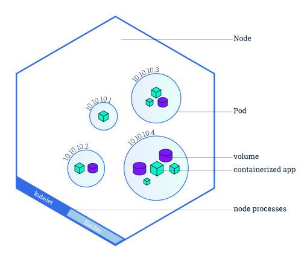

# 2.查看Pods/Nodes

<AdSenseTitle/>

本文翻译自 Kubernetes  [Viewing Pods and Nodes](https://kubernetes.io/docs/tutorials/kubernetes-basics/explore/explore-intro/) ，并有所改写

## 目标

- 了解Kubernetes Pods（容器组）
- 了解Kubernetes Nodes（节点）
- 排查故障

## Kubernetes Pods

在 [部署第一个应用程序](./deploy-app.html) 中创建 Deployment 后，k8s创建了一个 **Pod（容器组）** 来放置应用程序实例（container 容器）。

## Pods概述

</img>


**Pod 容器组** 是一个k8s中一个抽象的概念，用于存放一组 container（可包含一个或多个 container 容器，即图上正方体)，以及这些 container （容器）的一些共享资源。这些资源包括：

- 共享存储，称为卷(Volumes)，即图上紫色圆柱
- 网络，每个 Pod（容器组）在集群中有个唯一的 IP，pod（容器组）中的 container（容器）共享该IP地址
- container（容器）的基本信息，例如容器的镜像版本，对外暴露的端口等

> 例如，Pod可能既包含带有Node.js应用程序的 container 容器，也包含另一个非 Node.js 的 container 容器，用于提供 Node.js webserver 要发布的数据。Pod中的容器共享 IP 地址和端口空间（同一 Pod 中的不同 container 端口不能相互冲突），始终位于同一位置并共同调度，并在同一节点上的共享上下文中运行。（同一个Pod内的容器可以使用 localhost + 端口号互相访问）。
>

Pod（容器组）是 k8s 集群上的最基本的单元。当我们在 k8s 上创建 Deployment 时，会在集群上创建包含容器的 Pod (而不是直接创建容器)。每个Pod都与运行它的 worker 节点（Node）绑定，并保持在那里直到终止或被删除。如果节点（Node）发生故障，则会在群集中的其他可用节点（Node）上运行相同的 Pod（从同样的镜像创建 Container，使用同样的配置，IP 地址不同，Pod 名字不同）。

::: tip
重要：
* Pod 是一组容器（可包含一个或多个应用程序容器），以及共享存储（卷 Volumes）、IP 地址和有关如何运行容器的信息。
* 如果多个容器紧密耦合并且需要共享磁盘等资源，则他们应该被部署在同一个Pod（容器组）中。
:::

## Node（节点）

下图显示一个 Node（节点）上含有4个 Pod（容器组）

</img>

Pod（容器组）总是在 **Node（节点）** 上运行。Node（节点）是 kubernetes 集群中的计算机，可以是虚拟机或物理机。每个 Node（节点）都由 master 管理。一个 Node（节点）可以有多个Pod（容器组），kubernetes master 会根据每个 Node（节点）上可用资源的情况，自动调度 Pod（容器组）到最佳的 Node（节点）上。

每个 Kubernetes Node（节点）至少运行：

- Kubelet，负责 master 节点和 worker 节点之间通信的进程；管理 Pod（容器组）和 Pod（容器组）内运行的 Container（容器）。
- 容器运行环境（如Docker）负责下载镜像、创建和运行容器等。


## 实战：故障排除


<b-card>
<b-tabs content-class="mt-3">
  <b-tab title="使用kubectl" active>

在[部署第一个应用程序](./deploy-app.html) 中，我们使用了 kubectl 命令行界面部署了 nginx 并且查看了 Deployment 和 Pod。kubectl 还有如下四个常用命令，在我们排查问题时可以提供帮助：

- **kubectl get** - 显示资源列表

  ``` sh
  # kubectl get 资源类型
  
  #获取类型为Deployment的资源列表
  kubectl get deployments
  
  #获取类型为Pod的资源列表
  kubectl get pods
  
  #获取类型为Node的资源列表
  kubectl get nodes
  ```

  ::: tip 名称空间
  在命令后增加 `-A` 或 `--all-namespaces` 可查看所有 [名称空间中](/learning/k8s-intermediate/obj/namespaces.html) 的对象，使用参数 `-n` 可查看指定名称空间的对象，例如 
  ``` sh
  # 查看所有名称空间的 Deployment
  kubectl get deployments -A
  kubectl get deployments --all-namespaces
  # 查看 kube-system 名称空间的 Deployment
  kubectl get deployments -n kube-system
  ```
  > [并非所有对象都在名称空间里](/learning/k8s-intermediate/obj/namespaces.html#并非所有对象都在名称空间里)
  :::

- **kubectl describe** - 显示有关资源的详细信息

  ``` sh
  # kubectl describe 资源类型 资源名称
  
  #查看名称为nginx-XXXXXX的Pod的信息
  kubectl describe pod nginx-XXXXXX	
  
  #查看名称为nginx的Deployment的信息
  kubectl describe deployment nginx	
  ```

- **kubectl logs** - 查看pod中的容器的打印日志（和命令docker logs 类似）

  ``` sh
  # kubectl logs Pod名称
  
  #查看名称为nginx-pod-XXXXXXX的Pod内的容器打印的日志
  #本案例中的 nginx-pod 没有输出日志，所以您看到的结果是空的
  kubectl logs -f nginx-pod-XXXXXXX
  ```

- **kubectl exec** - 在pod中的容器环境内执行命令(和命令docker exec 类似)

  ```sh
  # kubectl exec Pod名称 操作命令
  
  # 在名称为nginx-pod-xxxxxx的Pod中运行bash
  kubectl exec -it nginx-pod-xxxxxx /bin/bash
  ```

请尝试在您的集群中执行一下上述的几个命令，了解如何通过 kubectl 操作 kubernetes 集群中的 Node、Pod、Container。

  </b-tab>
  <b-tab title="使用Kuboard">

**在名称空间中查看部署**


**查看部署及其容器组**


  </b-tab>
</b-tabs>
</b-card>

::: tip
Worker节点是k8s中的工作计算机，可能是VM或物理计算机，具体取决于群集。多个Pod可以在一个节点上运行。
:::


~~现在我们已经学会在k8s上部署程序，并且也知道了部署在k8s中涉及的资源和流程，

~~等等，我们的程序还不知道如何访问呢？其实也是一个yaml文件就能实现

~~let‘s go-> [使用 Service（服务）公布您的应用程序](./expose.html)
