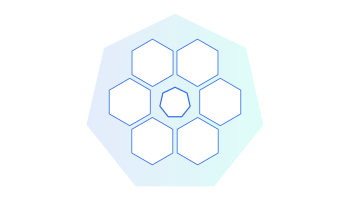
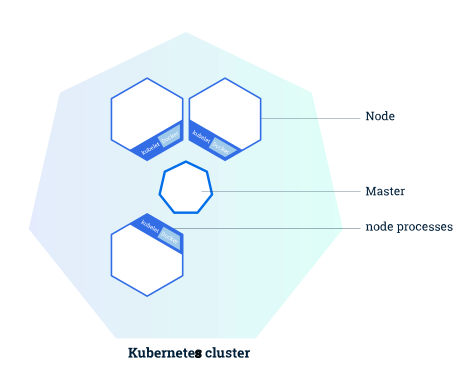

# 0.学习Kubernetes基础知识

<AdSenseTitle/>

本文翻译自 Kubernetes  [Learn Kubernetes Basics](https://kubernetes.io/docs/tutorials/kubernetes-basics/) ，并有所改写

相信很多初学者在入门 Kubernetes (以下简称k8s)时，都会被各种英文单词所困扰(例如：Deployment、Pod、Service等)，这些名词在被翻译后也往往失去了原意，更不能体现出他们的相互关系。笔者在刚开始学习k8s时也遭遇到这种困境。但是，任何复杂的系统都是发源于最基本的公式或定理，k8s虽然庞大且复杂，不过只要抓住一些基本的脉络(一些最基本的组件的定义及使用)，入门便也是毫不费劲。

本文基于k8s官方基础教程，从现实运维使用场景出发，结合上述新手入门困境，基于基本组件的定义、功能和使用角度进行讲解，帮助新手在最小化复杂度的前提下上手k8s。

## 学习目标

- 在k8s集群上部署应用程序
- 对应用程序进行扩容缩容（多实例）
- 对应用程序进行版本更新
- 使用k8s工具排查部署问题

## Kubernetes功能

官方定义k8s能够对容器化软件进行部署管理，在不停机的前提下提供简单快速的发布和更新方式。换句话说，如果项目需要多机器节点的微服务架构，并且采用Docker image（镜像）进行容器化部署，那么k8s可以帮助我们屏蔽掉集群的复杂性，自动选择最优资源分配方式进行部署。在此基础上，k8s还提供简单的多实例部署及更新方案，仅需几个操作命令就可以轻松实现。

## Kubernetes 入门目录

* [01.部署第一个应用程序](./deploy-app.html) 5分钟
* [02.查看 Pods / Nodes](./explore.html) 10分钟
* [03.公布应用程序](./expose.html) 10分钟
* [04.伸缩应用程序](./scale.html) 10分钟
* [05.执行滚动更新](./update.html) 10分钟

## k8s集群简单介绍

本篇中我们先从第一部分入手，对k8s集群有个整体上的把握。

</img>

上图描述的是拥有一个Master(主)节点和六个Worker(工作)节点的k8s集群

**Master 负责管理集群** 负责协调集群中的所有活动，例如调度应用程序，维护应用程序的状态，扩展和更新应用程序。

**Worker节点(即图中的Node)是VM(虚拟机)或物理计算机，充当k8s集群中的工作计算机。** 每个Worker节点都有一个Kubelet，它管理该Worker节点并负责与Master节点通信。该Worker节点还应具有用于处理容器操作的工具，例如Docker。

~~恭喜你，新成就达成，是不是很简单，

~~初学仅需对主要概念有个整体且正确的把握即可，让我们继续吧

~~let‘s go-> [部署第一个应用程序](./deploy-app.html)
