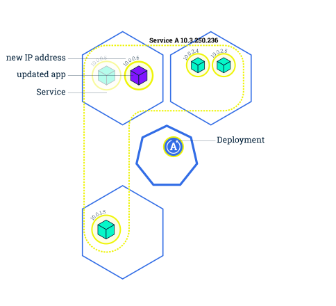
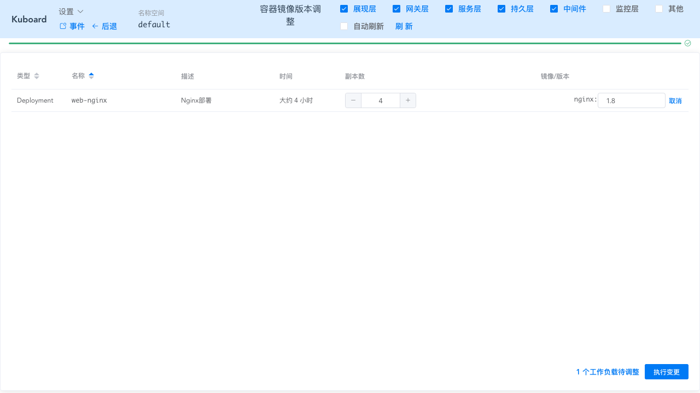

# 5.执行滚动更新

<AdSenseTitle/>

本文翻译自 Kubernetes 官网 [Performing a Rolling Update](https://kubernetes.io/docs/tutorials/kubernetes-basics/update/update-intro/) ，并有所改写

## 目标

- 使用 kubectl 执行 Rolling Update（滚动更新）

## 更新应用程序

用户期望应用程序始终可用，为此开发者/运维者在更新应用程序时要分多次完成。在 Kubernetes 中，这是通过 Rolling Update 滚动更新完成的。**Rolling Update滚动更新** 通过使用新版本的 Pod 逐步替代旧版本的 Pod 来实现 Deployment 的更新，从而实现零停机。新的 Pod 将在具有可用资源的 Node（节点）上进行调度。

> Kubernetes 更新多副本的 Deployment 的版本时，会逐步的创建新版本的 Pod，逐步的停止旧版本的 Pod，以便使应用一直处于可用状态。这个过程中，Service 能够监视 Pod 的状态，将流量始终转发到可用的 Pod 上。

在上一个模块中，我们学习了将应用程序 Scale Up（扩容）为多个实例，这是执行更新而不影响应用程序可用性的前提（如果只有 1 个实例那还玩啥）。默认情况下，**Rolling Update 滚动更新** 过程中，Kubernetes 逐个使用新版本 Pod 替换旧版本 Pod（最大不可用 Pod 数为 1、最大新建 Pod 数也为 1）。这两个参数可以配置为数字或百分比。在Kubernetes 中，更新是版本化的，任何部署更新都可以恢复为以前的（稳定）版本。

## 滚动更新概述

1. 原本 Service A 将流量负载均衡到 4 个旧版本的 Pod （当中的容器为 绿色）上

</img>

2. 更新完 Deployment 部署文件中的镜像版本后，master 节点选择了一个 worker 节点，并根据新的镜像版本创建 Pod（紫色容器）。新 Pod 拥有唯一的新的 IP。同时，master 节点选择一个旧版本的 Pod 将其移除。

    此时，Service A 将新 Pod 纳入到负载均衡中，将旧Pod移除

</img>

3. 同步骤2，再创建一个新的 Pod 替换一个原有的 Pod

</img>

4. 如此 Rolling Update 滚动更新，直到所有旧版本 Pod 均移除，新版本 Pod 也达到 Deployment 部署文件中定义的副本数，则滚动更新完成

</img>

滚动更新允许以下操作：

- 将应用程序从准上线环境升级到生产环境（通过更新容器镜像）
- 回滚到以前的版本
- 持续集成和持续交付应用程序，无需停机

## 实战：更新 nginx Deployment

<SharingBlock>

<b-card>
<b-tabs content-class="mt-3">
<b-tab title="使用kubectl" active>

**修改 nginx-deployment.yaml 文件**

修改文件中 image 镜像的标签，如下所示

``` yaml {19}
apiVersion: apps/v1
kind: Deployment
metadata:
  name: nginx-deployment
  labels:
    app: nginx
spec:
  replicas: 4
  selector:
    matchLabels:
      app: nginx
  template:
    metadata:
      labels:
        app: nginx
    spec:
      containers:
      - name: nginx
        image: nginx:1.8   #使用镜像nginx:1.8替换原来的nginx:1.7.9
        ports:
        - containerPort: 80
```

**执行命令**

``` sh
kubectl apply -f nginx-deployment.yaml
```

**查看过程及结果**

执行命令，可观察到 pod 逐个被替换的过程。
``` sh
watch kubectl get pods -l app=nginx
```

</b-tab>
<b-tab title="使用Kuboard">

* **进入 default 名称空间**

* 点击 ***调整镜像版本***

  勾选展现层，并刷新，可找到 ***Nginx部署***

* 针对 ***Nginx部署*** 点击修改

  填写新的 nginx 版本号： 1.8， 如下图所示：



* 点击 ***变更***

* 点击 ***应用***

* 点击 ***完成***

  可观察到 Kubernetes 对 ***Nginx部署*** 执行滚动更新的过程，如下图所示


</b-tab>
</b-tabs>
</b-card>


~~呱唧呱唧，恭喜您，即将成为k8s的大神的您，已经迈进了您k8s的最重要的一步了--入门，那么接下来请再接再厉，继续征服k8s的高峰！！！

</SharingBlock>
