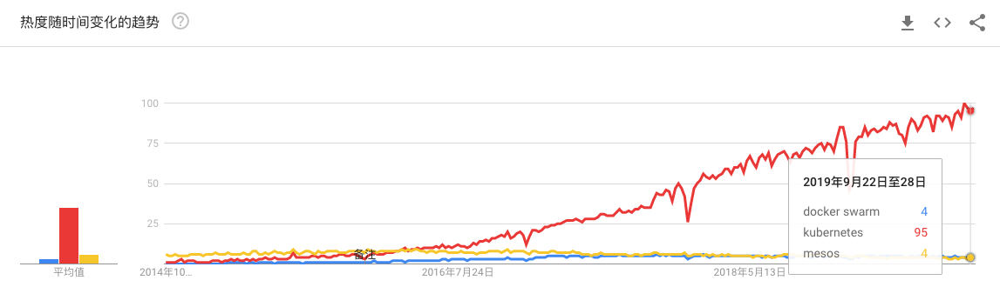
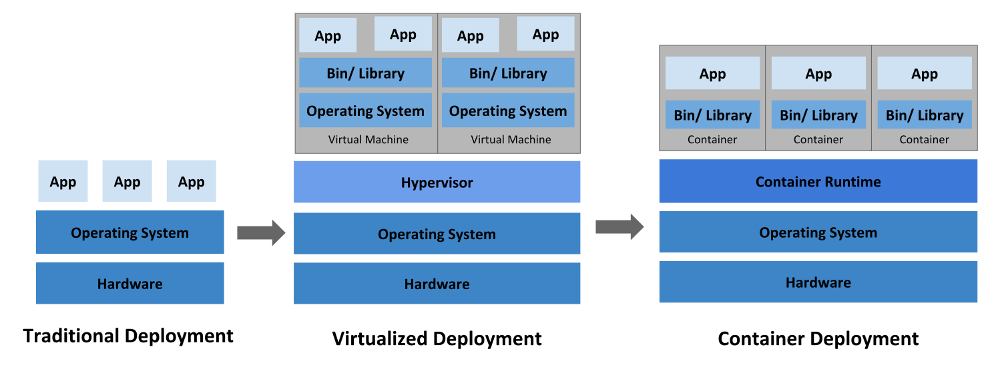

# Kubernetes介绍

<AdSenseTitle/>

> 参考文档： [What is Kubernetes](https://kubernetes.io/docs/concepts/overview/what-is-kubernetes/)

Kubernetes是一个可以移植、可扩展的开源平台，使用 [声明式的配置](/learning/k8s-intermediate/workload/wl-deployment/#deployment-概述) 并依据配置信息自动地执行容器化应用程序的管理。在所有的容器编排工具中（类似的还有 docker swarm / mesos等），Kubernetes的生态系统更大、增长更快，有更多的支持、服务和工具可供用户选择。

Kubernetes的名字起源于希腊语，含义是 `舵手`、`领航员`、`向导`。Google于2014年将Brog系统开源为Kubernetes。Kubernetes构建在Google Brog [十五年运行大规模分布式系统的经验](https://ai.google/research/pubs/pub43438) 基础之上，并结合了开源社区最好的想法和实践。

以下是使用 google trends 对比 `kubernetes` 、 `docker swarm`、 `mesos` 三个关键词的截图。

## 回顾

为了理解Kubernetes的用处，我们先回顾一下历史。

大致来说，在部署应用程序的方式上，我们主要经历了三个时代：

* **传统部署时代**：早期，企业直接将应用程序部署在物理机上。由于物理机上不能为应用程序定义资源使用边界，我们也就很难合理地分配计算资源。例如：如果多个应用程序运行在同一台物理机上，可能发生这样的情况：其中的一个应用程序消耗了大多数的计算资源，导致其他应用程序不能正常运行。应对此问题的一种解决办法是，将每一个应用程序运行在不同的物理机上。然而，这种做法无法大规模实施，因为资源利用率很低，且企业维护更多物理机的成本昂贵。
* **虚拟化部署时代**：针对上述问题，虚拟化技术应运而生。用户可以在单台物理机的CPU上运行多个虚拟机（Virtual Machine）。
  * 虚拟化技术使得应用程序被虚拟机相互分隔开，限制了应用程序之间的非法访问，进而提供了一定程度的安全性。
  * 虚拟化技术提高了物理机的资源利用率，可以更容易地安装或更新应用程序，降低了硬件成本，因此可以更好地规模化实施。
  * 每一个虚拟机可以认为是被虚拟化的物理机之上的一台完整的机器，其中运行了一台机器的所有组件，包括虚拟机自身的操作系统。
* **容器化部署时代**：容器与虚拟机类似，但是降低了隔离层级，共享了操作系统。因此，容器可以认为是轻量级的。
  * 与虚拟机相似，每个容器拥有自己的文件系统、CPU、内存、进程空间等
  * 运行应用程序所需要的资源都被容器包装，并和底层基础架构解耦
  * 容器化的应用程序可以跨云服务商、跨Linux操作系统发行版进行部署

容器化越来越流行，主要原因是它带来的诸多好处：
* **敏捷地创建和部署应用程序**：相较于创建虚拟机镜像，创建容器镜像更加容易和快速
* 持续构建集成：可以更快更频繁地构建容器镜像、部署容器化的应用程序、并且轻松地回滚应用程序
* **分离开发和运维的关注点**：在开发构建阶段就完成容器镜像的构建，构建好的镜像可以部署到多种基础设施上。这种做法将开发阶段需要关注的内容包含在如何构建容器镜像的过程中，将部署阶段需要关注的内容聚焦在如何提供基础设施以及如何使用容器镜像的过程中。降低了开发和运维的耦合度
* **可监控性**：不仅可以查看操作系统级别的资源监控信息，还可以查看应用程序健康状态以及其他信号的监控信息
* **开发、测试、生产不同阶段的环境一致性**：开发阶段在笔记本上运行的容器与测试、生产环境中运行的容器一致
* **跨云服务商、跨操作系统发行版的可移植性**：容器可运行在 Ubuntu、RHEL、CoreOS、CentOS等不同的操作系统发行版上，可以运行在私有化部署、Google Kubernetes Engine、AWS、阿里云等不同的云供应商的环境中
* **以应用程序为中心的管理**：虚拟机时代的考虑的问题是在虚拟硬件上运行一个操作系统，而容器化时代，问题的焦点则是在操作系统的逻辑资源上运行一个应用程序
* **松耦合、分布式、弹性、无约束的微服务**：应用程序被切分成更小的、独立的微服务，并可以动态部署和管理，而不是一个部署在专属机器上的庞大的单片应用程序
* **资源隔离**：确保应用程序性能不受干扰
* **资源利用**：资源高效、高密度利用

## Kubernetes的功能

容器是一个非常好的打包并运行应用程序的方式。在生产环境中，您需要管理容器化应用程序，并且确保其不停机地连续运行。例如：一个容器故障停机，另外一个容器需要立刻启动以替补停机的容器。类似的这种对容器的管理动作由系统来执行会更好更快速。

Kubernetes针对此类问题，提供了容器化编排解决方案，可以使你非常健壮地运行分布式系统。Kubernetes可以处理应用程序的伸缩、failover、部署模式等多种需求。例如，Kubernetes可以轻易地管理系统的金丝雀发布（灰度发布）。

Kubernetes提供的特性有：

* **服务发现和负载均衡**
  
  Kubernetes 可以通过 DNS 名称或 IP 地址暴露容器的访问方式。并且可以在同组容器内分发负载以实现负载均衡

* **存储编排**
  
  Kubernetes可以自动挂载指定的存储系统，例如 local stroage/nfs/云存储等

* **自动发布和回滚**

  您可以在 Kubernetes 中声明您期望应用程序容器应该达到的状态，Kubernetes将以合适的速率调整容器的实际状态，并逐步达到最终期望的结果。请参考 [声明式的配置](/learning/k8s-intermediate/workload/wl-deployment/#deployment-概述) 

* **自愈**
  
  Kubernetes提供如下自愈能力：
  * 重启已经停机的容器
  * 替换、kill 那些不满足自定义健康检查条件的容器
  * 在容器就绪之前，避免调用者发现该容器

* **密钥及配置管理**

  Kubernetes可以存储和管理敏感信息（例如，密码、OAuth token、ssh密钥等）。您可以更新容器应用程序的密钥、配置等信息，而无需：
  * 重新构建容器的镜像
  * 在不合适的地方暴露密码信息

## Kubernetes的边界

Kubernetes不是一个传统意义的、保罗万象的 PaaS（Platform as a Service）系统。Kubernetes在容器层面工作，而不是硬件层面，它提供了与 PaaS 平台相似的通用特性，例如：部署、伸缩、负载均衡、日志、监控等。然而，Kubernetes并不是一个单一整体，这些特性都是可选、可插拔的。Kubernetes提供用于搭建开发平台的基础模块，同时为用户提供了不同模块的选择性和多样性。

Kubernetes：

* 不限制应用程序的类型。Kubernetes的目标是广泛支持不同类型的工作负载，包括：有状态、无状态、数据处理等类型的应用。只要应用可以在容器中运行，就能够非常好地在 Kubernetes 上运行
* 不部署源码、不编译或构建应用程序。持续集成、分发、部署（CI/CD）的工作流极大程度上取决于组织的文化、偏好以及技术要求。Kubernetes可以作为部署平台参与到 CI/CD 流程，但是不涉及镜像构建和分发的过程
  > 译者注：可选的有 Jenkins / Gitlab Runner / docker registry / harbour 等
* 不提供应用程序级别的服务，包括：中间件（例如，消息总线）、数据处理框架（例如，Spark）、数据库（例如，mysql）、缓存（例如，Redis），或者分布式存储（例如，Ceph）。此类组件可以在 Kubernetes 上运行，或者可以被运行在 Kubernetes 上的应用程序访问
* 不限定日志、监控、报警的解决方案。Kubernetes 提供一些样例展示如何与日志、监控、报警等组件集成，同时提供收集、导出监控度量（metrics）的一套机制。您可以根据自己的需要选择日志、监控、报警组件
  > 译者注：可选的有 ELK / Prometheus / Graphana / Pinpoint / Skywalking / Metrics Server 等
* 不提供或者限定配置语言（例如，jsonnet）。Kubernetes提供一组声明式的 API，您可以按照自己的方式定义部署信息。
  > 译者注：可选的有 helm/kustomize/kubectl/kubernetes dashboard/kuboard/octant/k9s 等
* 不提供或限定任何机器的配置、维护、管理或自愈的系统。
  > 译者注：在这个级别上，可选的组件有 puppet、ansible、open stack 等
* 此外，Kubernetes不是一个纯粹意义上的容器编排系统。事实上，Kubernetes 消除了容器编排的需求。容器编排的技术定义是`预定义流程的执行`（先做A、再做B、然后做C）。与此相对应，Kubernetes构建了一系列相互独立、可预排的控制过程，以持续不断地将系统从当前状态调整到声明的目标状态。如何从 A 达到 C，并不重要。集中化的控制也就不需要了。这个设计思想使得Kubernetes使用更简单、更强大、稳健、反脆弱和可扩展。
