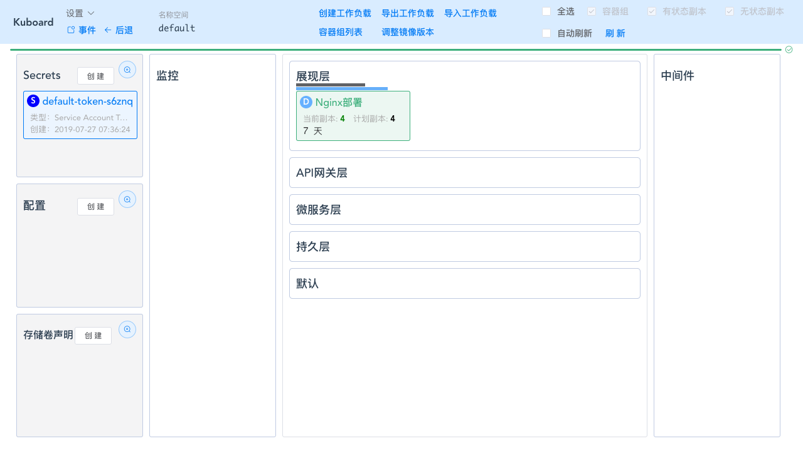
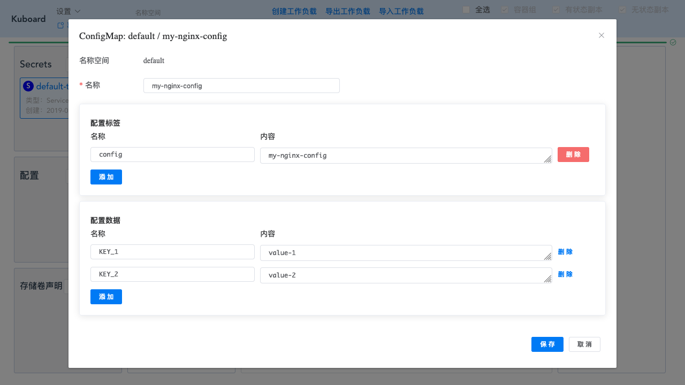

# 使用 ConfigMap 配置您的应用程序

本文参考了 Kubernetes 官网 [Configure a Pod to Use a ConfigMap](https://kubernetes.io/docs/tasks/configure-pod-container/configure-pod-configmap)，并有所改写

Kubernetes ConfigMap 可以将配置信息和容器镜像解耦，以使得容器化的应用程序可移植。本文提供了一系列的实例，解释如何通过 Kuboard 创建 ConfigMap 以及如何使用 ConfigMap 中的数据配置 Pod（容器组）。

## 前提条件

您已经安装了 Kubernetes 集群，并且已经在集群中安装了 Kuboard，如果尚未安装，请参考：

* [安装 Kubernetes 单Master节点](/install/install-k8s.html)
* [安装 Kuboard](/install/install-dashboard.html)

## 创建 ConfigMap

::: tip 提示
Kubernetes 官网描述了多种 ConfigMap 的创建方法，本文不再复述，请自行参考文档 [Configure a Pod to Use a ConfigMap](https://kubernetes.io/docs/tasks/configure-pod-container/configure-pod-configmap)
:::

* 打开 Kuboard 界面，并点击进入您想要创建 ConfigMap 的 **名称空间**

  如下图所示：

  

* 点击 **配置** --> **创建** 按钮

  并填写表单，如下图所示：

  

* 点击 **保存**

  ConfigMap 创建成功

* 
