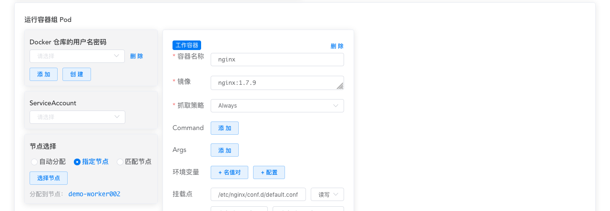
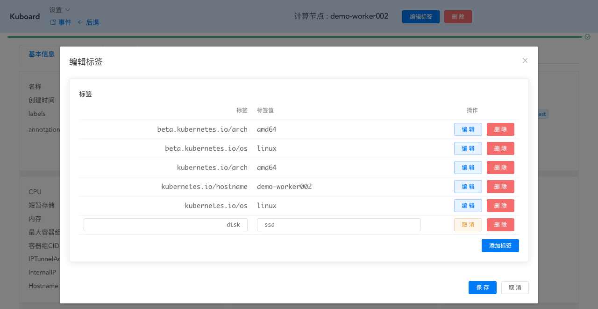
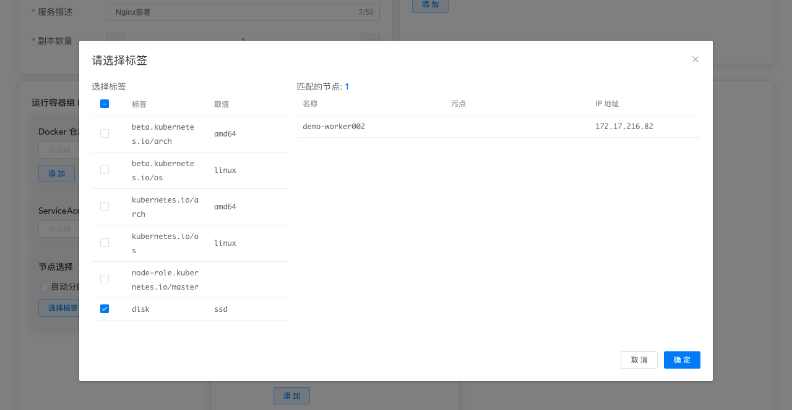

# 将容器组调度到指定的节点

参考文档： Kubernetes 官网 [Assigning Pods to Nodes](https://kubernetes.io/docs/concepts/configuration/assign-pod-node/)

## 概述

在 Kubernetes，您可以限定 Pod 只能在特定的节点上运行，或者优先选择在特定的节点上运行。通常您并不需要这样做，而应该交由 kubernetes 调度程序根据资源使用情况自动地为 Pod 分配节点。但是少数情况下，这种限定仍然是必要的，例如：
* 确保某些 Pod 被分配到具有固态硬盘的节点
* 将相互通信频繁的两个 Pod 分配到同一个高可用区的节点

Kubernetes 一共提供了四种方法，可以将 Pod 调度到指定的节点上，这些方法从简便到复杂的顺序如下：
* 指定节点 nodeName <Badge text="Kuboard 已支持" type="success"/>
* 节点选择器 nodeSelector <Badge text="Kuboard 已支持" type="success"/> <Badge text="Kubernetes 推荐用法" type="error"/>
* Node isolation/restriction <Badge text="Kuboard 暂不支持" type="warn"/>
* Affinity and anti-affinity <Badge text="Kuboard 暂不支持" type="warn"/>

本文后续章节逐个描述了他们的用法

## 指定节点 nodeName

nodeName 是四种方法中最简单的一个，但是因为它的局限性，也是使用最少的。nodeName 是 PodSpec 当中的一个字段。如果该字段非空，调度程序直接将其指派到 nodeName 对应的节点上运行。

通过 nodeName 限定 Pod 所运行的节点有如下局限性：

* 如果 nodeName 对应的节点不存在，Pod 将不能运行
* 如果 nodeName 对应的节点没有足够的资源，Pod 将运行失败，可能的原因有：OutOfmemory /OutOfcpu
* 集群中的 nodeName 通常是变化的（新的集群中可能没有该 nodeName 的节点，指定的 nodeName 的节点可能从集群中移除）

### 在 Kuboard 中使用 nodeName

您在 Kuboard 工作负载编辑器中，可以通过 ***指定节点*** --> ***选择节点*** 按钮，选择对应 nodeName 的取值。如下图所示：

## 节点选择器 nodeSelector

nodeSelector 是 PodSpec 中的一个字段。指定了一组名值对。节点的 labels 中必须包含 Pod 的 nodeSelector 中所有的名值对，该节点才可以运行此 Pod。最普遍的用法中， nodeSelector 只包含一个名值对。

下面的步骤描述了如何在 Kuboard 中使用 nodeSelector

### 为节点增加标签 labels

* 从 Kuboard **集群概览** 界面进入您选定的节点界面

* 点击 ***编辑标签*** 按钮

  增加标签 disk:ssd，并保存，如下图所示：

  

### 为工作负载选择节点

* 在 Kuboard 界面进入工作负载所在的名称空间

* 点击您要编辑的工作负载，进入工作负载查看页

* 点击 ***编辑*** 按钮，进入工作负载编辑页

* 点击 **节点选择** --> **匹配节点** --> **选择标签** 按钮

  选择 disk:ssd 标签，此时可以看到匹配的节点有刚才您添加标签的节点。点击 ***确定*** 按钮

  

* 点击 ***保存*** 按钮

  此时您已完成了通过 nodeSelector 为 Pod 指定节点的任务。

## Node isolation/restriction <Badge text="Kuboard 暂不支持" type="warn"/>

请参考 Kubernetes 官网文档 [Node isolation/restriction](https://kubernetes.io/docs/concepts/configuration/assign-pod-node/#node-isolation-restriction)

## Affinity and anti-affinity <Badge text="Kuboard 暂不支持" type="warn"/>

请参考 Kubernetes 官网文档 [Affinity and anti-affinity](https://kubernetes.io/docs/concepts/configuration/assign-pod-node/#affinity-and-anti-affinity)
