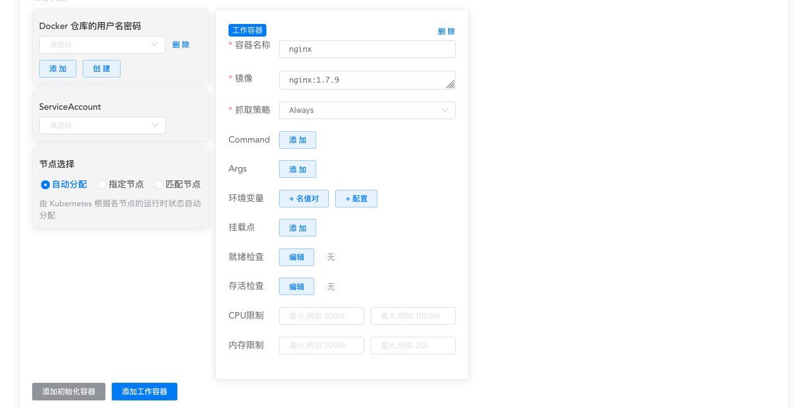
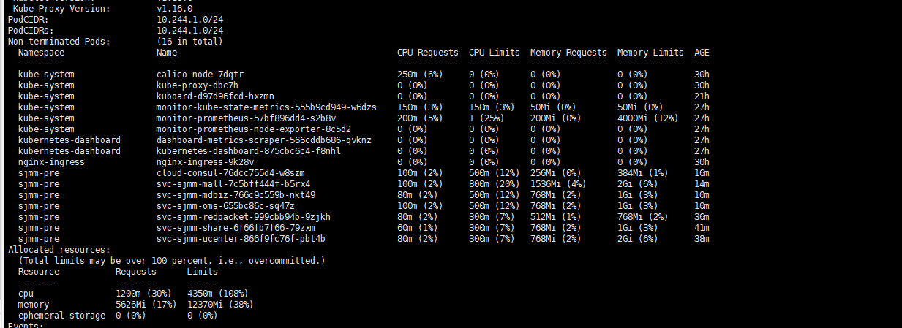

# 管理容器的计算资源

<AdSenseTitle/>

参考文档： Kubernetes  [Managing Compute Resources for Containers](https://kubernetes.io/docs/concepts/configuration/manage-compute-resources-container/)

## 概述

在 Kubernetes 中创建工作负载时，您可以为 Pod 中的每一个容器指定其所需要的内存（RAM）大小和 CPU 数量。如果这些信息被指定了，Kubernetes 调度器可以更好的决定将 Pod 调度到哪一个节点。对于容器来说，其所需要的资源也将依据其指定的数值得到保证。

## 资源类型及计量

当我们讨论计算资源的时候，主要是指 CPU 和 内存。CPU 的计量单位是内核的单元数，内存的计量单位是 byte 字节数。应用程序可以按量请求、分配、消耗计算资源。

### CPU 的计量

在 Kubernetes 中，1 个 CPU 代表：
* 1 AWS vCPU
* 1 GCP Core
* 1 Azure vCore
* 1 IBM vCPU
* 物理机上 Intel 超线程 CPU 的 1 个超线程（Hyperthread）

Kubernetes 中，0.5 代表请求半个 CPU 资源。表达式 0.1 等价于 表达式 100m （英文读作 one hundred millicpu 或 one hundred millicores）。在 API Server 中，表达式 0.1 将被转换成 100m，精度低于 1m 的请求是不受支持的。 CPU 的计量代表的是绝对值，而非相对值，例如，您请求了 0.1 个 CPU，无论您的节点是 单核、双核、48核，您得到的 CPU 资源都是 0.1 核。

::: tip
在 `top` 命令查看CPU消耗，100% 代表 1核；4核为 400%；10% 代表 0.1 核 或者 100m
:::

### 内存的计量

内存的计量单位是 byte 字节。您可以使用一个整数来表达内存的大小，也可以使用后缀来表示（E、P、T、G、M、K）。您也可以使用 2 的幂数来表示内存大小，其后缀为（Ei、Pi、Ti、Gi、Mi、Ki）。例如，下面的几个表达方式所表示的内存大小大致相等：

`128974848`, `129e6`, `129M`, `123Mi`

## 容器组及容器的计算资源请求及限制

Kubernetes 中，可以为容器指定计算资源的请求数量 request 和限制数量 limit。尽管资源的请求/限制数量只能在容器上指定，我们仍然经常讨论容器组的资源请求/限制数量。容器组对某一个类型的资源请求/限制数量是该容器组中所有工作容器对该资源请求/限制数量的求和。

在 Kuboard 的工作负载编辑器中编辑容器资源请求及限制的界面如下图所示：

## 带有资源请求的容器组是如何调度的

当您创建 Pod 时（直接创建，或者通过控制器创建），Kubernetes 调度程序选择一个节点去运行该 Pod。每一个节点都有一个最大可提供的资源数量：CPU 数量和内存大小。调度程序将确保：对于每一种资源类型，已调度的 Pod 对该资源的请求之和小于该节点最大可供使用资源数量。

::: tip Kubernetes文档原文翻译
尽管某个节点实际使用的CPU、内存数量非常低，如果新加入一个 Pod 使得该节点上对 CPU 或内存请求的数量之和大于了该节点最大可供使用 CPU 或内存数量，则调度程序不会将该 Pod 分配到该节点。Kubernetes 这样做可以避免在日常的流量高峰时段，节点上出现资源短缺的情况。
:::

::: tip Kuboard作者备注

在Kubernetes v1.16.1实际使用中（未验证其他版本），当节点的上容器CPU的请求 Limit（而非请求 Request）总和超出节点CPU总和时，在实际CPU使用率很低的情况下，就已经大量发生了驱逐Pod的现象。此时，可以考虑将资源Limits设置为0（不限制），使用 [Limit Range](/learning/k8s-advanced/policy/lr.html) 来限定Pod（或容器）的资源使用。

当大量Pod处于 Evict 状态时，请执行 `kubectl describe node ${EvictPod所在节点名}` 命令，并注意输出结果中的Allocated resources区域，如下图所示：（Total limits may be over 100 percent, i.e., overcommitted.）

:::

## 带有资源限制的容器组是如何运行的

Kubelet 启动容器组的容器时，将 CPU、内存的最大使用限制作为参数传递给容器引擎。

以 Docker 容器引擎为例：

* 容器的 cpu 请求将转换成 docker 要求的格式，并以 `--cpu-shares` 标志传递到 `docker run` 命令
* 容器的 cpu 限制将也将转换成 millicore 表达式并乘以 100。结果数字是每 100ms 的周期内，该容器可以使用的 CPU 份额
* 容器的内存限制将转换成一个整数，并使用 `--memory` 标志传递到 `docker run` 命令

如下情况可能会发生：

* 如果某个容器超出了其内存限制，它可能将被终止。如果 restartPolicy 为 Always 或 OnFailure，kubelet 将重启该容器
* 如果某个容器超出了其内存申请（仍低于其内存限制），当节点超出内存使用时，该容器仍然存在从节点驱逐的可能性
* 短时间内容器有可能能够超出其 CPU 使用限制运行。kubernetes 并不会终止这些超出 CPU 使用限制的容器
