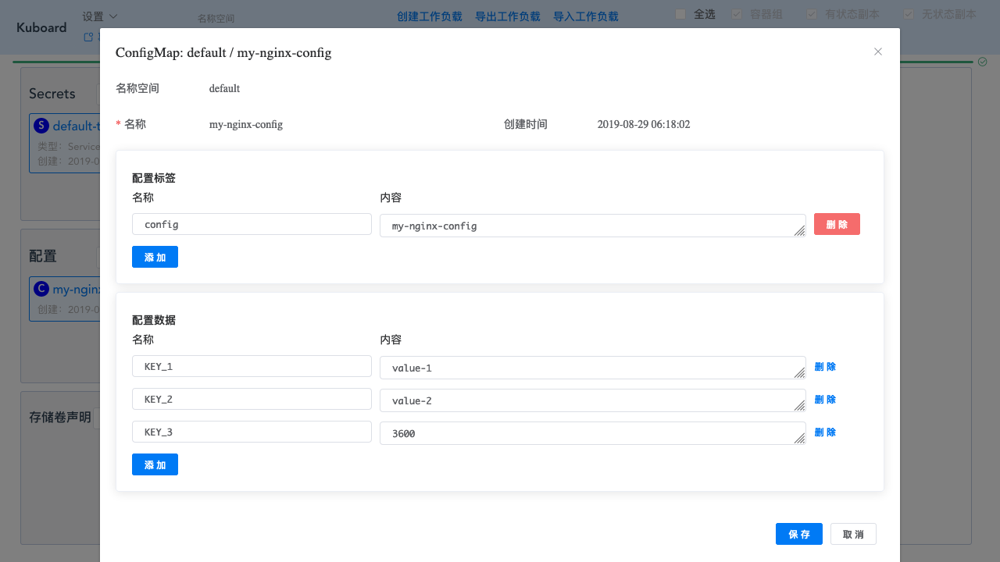
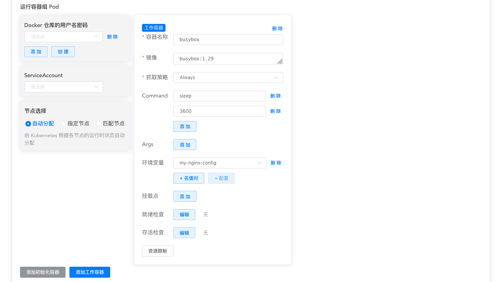
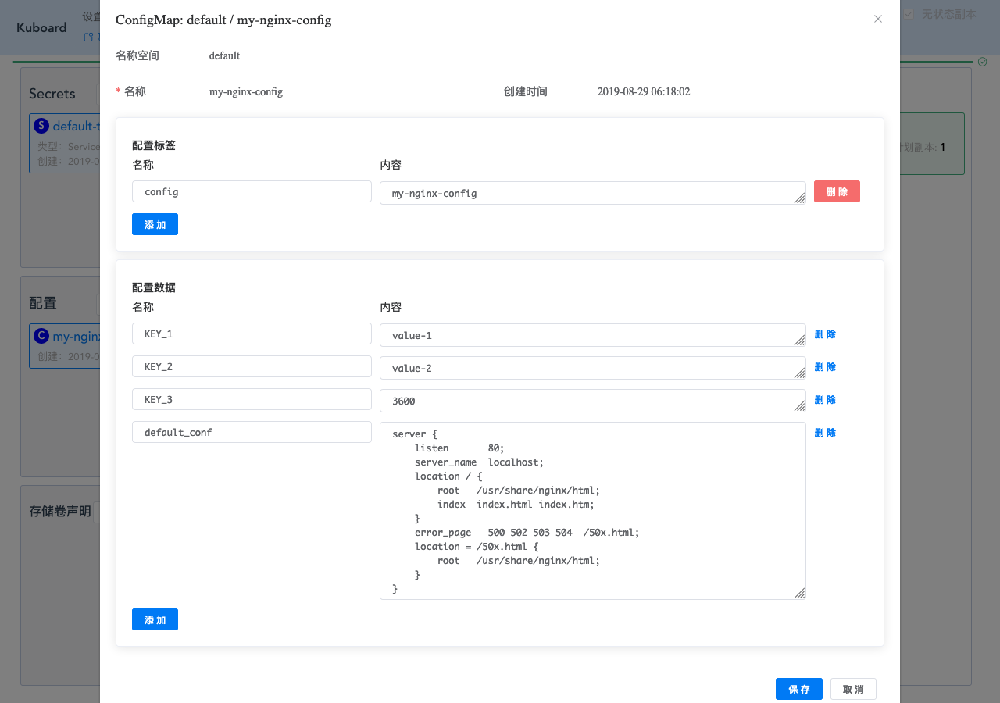
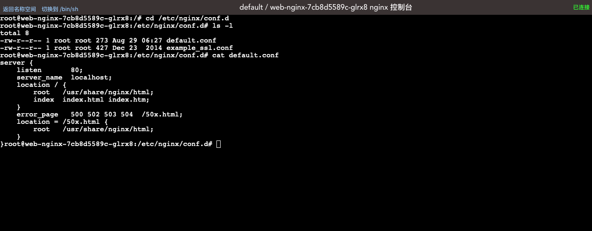

# 使用ConfigMap配置您的应用程序

<AdSenseTitle/>

本文参考了 Kubernetes  [Configure a Pod to Use a ConfigMap](https://kubernetes.io/docs/tasks/configure-pod-container/configure-pod-configmap)，并有所改写

Kubernetes ConfigMap 可以将配置信息和容器镜像解耦，以使得容器化的应用程序可移植。本文提供了一系列的实例，解释如何通过 Kuboard 创建 ConfigMap 以及如何使用 ConfigMap 中的数据配置 Pod（容器组）。

## 前提条件

您已经安装了 Kubernetes 集群，并且已经在集群中安装了 Kuboard，如果尚未安装，请参考：

* [安装 Kubernetes 单Master节点](/install/install-k8s.html)
* [安装 Kuboard](/install/install-dashboard.html)

## 创建 ConfigMap

::: tip 提示
Kubernetes 描述了多种 ConfigMap 的创建方法，本文不再复述，请自行参考文档 [Configure a Pod to Use a ConfigMap](https://kubernetes.io/docs/tasks/configure-pod-container/configure-pod-configmap)
:::

* 打开 Kuboard 界面，并点击进入您想要创建 ConfigMap 的 **名称空间**

  如下图所示：

  

* 点击 **配置** --> **创建** 按钮

  并填写表单，如下图所示：

  

* 点击 **保存**

  ConfigMap 创建成功

## ConfigMap --> 容器的环境变量

* 在名称空间页面点击 **创建工作负载**

  填写表单如下：

  | 字段名称 | 填写内容       | 备注                                                         |
  | -------- | -------------- | ------------------------------------------------------------ |
  | 服务类型 | Deployment     |                                                              |
  | 服务分层 | 中间件         |                                                              |
  | 服务名称 | busybox        |                                                              |
  | 服务描述 | busybox        |                                                              |
  | 副本数量 | 1              |                                                              |
  | 容器名称 | busybox        |                                                              |
  | 镜像     | busybox:1.29   |                                                              |
  | 抓取策略 | Always         |                                                              |
  | Command  | sleep<br/>3600 | sleep 和 3600 是两个元素                                     |
  | 环境变量 | ENV_KEY_1      | 选择 ConfigMap<br/> ConfigMap 填写 ***my-nginx-config*** <br/> Key 填写 ***KEY_1*** |

  如下图所示：

  

  

* 点击 **保存**

* 点击 **应用**

* 点击 **完成**

* 在 ***cloud-busybox*** 的工作负载查看界面，进入容器 ***busybox*** 的终端

  切换到 /bin/sh 终端

  执行命令： `echo $ENV_KEY_1`

  可查看到输出结果为 `value-1`

  执行命令：`export`

  可查看到 ENV_KEY_1='value-1' 已经注入到该容器的环境变量中，如下图所示：

  

## ConfigMap --> 容器的环境变量（ConfigMap的所有名值对）

* 在名称空间页面点击 **创建工作负载**

  填写表单如下：

  | 字段名称 | 填写内容       | 备注                                                         |
  | -------- | -------------- | ------------------------------------------------------------ |
  | 服务类型 | Deployment     |                                                              |
  | 服务分层 | 中间件         |                                                              |
  | 服务名称 | busybox        |                                                              |
  | 服务描述 | busybox        |                                                              |
  | 副本数量 | 1              |                                                              |
  | 容器名称 | busybox        |                                                              |
  | 镜像     | busybox:1.29   |                                                              |
  | 抓取策略 | Always         |                                                              |
  | Command  | sleep<br/>3600 | sleep 和 3600 是两个元素                                     |
  | 环境变量 | ***my-nginx-config***      | 通过 ***+ 配置*** 按钮添加 |

  如下图所示：
  
  


* 点击 **保存**

* 点击 **应用**

* 点击 **完成**

* 在 ***cloud-busybox*** 的工作负载查看界面，进入容器 ***busybox*** 的终端

  切换到 /bin/sh 终端

  执行命令： `echo $KEY_1`

  可查看到输出结果为 `value-1`

  执行命令： `echo $KEY_2`

  可查看到输出结果为 `value-2`

  执行命令： `echo $KEY_3`
  
  可查看到输出结果为 `3600`
  
  执行命令：`export`
  
  可查看到 `KEY_1` `KEY_2` `KEY_3` 已经注入到该容器的环境变量中，如下图所示：
  
  

## ConfigMap --> Command 参数

* 在名称空间页面点击 **创建工作负载**

  填写表单如下：

  | 字段名称 | 填写内容       | 备注                                                         |
  | -------- | -------------- | ------------------------------------------------------------ |
  | 服务类型 | Deployment     |                                                              |
  | 服务分层 | 中间件         |                                                              |
  | 服务名称 | busybox        |                                                              |
  | 服务描述 | busybox        |                                                              |
  | 副本数量 | 1              |                                                              |
  | 容器名称 | busybox        |                                                              |
  | 镜像     | busybox:1.29   |                                                              |
  | 抓取策略 | Always         |                                                              |
  | Command  | /bin/sh<br/>-c<br/>echo ${ENV_KEY_1} ${ENV_KEY_3} ; sleep ${ENV_KEY_3} |                                      |
  | 环境变量 | ENV_KEY_1 / ENV_KEY_3      | 选择 ConfigMap<br/> ConfigMap 填写 ***my-nginx-config*** <br/> Key 填写 ***KEY_1*** <br/> <br/> 同样的方法添加 ENV_KEY_3 |
  如下图所示：
  
  


* 点击 **保存**

* 点击 **应用**

* 点击 **完成**

* 在 ***cloud-busybox*** 的工作负载查看界面，进入容器 ***busybox*** 的日志界面，可查看到该命令输出的结果为

  ``` sh
  value-1 3600
  ```

  如下图所示

  

## ConfigMap --> 数据卷

* 创建 ConfigMap 如下图所示：

  填写表单：

  | 字段名称     | 填写内容           | 备注                                                 |
  | ------------ | ------------------ | ---------------------------------------------------- |
  | 名称         | my-nginx-config    |                                                      |
  | KEY_1        | value-1            |                                                      |
  | KEY_2        | value-2            |                                                      |
  | KEY_3        | 3600               |                                                      |
  | default_conf | 请参考下面的代码块 | 用来替换 nginx 容器中 /etc/nginx/conf.d/default.conf |

  default_conf 的内容如下：

  ``` nginx
  server {
      listen       80;
      server_name  localhost;
      location / {
          root   /usr/share/nginx/html;
          index  index.html index.htm;
      }
      error_page   500 502 503 504  /50x.html;
      location = /50x.html {
          root   /usr/share/nginx/html;
      }
  }
  ```

  

  

* 创建 nginx Deployment 如下图所示：

  填写表单：

  | 字段名称               | 填写内容                         | 备注                                                         |
  | ---------------------- | -------------------------------- | ------------------------------------------------------------ |
  | 服务类型               | Deployment                       |                                                              |
  | 服务分层               | 展现层                           |                                                              |
  | 服务名称               | nginx                            |                                                              |
  | 服务描述               | Nginx部署                        |                                                              |
  | 副本数量               | 1                                |                                                              |
  | 数据卷：               | ----------                       | ------------                                                 |
  | 数据卷名称             | default-conf                     |                                                              |
  | 数据卷类型             | configMap                        |                                                              |
  | ConfigMap              | my-nginx-config                  |                                                              |
  | KeyToPath              | default_conf   -->  default.conf | 将数据卷内的 default_conf 的内容映射到路径 default.conf      |
  | 容器：                 | ----------                       | ------------                                                 |
  | 容器名称               | nginx                            |                                                              |
  | 镜像                   | nginx:1.7.9                      |                                                              |
  | 抓取策略               | Always                           |                                                              |
  | 挂载点：容器内路径     | /etc/nginx/conf.d/default.conf   | 容器内路径                                                   |
  | 挂载点：数据卷         | default-conf                     | 选择上面已经定义的数据卷                                     |
  | 挂载点：数据卷内子路径 | default.conf                     | 将数据卷内的 default.conf 映射到容器的 /etc/nginx/conf.d/default.conf |

  

* 点击 **保存**

* 点击 **应用**

* 点击 **完成**

* 进入 ***终端*** 界面

  执行命令

  ```sh
  # 切换当前目录
  cd /etc/nginx/conf.d
  # 查看当前目录下的文件 
  ls
  # 查看 default.conf 的内容（该文件原本的内容已被 configMap 中的内容替换）
  cat /default.conf
  ```

  

::: tip

* 在这个例子中，我们使用 ConfigMap ***my-nginx-config*** 中的 KEY ***default_conf*** 中的内容挂载到容器的 ***/etc/nginx/conf.d/default.conf*** 路径，以此替换了容器镜像中该路径原来的文件内容；
* 也可以将 ConfigMap 作为一个数据卷（在挂载时不指定数据卷内子路径）挂载到容器，此时 ConfigMap 将映射成一个文件夹，每一个 KEY 是文件夹下的文件名，KEY 对应的 VALUE 是文件当中的内容。

:::

## 注意事项

ConfigMap 作为 Kubernetes API 对象，以 key-value 名值对的形式存储配置信息。如前所述，这些信息可以被 Pod（容器组）以不同的方式使用：

* 将 ConfigMap 中某个 KEY 的 VALUE 作为容器组的环境变量
* 将 ConfigMap 中所有的名值对作为容器组的环境变量
* 在定义容器组的 Command 时，使用 ConfigMap 中 KEY 对应的 VALUE
* 将 ConfigMap 中的信息挂载到数据卷

**限制**：

* 必须先创建 ConfigMap，才能在容器组中引用 ConfigMap。如果您引用了一个不存在的 ConfigMap，容器组将不能启动；同样的，如果您引用了 ConfigMap 中不存在的 KEY，容器组也将不能启动
* ConfigMap 存在于名称空间当中，只有同一个名称空间下的容器组才能引用
