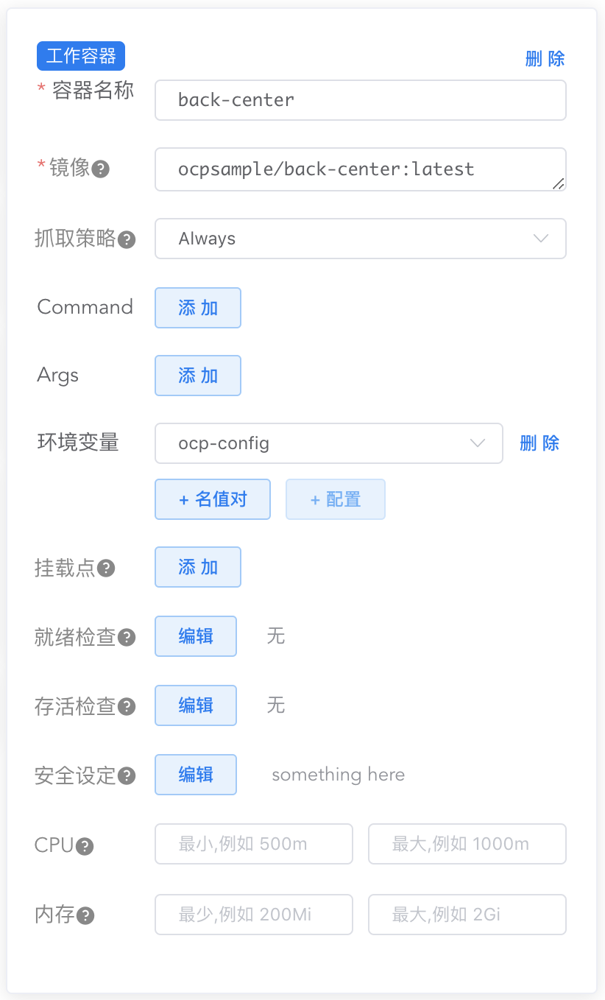
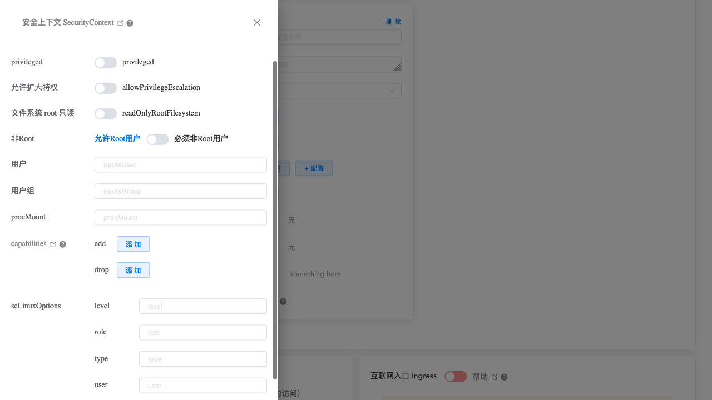

# Kuboard中容器的Security Context

<AdSenseTitle/>

通过 Kuboard，可以直接设定 Deployment、StatefulSet、DaemonSet 等中容器的 securityContext 的内容。在 Kuboard 工作负载编辑器界面中点击 `容器` --> `安全设定` --> **编辑** 按钮，

  

可查看到容器的 Security Context 设置界面，如下图所示：

上图界面中，各个字段的含义逐个解释如下：

| 字段名                                       | 字段类型                                                    | 字段说明                                                     |
| -------------------------------------------- | ----------------------------------------------------------- | ------------------------------------------------------------ |
| privileged                                   | boolean                                                     | 以 privileged 模式运行容器。此时容器中的进程本质上等价于宿主节点上的 root 用户。默认值为 `false` |
| 允许扩大特权 allowPrivilegeEscalation   | boolean                                                     | 该字段控制了进程是否可以获取比父进程更多的特权。直接作用是为容器进程设置 `no_new_privs`标记。当如下情况发生时，该字段始终为 `true`： 1. 以 privileged 模式运行 2. 进程拥有 CAP_SYS_ADMIN 的 Linux capability |
| 文件系统root只读 readOnlyRootFilesystem | boolean                                                     | 该容器的文件系统根路径是否为只读。默认为 `false`             |
| 非Root runAsNonRoot                     | boolean                                                     | 如果为 true，则 kubernetes 在运行容器之前将执行检查，以确保容器进程不是以 root 用户（UID为0）运行，否则将不能启动容器；如果此字段不设置或者为 false，则不执行此检查。也可以在Pod的SecurityContext中设定，如果 Pod 和容器的 securityContext 中都设定了这个字段，则对该容器来说以容器中的设置为准。 |
| 用户 runAsUser                          | integer                                                     | 执行容器 entrypoint 进程的 UID。默认为 docker 引擎的 GID。也可以在Pod的SecurityContext中设定，如果 Pod 和容器的 securityContext 中都设定了这个字段，则对该容器来说以容器中的设置为准。 |
| 用户组 runAsGroup                       | integer                                                     | 执行容器 entrypoint 进程的 GID。默认为 docker 引擎的 GID。也可以在Pod的SecurityContext中设定，如果 Pod 和容器的 securityContext 中都设定了这个字段，则对该容器来说以容器中的设置为准。 |
| procMount                                    | string                                                      | procMount 代表了容器的 proc mount 的类型。默认值是 `DefaultProcMount`（使用容器引擎的默认值）。该字段需要激活 Kubernetes 的ProcMountType 特性 |
| capabilities                                 | 
add: array drop: array
 | 为容器进程 add/drop Linux capabilities。默认使用容器引擎的设定。更多内容请参考 [为容器设置Linux Capabilities](./con-cap.html) |
| seLinuxOptions                               |                                                             | 此字段设定的 SELinux 上下文将被应用到 Pod 中所有容器。如果不指定，容器引擎将为每个容器分配一个随机的 SELinux 上下文。也可以在Pod的SecurityContext中设定，如果 Pod 和容器的 securityContext 中都设定了这个字段，则对该容器来说以容器中的设置为准。 |
