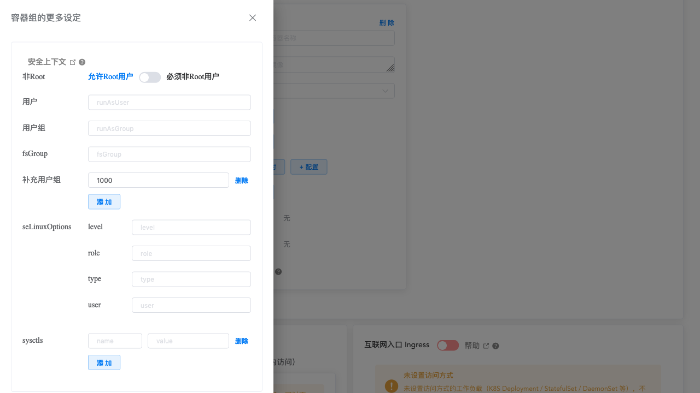

# Kuboard中Pod的Security Context

<AdSenseTitle/>

通过 Kuboard，可以直接设定 Deployment、StatefulSet、DaemonSet 等中 Pod 模板的 securityContext 的内容。在 Kuboard 工作负载编辑器界面中点击 **容器组的更多设定** 按钮，

  

可查看到 Pod 的 Security Context 设置界面，如下图所示：

上图界面中，各个字段的含义逐个解释如下：

| 字段名                             | 
字段类型
 | 字段说明                                                     |
| ---------------------------------- | ---------------------------------------- | ------------------------------------------------------------ |
| 非Root runAsNonRoot           | boolean                                  | 如果为 true，则 kubernetes 在运行容器之前将执行检查，以确保容器进程不是以 root 用户（UID为0）运行，否则将不能启动容器；如果此字段不设置或者为 false，则不执行此检查。该字段也可以在容器的 securityContext 中设定，如果 Pod 和容器的 securityContext 中都设定了这个字段，则对该容器来说以容器中的设置为准。 |
| 用户 runAsUser                | integer                                  | 执行容器 entrypoint 进程的 UID。默认为镜像元数据中定义的用户（dockerfile 中通过 USER 指令指定）。该字段也可以在容器的 securityContext 中设定，如果 Pod 和容器的 securityContext 中都设定了这个字段，则对该容器来说以容器中的设置为准。 |
| 用户组 runAsGroup             | integer                                  | 执行容器 entrypoint 进程的 GID。默认为 docker 引擎的 GID。该字段也可以在容器的 securityContext 中设定，如果 Pod 和容器的 securityContext 中都设定了这个字段，则对该容器来说以容器中的设置为准。 |
| fsGroup                            | integer                                  | 一个特殊的补充用户组，将被应用到 Pod 中所有容器。某些类型的数据卷允许 kubelet 修改数据卷的 ownership： 1. 修改后的 GID 取值来自于 fsGroup 2. setgid 标记位被设为 1（此时，数据卷中新创建的文件 owner 为 fsGroup） 3. permission 标记将与 `rw-rw----` 执行或运算 如果该字段不设置，kubelete 将不会修改数据卷的 ownership 和 permission |
| 补充用户组 supplementalGroups | integer                                  | 该列表中的用户组将被作为容器的主 GID 的补充，添加到 Pod 中容器的 enrtypoint 进程。可以不设置。 |
| seLinuxOptions                     | Object                                   | 此字段设定的 SELinux 上下文将被应用到 Pod 中所有容器。如果不指定，容器引擎将为每个容器分配一个随机的 SELinux 上下文。该字段也可以在容器的 securityContext 中设定，如果 Pod 和容器的 securityContext 中都设定了这个字段，则对该容器来说以容器中的设置为准。 |
| sysctls                            | Array                                    | 该列表中的所有 sysctl 将被应用到 Pod 中的容器。如果定义了容器引擎不支持的 sysctl，Pod 启动将会失败 |

关于 SecurityContex 在运行时怎么工作，请参考：
* [为Pod设置Security Context](./pod.html)
* [为容器设置Security Context](./con.html)
* [为容器设置Linux Capabilities](./con-cap.html)
* [为容器设置SELinux标签](./con-sel.html)
* [关于数据卷](./volumes.html)
