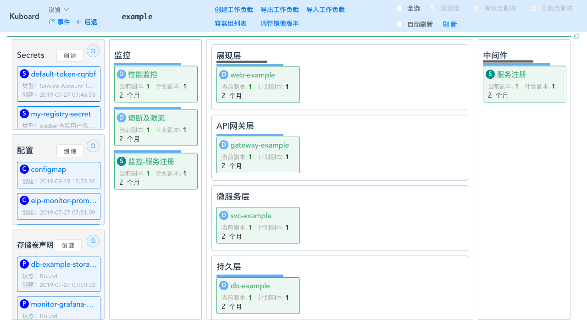
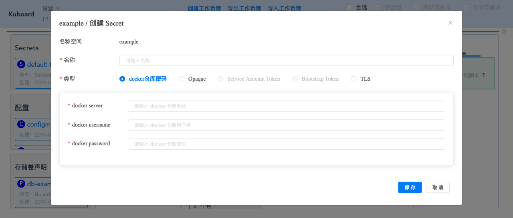

# 创建Secret（使用Kuboard）

本文简要描述如何在 Kuboard 中创建 Kubernetes Secret。

Kubernetes Secret 必须从属于某一个名称空间，进入 Kuboard 名称空间界面，Secret 列表在名称空间的左上角。如下图所示：

* 点击图中 Secrets 的文字，可刷新该列表
* 点击放大按钮，可放大列表窗口

  

* 点击 **创建** 按钮，可显示 Secret 的创建界面，如下图所示：

  

  * 可以创建的 Secret 类型有：
    * docker 仓库密码
    * Opaque (可自定义 key / value)
    * TLS （可存放 HTTPS 证书等）
  * 可以显示的 Secret 类型有：
    * Service Account Token
    * Bootstrap Token - 通常由系统创建
