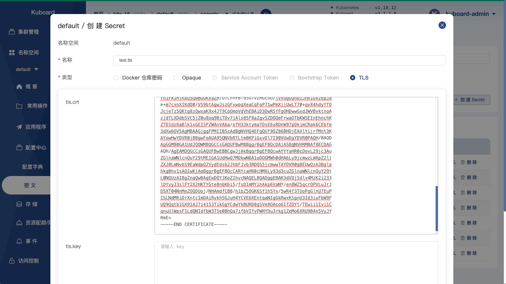
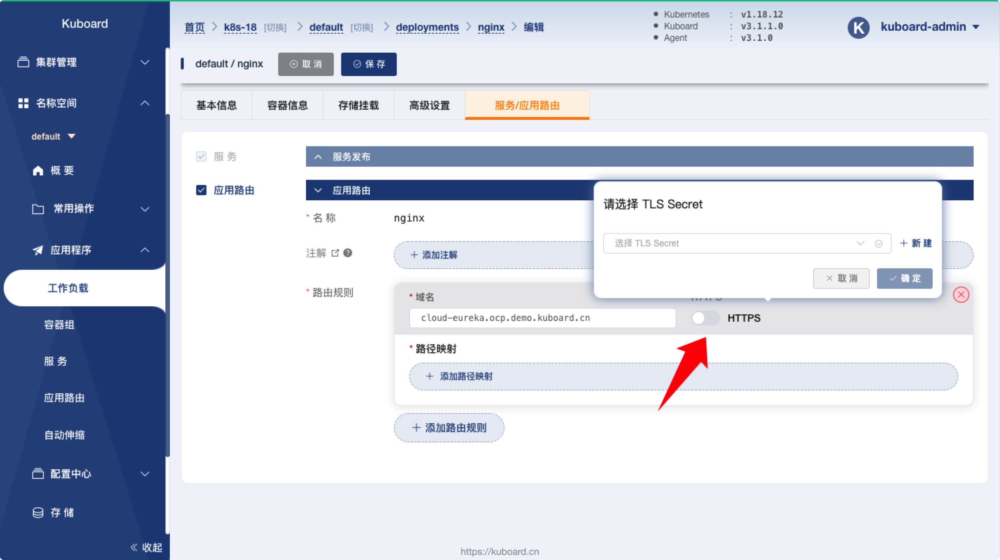
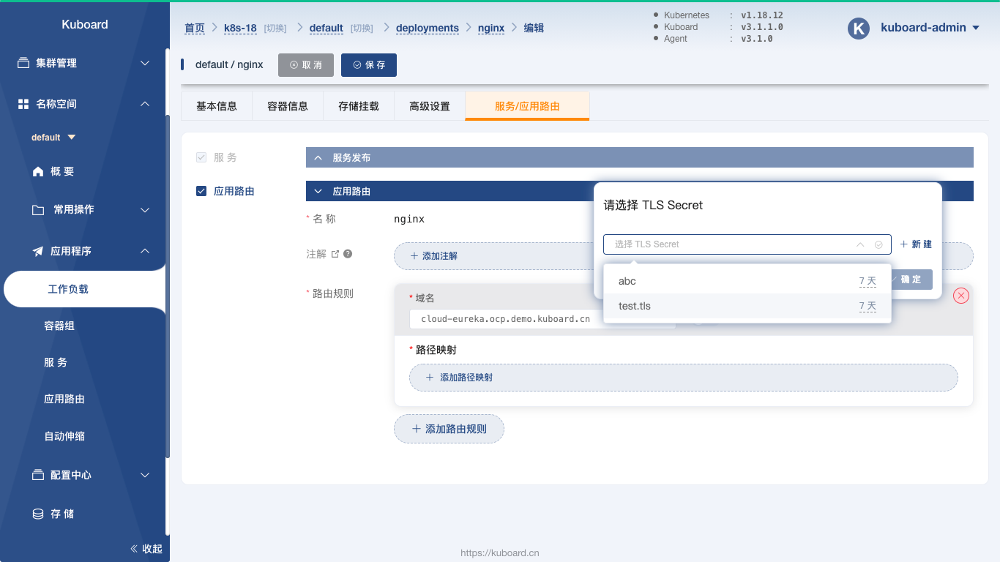

# 使用Secret存储Ingress TLS证书

<AdSenseTitle/>

可以直接在 Ingress 中配置 HTTPS 证书，使得你的网站支持 HTTPS 协议。

## 创建证书

如果您为自己的测试域名购买证书，可到阿里云 [SSL证书](https://www.aliyun.com/product/cas?spm=5176.12825654.eofdhaal5.136.e9392c4ax2Hoq2&aly_as=tcRolWYa) 产品页申请免费证书。在下载证书时，请选择 nginx 证书下载，解压缩下载到的 zip 文件后，您将获得一个 .key 私钥文件和一个 .pem 公钥文件

## 创建Secret

* 在 Kuboard 界面中进入 ***配置中心*** / ***密 文*** ，点击 ***创建 Secret*** 按钮，填写表单，如下图所示：

  * 选择类型为 TLS
  * 将 .key 文件中的内容填入 tls.key 字段
  * 将 .pem 文件中的内容填入 tls.crt 字段
  
  

* 点击 **保存** 按钮

## 在Ingress中引用Secret

* 在 Kuboard 界面中，点击要激活 HTTPS 的工作负载，进入编辑页面，如下图所示：

  在 **应用路由** 区域，勾选 HTTPS，并选择刚才创建好的 Secret

  

  

* 点击 **保存** 按钮

* 在浏览器打开对应的域名，验证 HTTPS 是否生效

::: tip

申请证书时，所填写的域名必须与Ingress配置的域名一致。

:::

:tada: :tada: :tada: 您已成功为 Ingress 配置了 HTTPS 证书。
