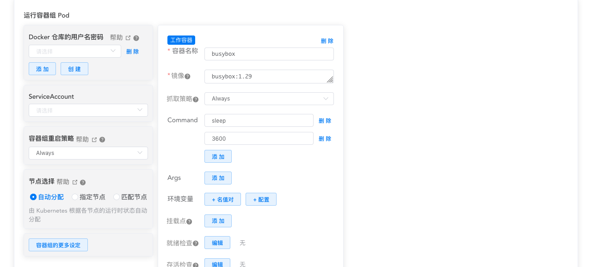
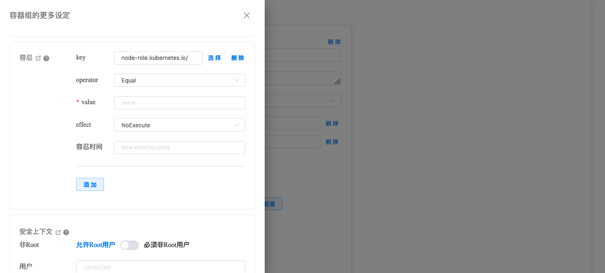

# 使用Kuboard配置容忍

<AdSenseTitle/>

> Kuboard v-1.0.5-beta.3 中增加了容忍的功能

在 Kubobard 工作负载编辑界面中点击 ***容器组的更多设定*** 按钮（下图左下角），

可为工作负载设置容忍，如下图所示：

各字段含义如下表所示：

| 字段名            | 字段类型 | 描述                                                         |
| ----------------- | -------- | ------------------------------------------------------------ |
| key               | string   | 此容忍针对的污点的 key。如果为空，则匹配所有的污点，此时 operator 必须为 `Exists`。当 key 为空，operator 为 `Exists` 时，表示容忍匹配所有 key / value 的污点 |
| operator          | string   | operator （操作符）表示 key 与 value 的关系。可选值为 `Exists` 和 `Equal`，默认为 `Equal`。 `Exists` 相当于 value 的通配符，此时 Pod 可以容忍包含该 key 的所有污点 |
| value             | string   | 此容忍针对的污点的 value。如果 operator 为 `Exists`，value 应该为空，否则，value 为一个常规字符串 |
| effect            | string   | 此容忍针对的污点的 effect。如果为空，则表示该容忍匹配污点的所有 effect。可选值为 `NoSchedule`、`PreferNoSchedule`、`NoExecute` |
| tolerationSeconds | integer  | TolerationSeconds 代表了容忍的持续时间，当该字段被填写时，effect 必须为 `NoExecute`。默认情况下，该字段为空，代表 Pod 可以一直容忍该污点（不会被驱逐）。0 以及负数将被认为是 0 （立刻驱逐）。参考 [基于污点的驱逐（TaintBasedEviction）](/learning/k8s-intermediate/config/taints-toleration/taint-based-evictions.html) |
