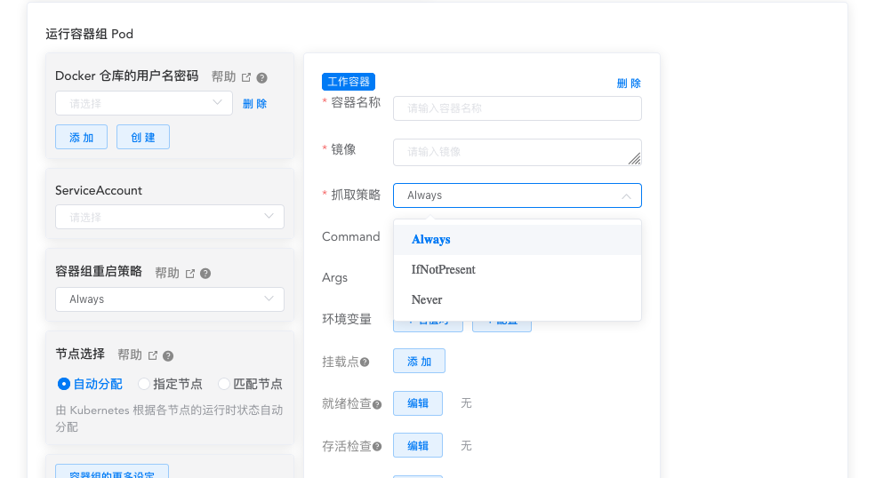

# 容器镜像

<AdSenseTitle/>

在 Kubernetes 的 Pod 中使用容器镜像之前，您必须将其推送到一个镜像仓库（或者使用仓库中已经有的容器镜像）。在 Kubernetes 的 Pod 定义中定义容器时，必须指定容器所使用的镜像，容器中的 `image` 字段支持与 `docker` 命令一样的语法，包括私有镜像仓库和标签。

例如：`my-registry.example.com:5000/example/web-example:v1.0.1` 由如下几个部分组成：

my-registry.example.com:5000/example/web-example:v1.0.1

* 蓝色部分：registry 地址
* 绿色部分：registry 端口
* 紫色部分：repository 名字
* 红色部分：image 名字
* 棕色部分：image 标签

如果您使用 `hub.dokcer.com` Registry 中的镜像，可以省略 registry 地址和 registry 端口。例如：`nginx:latest`，`eipwork/kuboard`

更多内容请参考：[使用私有仓库中的docker镜像](/learning/k8s-intermediate/private-registry.html)

## 更新镜像

Kubernetes中，默认的镜像抓取策略是 `IfNotPresent`，使用此策略，kubelet在发现本机有镜像的情况下，不会向镜像仓库抓取镜像。如果您期望每次启动 Pod 时，都强制从镜像仓库抓取镜像，可以尝试如下方式：
* 设置 container 中的 `imagePullPolicy` 为 `Always`
* 省略 `imagePullPolicy` 字段，并使用 `:latest` tag 的镜像
* 省略 `imagePullPolicy` 字段和镜像的 tag
* 激活 [AlwaysPullImages](https://kubernetes.io/docs/reference/access-authn-authz/admission-controllers/#alwayspullimages) 管理控制器

在 Kuboard 中，可以在界面中直接指定 container 的 imagePullPolicy，如下图所示：

imagePullPolicy 字段和 image tag的可能取值将影响到 kubelet 如何抓取镜像：
* `imagePullPolicy: IfNotPresent` 仅在节点上没有该镜像时，从镜像仓库抓取
* `imagePullPolicy: Always` 每次启动 Pod 时，从镜像仓库抓取
* `imagePullPolicy` 未填写，镜像 tag 为 `:latest` 或者未填写，则同 `Always` 每次启动 Pod 时，从镜像仓库抓取
* `imagePullPolicy` 未填写，镜像 tag 已填写但不是 `:latest`，则同 `IfNotPresent` 仅在节点上没有该镜像时，从镜像仓库抓取
* `imagePullPolicy: Never`，Kubernetes 假设本地存在该镜像，并且不会尝试从镜像仓库抓取镜像

::: tip 重要
* 在生产环境部署时，您应该避免使用 `:latest` tag，如果这样做，您将无法追踪当前正在使用的镜像版本，也无法正确地执行回滚动作
* 如果要 100% 确保所有的容器都使用了同样的镜像版本，可以尝试使用镜像的 [digest](https://docs.docker.com/engine/reference/commandline/pull/#pull-an-image-by-digest-immutable-identifier)，例如 `sha256:45b23dee08af5e43a7fea6c4cf9c25ccf269ee113168c19722f87876677c5cb2`。 Digest 唯一地标识了容器镜像的版本，并且永远不会改变。
* 容器引擎的镜像缓存机制使得 `imagePullPolicy: Always` 仍然是高效的。在 Docker 中，如果镜像已经存在，抓取尝试非常快速，先检查镜像所有的 layer 是否有更新，如果该镜像在镜像仓库中所有 layer 的 digest 与本地所有 layer 的 digest 相同，则不会再下载镜像。
:::

## 使用私有仓库中的docker镜像

请参考 [使用私有仓库中的docker镜像](/learning/k8s-intermediate/private-registry.html)
